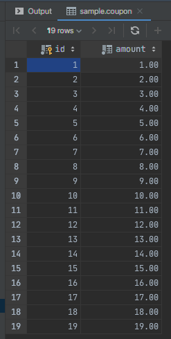
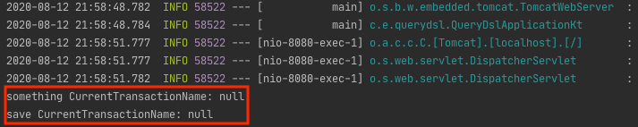
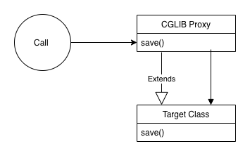
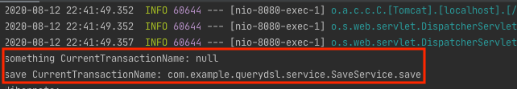

# 동일한 Bean(Class)에서 @Transactional 동작 방식

동일한 Bean 내에서 `@Transactional`을 사용하는 경우 예상했던 것과 다르게 동작할 수 있습니다. 발생 원인과 해결 방법에 대해서 정리한 포스팅입니다.

```kotlin
@Service
class CouponService(
    private val couponRepository: CouponRepository
) {

    fun something(i: Int) {
        println("something CurrentTransactionName: ${TransactionSynchronizationManager.getCurrentTransactionName()}")
        this.save(i)
    }

    @Transactional
    fun save(i: Int) {
        println("save CurrentTransactionName: ${TransactionSynchronizationManager.getCurrentTransactionName()}")
        (1..i).map {
            if (it == 20) {
                throw RuntimeException("$i ....")
            }
            couponRepository.save(Coupon(it.toBigDecimal()))
        }
    }
}

@RestController
@RequestMapping("/transaction")
class TransactionApi(
    private val couponService: CouponService
) {

    @GetMapping
    fun transactional(@RequestParam i: Int) {
        couponService.something(i)
    }
}
```
위 코드는 `Controller`에서 `something()` -> `save()`을 차례대로 호출하는 코드입니다. `save()` 메서드에서는 특정 경우 `RuntimeException`을 발생시키고 있습니다.  `save()` 메서드에 `@Transactional` 때문에 해당 반복문 전체에 트랜잭션이 묶이게 되고 예외가 발생하면 전체가 Rollback될 것이라고 예상됩니다.

```
curl --location --request GET 'http://localhost:8080/transaction?i=40'
```
위 와 같이 해당 컨트롤러를 호출하고 결과를 조회하면 아래와 같습니다.



결과는 전체를 롤백 되지 않고 19개가 commit 된 것을 확인할 수 있습니다. 그렇다는 것은 트랜잭션이 묶이지 않고 `SimpleJpaRepository`의 아래 `save()` 메서드를 통해서 단일 트랜잭션으로 진행된 것입니다.

```java
@Repository
@Transactional(readOnly = true)
public class SimpleJpaRepository<T, ID> implements JpaRepositoryImplementation<T, ID> {
    
        @Transactional
	@Override
	public <S extends T> S save(S entity) {

		if (entityInformation.isNew(entity)) {
			em.persist(entity);
			return entity;
		} else {
			return em.merge(entity);
		}
	}
}
```

**즉, 위와 같은 경우에는 동일한 Bean(Class)에서 Spring AOP CGLIB이 동작하지 않습니다.**



`TransactionSynchronizationManager.getCurrentTransactionName()` 메서드를 통해서 현재 트랜잭션을 확인해 보면 두 메서드 모두 `null`이라는 것은`this.save()` 메서드에 있는 `@Transactional`이 동작하지 않았다는 것입니다.

## 원인

> [Spring Document](https://docs.spring.io/spring/docs/current/spring-framework-reference/data-access.html#transaction-declarative-annotations)
> In proxy mode (which is the default), only external method calls coming in through the proxy are intercepted. This means that self-invocation (in effect, a method within the target object calling another method of the target object) does not lead to an actual transaction at runtime even if the invoked method is marked with @Transactional. Also, the proxy must be fully initialized to provide the expected behavior, so you should not rely on this feature in your initialization code (that is, @PostConstruct).

스프링 문서에 따르면 Proxy Default Mode(스프링에서 사용하는 기본 Proxy를 의미하는 거 같음)는 외부 메서드 (외부 Bean, 즉 동일하지 않은 Bean)에서 호출하는 경우에만 프록시를 타고 Self(`this.xxx()`)를 호출하는 경우 런타임에 `@Transactional`가 동작하지 않습니다.



즉, 위 그림처럼 CGBLIB Proxy를 통해서 `save()` 메서드가 Proxy 기반으로 `@Transactional`이 추가가 될 것을 기대했지만 호출하는 곳이 외부 Bean이 아닌 경우에는 Proxy가 인터셉트가 되지 않기 때문에 `@Transactional`이 동작하지 않게 되는 것입니다.

## 해결 방법

`Self Injection`, Spring AOP 대신 `AspectJ` 사용 등 몇 가지 방법을 검색을 통해서 확인했지만 개인적 견해로는 이 방법은 권장하고 싶지는 않습니다. AOP 라이브러리를 변경하는 것은 리스크가 너무 커 보였고, `Self Injection` 또한 직관적이지 않으며 `@Autowired`를 사용하는 것이 마음에 들지 않았습니다.

가장 간단한 해결 방법은 `Service` 클래스를 나누고 외부 Bean 호출을 통해서 Proxy가 올바르게 동작하게 하는 것입니다. 코드는 다음과 같습니다.

```kotlin
@Service
class CouponService(
    private val saveService: SaveService
) {
    fun something(i: Int) {
        println("something CurrentTransactionName: ${TransactionSynchronizationManager.getCurrentTransactionName()}")
        saveService.save(i)
    }
}

@Service
class SaveService(
    private val couponRepository: CouponRepository
) {
    @Transactional
    fun save(i: Int) {
        println("save CurrentTransactionName: ${TransactionSynchronizationManager.getCurrentTransactionName()}")
        (1..i).map {
            if (it == 20) {
                throw RuntimeException("$i ....")
            }
            couponRepository.save(Coupon(it.toBigDecimal()))
        }
    }
}
```

해당 코드를 다시 호출하면 아래와 같은 결과를 확인할 수 있습니다.


`save()` 메서드에서 트랜잭션이 생겼으며 해당 아래의 작업은 동일한 트랜잭션을 묶이게 됩니다. 즉 Proxy 기반으로 `@Transactional`이 동작했으며 예외가 발생하면 모두 Rollback을 진행하게 됩니다.