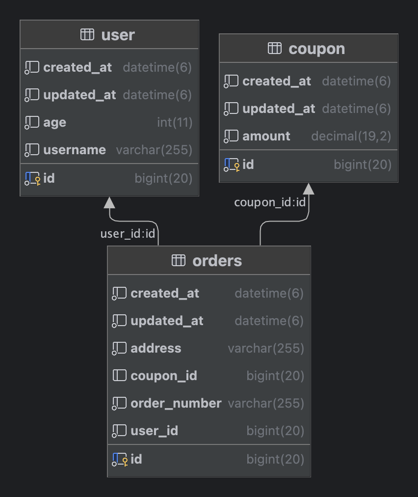

# JPA Paging Query

일반적으로 어드민 페이지와 같이 데이터를 테이블 뷰 형식으로 제공할 때, Paging 기법을 사용하여 현재 페이지의 내용과 페이지 정보를 표시합니다. JPA를 활용하면 이러한 반복적인 코드 작성을 보다 쉽게 처리할 수 있습니다.

데이터 모수가 적고 단순한 구조로 데이터를 보여주는 경우라면 JPA에서 제공해주는 방식으로 처리하는것이 효율적일 수있으나 데이터 모수가 많고 여러 테이블을 조인해서 표현해야하는 데이터 구조라면 성능 적인 이슈가 발생할 수 있습니다. 이러한 이슈와 성능 개선 방법에 대해 알아보겠습니다.

## Querydsl applyPagination 방식

데이터 모수가 적고 간단한 조회 구조를 가질 때, Querydsl의 applyPagination 메서드를 활용하면 페이징 로직을 더 쉽게 작성할 수 있습니다.

```kotlin
class OrderCustomRepositoryImpl : QuerydslRepositorySupport(Order::class.java), OrderCustomRepository {

    override fun findPagingBy(
        pageable: Pageable,
        address: String
    ): Page<Order> {
        val query: JPAQuery<Order> = from(order).select(order).where(order.address.eq(address))
        val content: List<Order> = querydsl.applyPagination(pageable, query).fetch()
        val totalCount: Long = query.fetchCount()
        return PageImpl(content, pageable, totalCount)
    }
}
```

[Spring-JPA Best Practices step-15 - Querydsl를 이용해서 Repository 확장하기 (1)](https://cheese10yun.github.io/spring-jpa-best-15/)에서 공유드린 QuerydslRepositorySupport를 기반으로 JpaRepository 확장시켜 페이징 로직을 구현했습니다.

세부 구현체에서는 조회 로직을 살펴 보게습니다. 이 과정에서 Querydsl를 기반으로 JPAQuery를 생성하며 필요한 조회 조건을 작성합니다. 그런 다음 해당 쿼리 객체를 이용하여 Content 조회와 전체 레코드 수 조회를 수행합니다. 마지막으로 각각의 실제 쿼리문을 확인하게 됩니다.

```
select order0_.id           as id1_4_,
       ...
       order0_.address      as address4_4_,
       order0_.created_at   as created_2_4_,
       order0_.updated_at   as updated_3_4_,
from orders order0_
where order0_.address = ?
limit ?, ?

select count(order0_.id) as col_0_0_
from orders order0_
where order0_.address = ?
```

Content 조회에 필요하 조회 쿼리와, 전체 레코드 조회에 필요한 쿼리를 JPAQuery를 통해 동일하게 사용이 가능하며, Querydsl의 applyPagination 메서드를 활용하여 offset 및 limit 관련 페이징 로직을 간단하게 구현할 수 있다는 큰 장점이 있습니다.

Querydsl의 applyPagination을 활용하면 페이징 조회 관련 로직을 간단하게 구현할 수 있어서 개발 생산성 측면에서 큰 이점이 있습니다. 그러나 모든 개발 결정 과정에서는 트레이드오프가 발생합니다. 모든 개발 결정 과정에서 편리한 기능을 즉시 활용할 수 있지만, 나중에는 추가 비용을 지불해야 하며 이 비용은 이자를 포함하여 청구될 수 있습니다.

어떤 문제가 발생하는지 살펴보겠습니다.

### Count Query의 성능 문제

Count 쿼리는 특정 조건에 해당하는 전체 레코드 수를 조회하는 구조로, 데이터 총량이 증가하면 성능 저하가 발생할 수 있습니다. 또한, 여러 테이블을 조인하여 데이터를 조회하는 경우에는 조회 조건이 복잡해져 정확한 인덱스를 타겟팅하기 어려운 이슈가 발생할 수 있습니다. 이는 조회 조건에 부합하는 전체 레코드를 Count하는 구조에서 필연적으로 발생할 수밖에 없는 문제입니다.

이러한 문제 외에도 다른 문제가 있습니다. JPAQuery를 사용하여 Content 조회 쿼리와 레코드 Count 조회 쿼리를 동일하게 처리하면 성능적인 손해가 발생할 수 있습니다. 특히 여러 테이블을 조인하여 데이터를 조회하는 경우에 이 문제가 더 두드러집니다.



주문 조회 시에 사용자 및 쿠폰 정보와 함께 내려줘야 하는 경우, 조회 필터에 주문 정보만 있는 상황에서 Count 쿼리를 실행할 때, 다른 테이블의 조인 없이 주문에 대한 Count 쿼리를 작성하는 것이 효율적입니다.

```sql
-- Content 조회 쿼리
select o.*,
       u.*,
       c.*
from orders o
         left join coupon c on o.coupon_id = c.id
         inner join user u on o.user_id = u.id
where o.address = ? limit ?, ?
;

-- Count 조회 쿼리
select count(o.id) ascount
from orders o
where o.address = ?
;
```

주문 조회에서 address 필드만 조회 조건에 해당된다면, 사용자 및 쿠폰 테이블과의 조인은 필요하지 않습니다. 이 경우, Count 쿼리를 간단하게 주문 테이블만을 대상으로 작성하는 것이 효율적입니다. 조회 조건이 복잡해질 때, Count 쿼리를 별도로 작성하는 것은 성능적으로 장점을 가질 수 있습니다.


## Paging 성능 최적화 방법

블라 블라

### Count 쿼리 사용하지 않는 방법

조회 조건에 부합하는 레코드를 조회하는 구조는 데이터의 양이 증가할수록 성능 저하가 발생할 수밖에 없는 구조적인 한계를 가지고 있습니다. 이러한 구조이기 때문에 Count가 꼭 필요한 데이터인지 비즈니스 적으로 확인해보고 꼭 필요한 데이터가 아니라면 사용하지 않는 것을 권장드립니다. 

Spring Data에서는 Total Count가 없는 형식의 페이징 처리를 지원하기 Slice를 지원해주고 있습니다. 


JPA & Querydsl을 사용하면 손쉽게

## Count Query 문제

## TODO

* [x] 기존 페이징 쿼리 방식
* [ ] paging 사용 하지 않고 slice 사용 하기
* [x] 페이징 쿼리가 느린 이유
* [x] 페이징 쿼리를 따로 둬야하는 이유
* [ ] 서포트 객체 만들기
* [ ] 페이징 쿼리 개선 