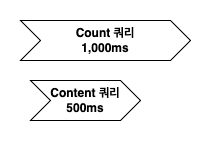
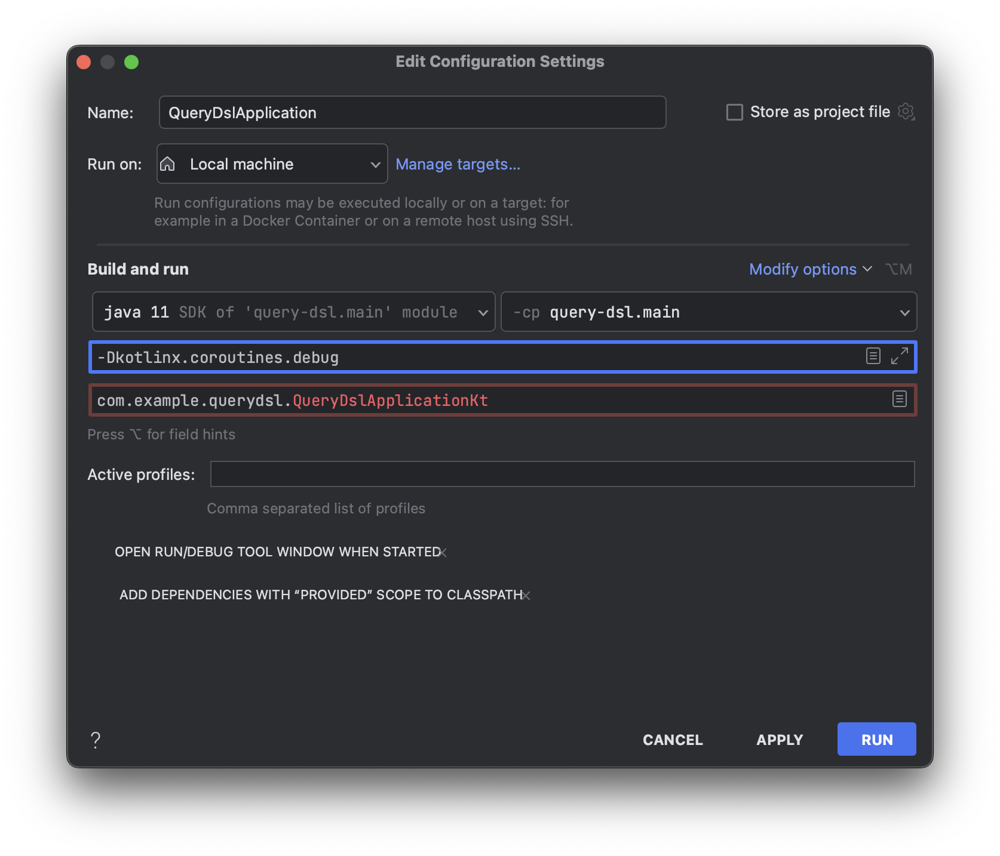

# JPA Paging Query

일반적으로 어드민 페이지와 같이 데이터를 테이블 뷰 형식으로 제공할 때, Paging 기법을 사용하여 현재 페이지의 내용과 페이지 정보를 표시합니다. JPA를 활용하면 이러한 반복적인 코드 작성을 보다 쉽게 처리할 수 있습니다.

데이터 모수가 적고 단순한 구조로 데이터를 보여주는 경우라면 JPA에서 제공해주는 방식으로 처리하는것이 효율적일 수있으나 데이터 모수가 많고 여러 테이블을 조인해서 표현해야하는 데이터 구조라면 성능 적인 이슈가 발생할 수 있습니다. 이러한 이슈와 성능 개선 방법에 대해 알아보겠습니다.

## Querydsl 페이징 처리 방식

데이터 모수가 적고 간단한 조회 구조를 가질 때, Querydsl의 applyPagination 메서드를 활용하면 페이징 로직을 더 쉽게 작성할 수 있습니다.

```kotlin
class OrderCustomRepositoryImpl : QuerydslRepositorySupport(Order::class.java), OrderCustomRepository {

    override fun findPagingBy(
        pageable: Pageable,
        address: String
    ): Page<Order> {
        val query: JPAQuery<Order> = from(order).select(order).where(order.address.eq(address))
        val content: List<Order> = querydsl.applyPagination(pageable, query).fetch()
        val totalCount: Long = query.fetchCount()
        return PageImpl(content, pageable, totalCount)
    }
}
```

[Spring-JPA Best Practices step-15 - Querydsl를 이용해서 Repository 확장하기 (1)](https://cheese10yun.github.io/spring-jpa-best-15/)에서 공유드린 QuerydslRepositorySupport를 기반으로 JpaRepository 확장시켜 페이징 로직을 구현했습니다.

세부 구현체에서는 조회 로직을 살펴 보게습니다. 이 과정에서 Querydsl를 기반으로 JPAQuery를 생성하며 필요한 조회 조건을 작성합니다. 그런 다음 해당 쿼리 객체를 이용하여 Content 조회와 전체 레코드 수 조회를 수행합니다. 마지막으로 각각의 실제 쿼리문을 확인하게 됩니다.

```
select order0_.id           as id1_4_,
       ...
       order0_.address      as address4_4_,
       order0_.created_at   as created_2_4_,
       order0_.updated_at   as updated_3_4_,
from orders order0_
where order0_.address = ?
limit ?, ?

select count(order0_.id) as col_0_0_
from orders order0_
where order0_.address = ?
```

Content 조회에 필요하 조회 쿼리와, 전체 레코드 조회에 필요한 쿼리를 JPAQuery를 통해 동일하게 사용이 가능하며, Querydsl의 applyPagination 메서드를 활용하여 offset 및 limit 관련 페이징 로직을 간단하게 구현할 수 있다는 큰 장점이 있습니다.

Querydsl의 applyPagination을 활용하면 페이징 조회 관련 로직을 간단하게 구현할 수 있어서 개발 생산성 측면에서 큰 이점이 있습니다. 그러나 모든 개발 결정 과정에서는 트레이드오프가 발생합니다. 모든 개발 결정 과정에서 편리한 기능을 즉시 활용할 수 있지만, 나중에는 추가 비용을 지불해야 하며 이 비용은 이자를 포함하여 청구될 수 있습니다.

어떤 문제가 발생하는지 살펴보겠습니다.

### Count 쿼리의 성능 문제

Count 쿼리는 특정 조건에 해당하는 전체 레코드 수를 조회하는 구조로, 데이터 총량이 증가하면 성능 저하가 발생할 수 있습니다. 반면 Content를 조회하는 limit 및 offset 쿼리는 빠르게 처리되지만(offset 비교적 크지 않은 초반 구간), Count 쿼리는 시간이 오래 걸려 병목 현상이 발생할 수 있습니다. 또한, 여러 테이블을 조인하여 데이터를 조회하는 경우에는 조회 조건이 복잡해져 정확한 인덱스를 타겟팅하기 어려운 이슈가 발생할 수 있습니다. 이는 조회 조건에 부합하는 전체 레코드를 Count하는 구조에서 필연적으로 발생할 수밖에 없는 문제입니다.

### Count 쿼리의 최적화 문제

이러한 문제 외에도 다른 문제가 있습니다. JPAQuery를 사용하여 Content 조회 쿼리와 레코드 Count 조회 쿼리를 동일하게 처리하면 성능적인 손해가 발생할 수 있습니다. 특히 여러 테이블을 조인하여 데이터를 조회하는 경우에 이 문제가 더 두드러집니다.


주문 조회 시에 사용자 및 쿠폰 정보와 함께 내려줘야 하는 경우, 조회 필터에 주문 정보만 있는 상황에서 Count 쿼리를 실행할 때, 다른 테이블의 조인 없이 주문에 대한 Count 쿼리를 작성하는 것이 효율적입니다.

```sql
-- Content 조회 쿼리
select o.*,
       u.*,
       c.*
from orders o
         left join coupon c on o.coupon_id = c.id
         inner join user u on o.user_id = u.id
where o.address = ? limit ?, ?
;

-- Count 조회 쿼리
select count(o.id) ascount
from orders o
where o.address = ?
;
```

주문 조회에서 address 필드만 조회 조건에 해당된다면, 사용자 및 쿠폰 테이블과의 조인은 필요하지 않습니다. 이 경우, Count 쿼리를 간단하게 주문 테이블만을 대상으로 작성하는 것이 효율적입니다. 조회 조건이 복잡해질 때, Count 쿼리를 별도로 작성하는 것은 성능적으로 장점을 가질 수 있습니다.

## Querydsl 페이징 성능 최적화 방법

블라 블라

### Slice 기반으로 Count 쿼리를 사용하지 않는 방법

JPA Slice 방식은 일반적인 Page 방식과는 다르게 Total Count를 조회하는 count 쿼리를 실행하지 않는 방식입니다. 이로 인해 조회 성능에 있어서 일정한 이점이 있습니다. 페이지네이션된 데이터를 불러올 때, 전체 데이터의 총 개수를 파악하지 않고도 일부 데이터를 가져올 수 있기 때문에, Total Count가 필요 없는 상황에서 사용하면 성능을 향상시킬 수 있습니다. Slice 방식은 특히 대용량 데이터의 페이징 처리에 유용합니다. 이렇게 Slice 방식은 Total Count를 구하지 않고도 효율적인 페이징 처리를 가능하게 합니다. Total Count가 꼭 필요한 데이터인지 비즈니스 적으로 확인해보고 꼭 필요한 데이터가 아니라면 사용하지 않는 것을 권장드립니다.

#### Slice 페이징 처리 방법

Spring Data에서는 Total Count가 없는 형식의 페이징 처리를 지원하기 Slice를 지원해주고 있습니다.

```kotlin
class OrderCustomRepositoryImpl : QuerydslRepositorySupport(Order::class.java), OrderCustomRepository {
    override fun findSliceBy(pageable: Pageable, address: String): Slice<Order> {
        val query: JPAQuery<Order> = from(order).select(order).where(order.address.eq(address))
        val content: List<Order> = querydsl.applyPagination(pageable, query).fetch()
        val hasNext: Boolean = content.size >= pageable.pageSize
        return SliceImpl(content, pageable, hasNext)
    }
}

```

Total Count가 필요 없기 때문에 생략 가능하며, 페이징 로직은 동일하게 `applyPagination`으로 진행하며 중요한 부분은 `hasNext`로 앞으로 더 읽을 데이터가 남아 있는지를 결정하는 변수입니다.

Order 데이터가 총 22개 있다고 가정하고 Page 0 ~ 4까지 Size 5개를 기준으로 조회 한다고 가정해 보겠습니다.

| Page | Size | Content | Last |
|------|------|---------|:-----|
| 0    | 5    | 5       | F    | 
| 1    | 5    | 5       | F    | 
| 2    | 5    | 5       | F    | 
| 3    | 5    | 5       | F    |
| 4    | 5    | 3       | T    |

Page 3까지는 Content가 설정한 크기만큼 반환되어 Last가 False 상태입니다. 그러나 Page 4에서는 남은 Content가 3개만 남아 있기 때문에 3개의 Content를 반환하고 Last가 True 상태로 변경됩니다. 이 방식은 코드로 작성하면 `content.size >= pageable.pageSize`로 표현됩니다.

이 방식은 Total Count를 알 수 없기 때문에 Last 여부를 확인하기 위해서는 끝까지 데이터를 읽어봐야 정확히 판단할 수 있습니다. 반면에 Slice가 아닌 Page 방식에서는 Total Count를 알고 있어 다음 페이지를 읽지 않아도 Last 여부를 정확히 판단할 수 있습니다.

Order 데이터가 총 22개 있다고 가정하고 동일한 Size를 가지는 Page 방식과 Slice 방식을 비교해보겠습니다.

| 방식       | Page | Size | Content | Total Count | Last |
|:---------|------|------|---------|:------------|:-----|
| Page 방식  | 0    | 22   | 22      | 22          | T    | 
| Slice 방식 | 0    | 22   | 22      | 알 수 없음      | F    |
| Slice 방식 | 0    | 23   | 22      | 알 수 없음      | T    |

Page 방식에서는 Total Count를 알고 있기 때문에 Content Size가 동일하다면 Last가 True로 판단할 수 있습니다. 반면에 Total Count을 모르는 Slice 방식에서는 다음 페이지까지 읽어보고 Content Size가 0인 것을 확인해야 Last가 True로 판단할 수 있습니다. Size를 23으로 조회하면 응답하는 Content는 22개로, 요청한 Size보다 Content가 작게 응답되므로 Last를 True로 판단할 수 있습니다.

이로 인해 발생하는 성능적인 차이를 언급하는 것은 아니며, Page 방식과 Slice 방식 간의 구조적인 차이를 설명하기 위해 이를 언급한 것입니다.

#### Slice 사용이 용이한 구간

테이블 뷰 형식으로 페이징 처리를 할 때, Total Count가 반드시 필요하지 않은 경우에는 대부분 Slice 방식을 활용하는 것이 효율적입니다. 예를 들어, 최근 주문 정보를 기반으로 회원 등급을 업데이트하는 배치 기능을 개발한다고 가정해보겠습니다. 이 경우에는 Count 쿼리를 사용할 필요가 없습니다. 단순히 필요한 데이터를 offset과 limit 방식으로 읽고 처리하기 때문에 Count 쿼리를 수행하지 않아도 됩니다. 더불어 Count 쿼리는 데이터 양에 상관없이 일정 시간이 걸리는데, 데이터 양이 많은 경우 Content 조회 쿼리보다 더 많은 시간이 소요됩니다. 그러므로 이 Count 쿼리를 계속 사용하는 것은 성능상의 부담을 가중시킬 수 있습니다.

[Spring Batch HTTP Page Item Reader](https://cheese10yun.github.io/spring-batch-http-page-item-reader/) 처럼 대량의 데이터를 처리하는 배치 애플리케이션에 API를 제공할 때는 Slice 기반으로 제공하는 것이 성능적으로 이점이 있습니다.

### Count 쿼리의 최적화 하여 개선

Total Count가 반드시 필요한 경우에는 Slice 방식을 사용할 수 없으므로 Page 방식을 사용해야 합니다. 또한, 위에서 언급한 대로 여러 테이블을 조인해서 복잡한 데이터를 조회하는 경우에는 Count 쿼리를 별도로 구현하는 것이 성능적인 이점을 가져올 수 있습니다.

이는 AbstractJPAQuery의 `fetchCount()`가 Deprecated된 이유 중 하나입니다. 조인이 많거나 복잡한 쿼리에서 fetchCount를 사용하면 성능 저하가 발생할 수 있기 때문에 다른 방식으로 count 쿼리를 실행하도록 권장하고 있습니다.

Count 쿼리를 별도로 구현하면 다음과 같이 구현할 수 있습니다.

```kotlin
class OrderCustomRepositoryImpl : QuerydslRepositorySupport(Order::class.java), OrderCustomRepository {
    override fun findPagingBy(pageable: Pageable, address: String): Page<Order> {
        val content: List<Order> = from(order)
            .select(order)
            .innerJoin(user).on(order.userId.eq(user.id))
            .leftJoin(coupon).on(order.couponId.eq(coupon.id))
            .where(order.address.eq(address))
            .run {
                querydsl.applyPagination(pageable, this).fetch()
            }
        val totalCount: Long = from(order)
            .select(order.count())
            .where(order.address.eq(address))
            .fetchFirst()

        return PageImpl(content, pageable, totalCount)
    }
}
```
PageImpl을 사용하여 Page 객체를 생성할 때, totalCount를 Content 쿼리와 별도로 구현하여 작성합니다. totalCount를 구할 때 SimpleExpression의 `count()`를 사용하여 질의합니다. 이러한 최종 쿼리를 살펴보겠습니다.

```sql
-- Content 쿼리
select order0_.id           as id1_4_,
       order0_.created_at   as created_2_4_,
       order0_.updated_at   as updated_3_4_,
       order0_.address      as address4_4_,
       order0_.coupon_id    as coupon_i5_4_,
       order0_.order_number as order_nu6_4_,
       order0_.user_id      as user_id7_4_
from orders order0_
         inner join user user1_ on (order0_.user_id = user1_.id)
         left outer join coupon coupon2_ on (order0_.coupon_id = coupon2_.id)
where order0_.address = ? limit ?, ?
;

-- Count 쿼리
select count(order0_.id) as col_0_0_
from orders order0_
where order0_.address = ? limit ?
;
```
Content 쿼리는 Content에 필요한 정보를 여러 테이블의 조인을 통해 가져오며, Count 쿼리는 조회 조건에 필요한 정보만 가져옵니다. 이때 `fetchCount()`가 Deprecated 되었기 때문에 `fetchFirst()`로 대체합니다. 이렇게 Count 쿼리를 따로 구현하면 Count 조건에 맞는 방식으로 최적화하여 성능적인 이점을 얻을 수 있습니다.

### Count 쿼리와 Content 쿼리 병렬 처리하여 개선 방법


Count 쿼리가 1,000ms가 소요되고, 이후 Content 쿼리가 500ms 소요된다고 가정하면 총 1,500ms가 소요됩니다. 이 작업을 전체 데이터를 읽을 때마다 반복하면 성능상 문제가 발생할 수 있습니다. 그러나 이 두 작업은 서로 의존성이 없기 때문에 병렬로 처리할 수 있습니다.



Count 쿼리와 Content 쿼리를 병렬로 처리하면 Count 쿼리가 소요 시간이 더 길어도 1,000ms에 작업을 완료할 수 있습니다. 병렬 처리를 코루틴을 활용하여 구현해보겠습니다.

#### 코루틴을 이용한 Count 쿼리와 Content 쿼리 병렬 처리

```kotlin
class OrderCustomRepositoryImpl : QuerydslRepositorySupport(Order::class.java), OrderCustomRepository {
    override fun findPagingBy(pageable: Pageable, address: String): Page<Order> = runBlocking {
        log.info("findPagingBy thread : ${Thread.currentThread()}")
        val content: Deferred<List<Order>> = async {
            log.info("content thread : ${Thread.currentThread()}")
            from(order)
                .select(order)
                .innerJoin(user).on(order.userId.eq(user.id))
                .leftJoin(coupon).on(order.couponId.eq(coupon.id))
                .where(order.address.eq(address))
                .run {
                    querydsl.applyPagination(pageable, this).fetch()
                }
        }
        val totalCount: Deferred<Long> = async {
            log.info("count thread : ${Thread.currentThread()}")
            from(order)
                .select(order.count())
                .where(order.address.eq(address))
                .fetchFirst()
        }

        PageImpl(content.await(), pageable, totalCount.await())
    }
}
```
코루틴의 `async`와 `await`를 활용하여 Content 쿼리와 Count 쿼리를 병렬로 처리하였습니다. 이 과정에서 스레드 정보를 확인하기 위해 `Thread.currentThread()`를 사용하여 현재 스레드 정보를 출력합니다.

```
INFO [nio-8080-exec-1] c.e.querydsl.repository.order.OrderApi   : thread api : Thread[http-nio-8080-exec-1,5,main]
INFO [-1 @coroutine#1] c.e.q.r.order.OrderCustomRepositoryImpl  : findPagingBy thread : Thread[http-nio-8080-exec-1 @coroutine#1,5,main]
INFO [-1 @coroutine#2] c.e.q.r.order.OrderCustomRepositoryImpl  : content thread : Thread[http-nio-8080-exec-1 @coroutine#2,5,main]
INFO [-1 @coroutine#3] c.e.q.r.order.OrderCustomRepositoryImpl  : count thread : Thread[http-nio-8080-exec-1 @coroutine#3,5,main]
```

OrderApi의 `exec-1` 요청 스레드를 기준으로 `findPagingBy`, `content`, `count` 스레드가 동일한 스레드를 사용하는 것을 확인할 수 있습니다. 이것은 `@coroutine#` 주석에서 볼 수 있듯이 한 스레드 내에서 여러 코루틴을 실행할 수 있는 구조를 의미합니다.



VM Option에 `-Dkotlinx.coroutines.debug`을 추가하면 실행 중인 코루틴이 어떤 스레드에서 실행되는지를 확인할 수 있습니다.


#### 코루틴을 이용한 Count 쿼리와 Content 쿼리 병렬 처리 테스트

Count 쿼리에는 `delay(1_000)`이 주어서 1초 동안 대기하며, Content 쿼리에는 `delay(500)`이 주어서 0.5초 동안 대기하면서 테스트를 진행합니다.

```kotlin
@Test
fun `count 1,000ms, content 500ms delay test`() = runBlocking {
    val time = measureTimeMillis {
        orderRepository.findPagingBy(
            pageable = PageRequest.of(0, 10),
            address = "address"
        )
    }
    println("${time}ms") // 1037ms
}
```
소요 시간은 1037ms으로 정상적으로 병렬 처리가 되는 것을 확인할 수 있습니다. 


## Support 객체를 통한 Querydsl 페이징 로직 개선 

Slice, Page 등과 같은 페이징 처리를 위한 중복 로직을 피하고 편리하게 사용하기 위해 해당 기능을 Support 객체에 관련 로직을 위임 시키겠습니다. [Querydsl Repository Support 활용](https://cheese10yun.github.io/querydsl-support/)에서 소개한 QuerydslRepositorySupport를 기반으로 해당 기능을 한 번 더 감싸는 QuerydslCustomRepositorySupport 클래스에서 페이징 로직을 작성하겠습니다.

```kotlin
abstract class QuerydslCustomRepositorySupport(domainClass: Class<*>) : QuerydslRepositorySupport(domainClass) {

    protected var queryFactory: JPAQueryFactory by Delegates.notNull()

    @PersistenceContext
    override fun setEntityManager(entityManager: EntityManager) {
        super.setEntityManager(entityManager)
        this.queryFactory = JPAQueryFactory(entityManager)
    }

    protected fun <T> select(expr: Expression<T>): JPAQuery<T> {
        return queryFactory.select(expr)
    }

    protected fun <T> selectFrom(from: EntityPath<T>): JPAQuery<T> {
        return queryFactory.selectFrom(from)
    }

    protected fun from(path: EntityPath<*>): JPAQuery<*> {
        return queryFactory.from(path)
    }

    protected fun <T> applyPagination(
        pageable: Pageable,
        contentQuery: Function<JPAQueryFactory, JPAQuery<T>>,
        countQuery: Function<JPAQueryFactory, JPAQuery<Long>>
    ): Page<T> = runBlocking {
        val jpaContentQuery = contentQuery.apply(queryFactory)
        val content = async { querydsl!!.applyPagination(pageable, jpaContentQuery).fetch() as List<T> }
        val count = async { countQuery.apply(queryFactory).fetchFirst() }

        PageImpl(content.await(), pageable, count.await())
    }

    protected fun <T> applySlicePagination(
        pageable: Pageable,
        query: Function<JPAQueryFactory, JPAQuery<T>>
    ): Slice<T> {
        val jpaContentQuery = query.apply(queryFactory)
        val content = querydsl!!.applyPagination(pageable, jpaContentQuery).fetch()
        val hasNext = content.size >= pageable.pageSize
        return SliceImpl(content, pageable, hasNext)
    }
}
```
* `queryFactory`에서 제공하는 `selectFrom` 및 `select` 기능도 통합하여 DSL 표현을 보다 다양하게 활용할 수 있도록 합니다.
* `applyPagination` 메서드는 페이징 처리를 위해 `Pageable` 객체와, Content 쿼리를 위한 `contentQuery`, Count 쿼리를 위한 `countQuery` 객체를 입력으로 받아서 코루틴을 활용하여 병렬 처리를 수행합니다.
* `applySlicePagination` 메서드는 Content 쿼리만을 수행하기 때문에 `query` 객체만을 입력으로 받고, content 조회와 `hasNext` 로직을 작성합니다.

```kotlin

class OrderCustomRepositoryImpl : QuerydslCustomRepositorySupport(Order::class.java), OrderCustomRepository {
    // Slice 로직 AS-IS
    override fun findSliceBy(
        pageable: Pageable,
        address: String
    ): Slice<Order> {
        val query: JPAQuery<Order> = from(order).select(order).where(order.address.eq(address))
        val content: List<Order> = querydsl!!.applyPagination(pageable, query).fetch()
        val hasNext: Boolean = content.size >= pageable.pageSize
        return SliceImpl(content, pageable, hasNext)
    }

    override fun findSliceBy2(pageable: Pageable, address: String): Slice<Order> {
        return applySlicePagination(
            pageable = pageable,
            query = {
                selectFrom(order).where(order.address.eq(address))
            }
        )
    }

    // Page 로직 AS-IS
    override fun findPagingBy(
        pageable: Pageable,
        address: String
    ): Page<Order> = runBlocking {
        val content: Deferred<List<Order>> = async {
            from(order)
                .select(order)
                .innerJoin(user).on(order.userId.eq(user.id))
                .leftJoin(coupon).on(order.couponId.eq(coupon.id))
                .where(order.address.eq(address))
                .run {
                    querydsl!!.applyPagination(pageable, this).fetch()
                }
        }
        val totalCount: Deferred<Long> = async {
            from(order)
                .select(order.count())
                .where(order.address.eq(address))
                .fetchFirst()
        }

        PageImpl(content.await(), pageable, totalCount.await())
    }

    // Page 로직 TO-BE
    override fun findPaging(
        pageable: Pageable,
        address: String
    ): Page<Order> {
        return applyPagination(
            pageable = pageable,
            contentQuery = { selectFrom(order).where(order.userId.isNotNull) },
            countQuery = { select(order.count()).from(order).where(order.userId.isNotNull) },
        )
    }
    
}
```
`QuerydslCustomRepositorySupport` 객체를 상속받아 `applyPagination`과 `applySlicePagination` 로직을 작성합니다. 페이징 로직에 대한 처리는 모두 `QuerydslCustomRepositorySupport`로 위임되며, 각 Repository에서는 해당하는 쿼리만 작성하면 되는 구조로 코드가 훨씬 더 간결해졌습니다.