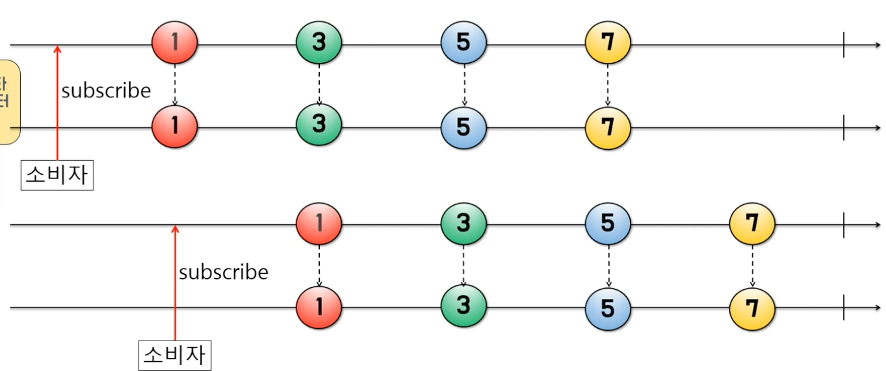
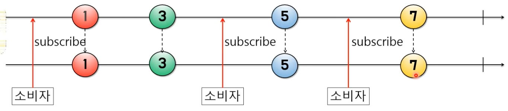
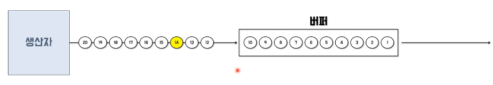
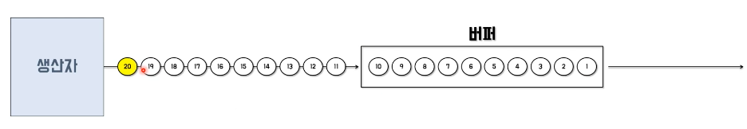

# 리액티브 프로그래밍 이란?

## 정의
**변화의 전파**와 **데이터 흐름**과 관련된 **선언적 프로그래밍** 패러다임이다.

* 변화의 전파와 데이터 흐름: 데이터가 변경 될 떄마다 이벤트를 발생시켜 데이터를 계속적으로 전달 한다
* 선언적 프로그래밍: 실행할 동작을 구체적으로 명시하는 프로그래밍과 달리 선언형 프로그래밍은 단순히 목표를 선언한다.

```java
class Test {
    @Test
    void 선언형프로그래밍() {
        // List에 있는 숫자들 중에 6보다 큰 홀수들의 합계를 구하시오
        final List<Integer> numbers = Arrays.asList(1, 3, 21, 10, 8, 11);
        int sum = 0;

        for (Integer number : numbers) {
            if (number > 6 && (number % 2 != 0)) {
                sum += number;
            }
        }

        System.out.println("명령형 프로그래밍 사용 : " + sum);
    }

    @Test
    void 선언적프로그래밍() {
        // List에 있는 숫자들 중에 6보다 큰 홀수들의 합계를 구하시오
        final List<Integer> numbers = Arrays.asList(1, 3, 21, 10, 8, 11);

        final int sum = numbers.stream()
            .filter(number -> number > 6 && (number % 2 != 0))
            .mapToInt(number -> number)
            .sum();

        System.out.println("명령형 프로그래밍 사용 : " + sum);
    }
}
```

## 리액티브의 개념이 적용된 예

### Push 방식
데이터의 변화가 발생했을 때 변경이 발생한 곳에서 데이터를 보내주는 방식

* RTC
* 소켓 프로그래밍
* DB Trigger
* Spring ApplicationEvent
* 스마트폰의 Push 메시지

### Pull 방식
변경된 데이터가 있는지 요청을 보내고 질의하고 변경된 데이터를 가져오는 방식
*  클라이언트 요청 & 서버 응답 방식의 애플리케이션
* Java와 같은 절차형 프로그래밍 언어

## 리엑티브 프로그래밍을 위해 알아야 될 것들
* Observable: 데이터 소스
* 리액티브 연산자: 데이터 소스를 처리하는 함수
* 스케줄러: 스레드 관리자
* Subscriber: Observable이 발행하는 데이터를 구독하는 구독자
* 함수형 프로그래밍: RxJava에서 제공하는 연산자 함수를 사


```java
@Test
void 리액티브프로그래밍() throws InterruptedException {
    Observable.just(100, 200, 300, 400, 500)
//        .doOnNext(data -> System.out.println(getThreadNAme() + " : doOnNext() :" + data))
//        .subscribeOn(Schedulers.io())
//        .observeOn(Schedulers.computation())
        .filter(number -> number > 300)
        .subscribe(num -> System.out.println(getThreadNAme() + " : result : " + num));

//    Thread.sleep(500);

// 결과
//Test worker : result : 400
//Test worker : result : 500
}
```
* `just`를 통해서 데이터를 발행한다
* `filter`를 통해서 300 이상인 것을 필터링한다고 선언한다
* `subscribe` 발행된 데이터, 필터링된 데이터를 출력한다.
* 데이터를 발행- > 데이터를 가공 -> 데이터를 구독해서 처리
* `Test worker` 쓰레드에서 실행된다.

```java
@Test
void 리액티브프로그래밍() throws InterruptedException {
    Observable.just(100, 200, 300, 400, 500)
        .doOnNext(data -> System.out.println(getThreadNAme() + " : doOnNext() :" + data))
//            .subscribeOn(Schedulers.io())
//            .observeOn(Schedulers.computation())
        .filter(number -> number > 300)
        .subscribe(num -> System.out.println(getThreadNAme() + " : result : " + num));

    Thread.sleep(500);

//   Test worker : doOnNext() :100
//   Test worker : doOnNext() :200
//   Test worker : doOnNext() :300
//   Test worker : doOnNext() :400
//   Test worker : result : 400
//   Test worker : doOnNext() :500
//   Test worker : result : 500
}
```
* 동일하게 `Test worker` 스레드에서 실
* `doOnNext()` 데이터가 발행될 떄마다 실행된다.

```java
@Test
void 리액티브프로그래밍() throws InterruptedException {
    Observable.just(100, 200, 300, 400, 500)
        .doOnNext(data -> System.out.println(getThreadNAme() + " : doOnNext() :" + data))
        .subscribeOn(Schedulers.io())
//            .observeOn(Schedulers.computation())
        .filter(number -> number > 300)
        .subscribe(num -> System.out.println(getThreadNAme() + " : result : " + num));

//        Thread.sleep(500);
//   RxCachedThreadScheduler-1 : doOnNext() :100
//   RxCachedThreadScheduler-1 : doOnNext() :200
//   RxCachedThreadScheduler-1 : doOnNext() :300
//   RxCachedThreadScheduler-1 : doOnNext() :400
//   RxCachedThreadScheduler-1 : result : 400
//   RxCachedThreadScheduler-1 : doOnNext() :500
//   RxCachedThreadScheduler-1 : result : 500

}
```
* `subscribeOn()`를 실행하게되면 `RxCachedThreadScheduler` 스레드에서 실행된다.

```java
@Test
void 리액티브프로그래밍() throws InterruptedException {
    Observable.just(100, 200, 300, 400, 500)
        .doOnNext(data -> System.out.println(getThreadNAme() + " : doOnNext() :" + data))
        .subscribeOn(Schedulers.io())
        .observeOn(Schedulers.computation())
        .filter(number -> number > 300)
        .subscribe(num -> System.out.println(getThreadNAme() + " : result : " + num));

//        Thread.sleep(500);
//   RxCachedThreadScheduler-1 : doOnNext() :100
//   RxCachedThreadScheduler-1 : doOnNext() :200
//   RxCachedThreadScheduler-1 : doOnNext() :300
//   RxCachedThreadScheduler-1 : doOnNext() :400
//   RxCachedThreadScheduler-1 : doOnNext() :500
//   RxComputationThreadPool-1 : result : 400
//   RxComputationThreadPool-1 : result : 500
}
```
* `subscribeOn()` 데이터의 발행, 데이터의 흐름을 결정하는 스레드
* `observeOn()` 발행된 데이터를 가공하고, 구독 해서 처리하는 것을 담당하는 스레
* 데이터를 발행 -> 데이터 가공 -> 데이터 구독

# 마블 다이어그램이란?
리액티브 프로그래밍을 통해 발생하는 비동기적인 데이터의 흐름을 시각의 흐름에 따라 시각적으로 표시시한 다어그램

## 마블 다이어그램을 알아야하는 이유
* 문장으로 적혀 있는 리액티브 연산자의 기능을 이해하기 어려움
* 리액티브 연산자의 기능이 시각화 되어 있어서 이해하기 쉬움
* 리액티브 프로그래밍의 핵심 연산자를 사용하기 위한 핵심 도구

# Reactive Streams란 ?

* 리액티브 프로그래밍 라이브러리의 표준 사양이다
* RxJava는 Reactive Streams의 인터페이스들을 구현한 구현체이다.
* Reactive Streams는 Publisher, Subscriber, Subscription, Processor 라는 4개의 인터페이스를 제공한다.
    * Publisher: 데이터를 생성하고 통지한다.
    * Subscriber: 통지된 데이터를 전달받아서 처리한다.
    * Subscription: 전달 받을 데이터의 개수를 요청하고 구독을 해지한다.
    * Processor: Publisher, Subscriber의 기능이 모두 있

## Publisher와 Subscriber간의 프로세스 흐름
```plantuml
Publisher <-- Subscriber: 데이터를 구독한다. Subscribe
Publisher --> Subscriber: 데이터를 통지할 준비가 되었음을 알린다. OnSubscribe
Publisher <-- Subscriber: 전달 받은 통지 데이터 개수를 요청한다. Subscription.request
Publisher --> Publisher: 데이터를 생성한다.
Publisher --> Subscriber: 요청 받은 개수만큼 데이터를 총지한다. OnNext
Publisher --> Publisher: 데이터를 생성한다.
Publisher --> Publisher: 데이터를 생성한다.
Publisher <-- Subscriber: 전달 받을 통지 데이터 개수를 요청한다. Subscription.request
Publisher --> Subscriber: 요청 받은 개수만큼 데이터를 통지한다. OnNext
Publisher --> Subscriber: 데이터 통지가 완료 되었음을 알린다. OnComplete
```

## Cold Publisher & Hot Publisher

### Cold Publisher


* 생산자는 소비자가 구독 할떄마다 데이터를 처음부터 새로 통지한다.
* 데이터를 통지하는 새로운 타임 라인이 생성된다.
* 소비자는 구독 시점과 상관없이 통지된 데이터를 처음부더 전달 받을 수 있다.
* Flowable, Observable이 대표적인 Cold Publisher

```java
@Test
void Cold_Publisher_Example() {
    Flowable<Integer> flowable = Flowable.just(1, 3, 4, 7);

    flowable.subscribe(data -> System.out.println("구독자1: " + data));
    flowable.subscribe(data -> System.out.println("구독자2: " + data));
}

// 구독자1: 1
// 구독자1: 3
// 구독자1: 4
// 구독자1: 7
// 구독자2: 1
// 구독자2: 3
// 구독자2: 4
// 구독자2: 7
```
* 구독 순서와 상관 없이 

### Hot Publisher


* 생상자는 소비자 수와 상관없이 데이터를 한번만 통지한다
* 즉, 데이터를 통지하는 타임 라인은 하나이다.
* 소비자는 발행된 데이터를 처음부터 전달 받은게 아니라 구독한 시점에 통지된 데이터들만 전달 받을 수있다.

```java
@Test
void Hot_Publisher_Example() {
    PublishProcessor<Integer> processor = PublishProcessor.create();

    processor.subscribe(data -> System.out.println("구독자1: " + data));
    processor.onNext(1);
    processor.onNext(3);

    processor.subscribe(data -> System.out.println("구독자2: " + data));
    processor.onNext(4);
    processor.onNext(7);

    processor.onComplete();

//   구독자1: 1
//   구독자1: 3
//   구독자1: 4
//   구독자2: 4
//   구독자1: 7
//   구독자2: 7
}
```

# Flowable & Observable

| Flowable                                                 | Observable                                            |
| -------------------------------------------------------- | ----------------------------------------------------- |
| Reactive Streams 인터페이스를 구현함                     | Reactive Streams 인터페이스를 구현하지 않음           |
| Subscriber에서 데이터츷 처리한다.                        | Observer에서 데이터를 처리한다.                       |
| 데이터 개수를 제어하는 배압이 가능이 있음                | 데이터 개수를 제어하는 배압이 기능이 없음             |
| Subscription으로 전달 받은 데이터 개수를 제어할 수 있다. | 배갑 기능이 없기 떄문에 데이터 개수를 제어할 수 없다. |
| Subscription으로 구독을 해지한다.                        | Disposable로 구독을해지한다                           |

## 배압(Back Pressure)이란?


Flowable에서 데이터를 통지하는 속다가 Subscriber에서 통지된 데이터를 전달받아 처리하는 속도 보다 빠를 때 밸런스를 맞추기 위해 데이터 통지량을 제어하는 기능을 말한다.

### 배압 기능이 없는 경우

```java
@Test
void missing_back_pressure() throws InterruptedException {
    Flowable.interval(1L, TimeUnit.MILLISECONDS)
        .doOnNext(data -> Logger.log(LogType.DO_ON_NEXT, data))
        .observeOn(Schedulers.computation())
        .subscribe(
            data -> {
                Logger.log(LogType.PRINT, "# 소비자 처리 대기 중..");
                TimeUtil.sleep(1000L);
                Logger.log(LogType.ON_NEXT, data);
            },
            error -> Logger.log(LogType.ON_ERROR, error),
            () -> Logger.log(LogType.ON_COMPLETE)
        );

    Thread.sleep(2000L);
}
doOnNext() | RxComputationThreadPool-2 | 00:24:14.790 | 0
doOnNext() | RxComputationThreadPool-2 | 00:24:14.794 | 1
doOnNext() | RxComputationThreadPool-2 | 00:24:14.795 | 2
print() | RxComputationThreadPool-1 | 00:24:14.794 | # 소비자 처리 대기 중..
...

onNext() | RxComputationThreadPool-1 | 00:24:15.796 | 0
onERROR() | RxComputationThreadPool-1 | 00:24:15.796 | io.reactivex.exceptions.MissingBackpressureException: Can't deliver value 128 due to lack of requests
```
`doOnNext()`는 `interval()`에서 통지하는 데이터를 처리하는 Callback 함수

생산자 쪽에서 통지한 첫 번쨰 데이터만 처리 `onNext() | RxComputationThreadPool-1 | 00:24:15.796 | 0` 하고 `onERROR() | RxComputationThreadPool-1 | 00:24:15.796 | io.reactivex.exceptions.MissingBackpressureException: Can't deliver value 128 due to lack of requests`예외가 발생, 생사자 쪽에서 통지하는 속도가 소비자에서 처리하는 속도 보다 빠르기 때문에 예외가 발생한다. 이러한 불균형을 처리하기 위해서 배압전략을 지원한다

## 배압 전략
RxJava에서는 BackpressureStrategy를 통해서 Flowable이 통지 대기 중 데이터를 어떻게 다룰지에 대한 배압 전략을 제공한다.

### Missing 전략
* 배압을 적용하지 않는다.
* 나중에 `OnBackpressureXXX()`로 배압 적용을 할 수 있다.

### Error 전략
* 통지된 데이터가 버퍼의 크기를 초과하면 `MissingBackpressureException` 에러를 통지한다.
* 즉, 소비자가 생산자의 ㅗㅇ지 속도를 따라 잡지 못할 떄 발생한다.

### Buffer 전략

#### Drop Latest

* 버퍼가 가득 찬 시점에 가장 먼저 Drop이 된 데이터를 기억해두었다가 버퍼를 비우게되면 기억해둔 데이터부터 버퍼에 담는다.
* `10` 까지 버퍼에 들어간 경우 `11` 부터 데이터를 `drop` 하게된다. 이후 해당 버퍼가 모두 비워지면 `11`부터(drop된 순서 부터) 차례대로 진행된다.

```java
@Test
void back_pressure_drop() {
    Flowable.interval(1L, TimeUnit.MILLISECONDS)
        .onBackpressureBuffer(
            128,
            () -> Logger.log(LogType.PRINT, "# Overflow 발생!"),
            BackpressureOverflowStrategy.DROP_LATEST
        )
        .doOnNext(data -> Logger.log(LogType.DO_ON_NEXT, data))
        .observeOn(Schedulers.computation())
        .subscribe(
            data -> {
                TimeUtil.sleep(5L);
                Logger.log(LogType.ON_NEXT, data);
            },
            error -> Logger.log(LogType.ON_ERROR, error)
        );

    TimeUtil.sleep(1000L);
}
```
* 생산자 쪽에서는 `interval()`를 통해서 `1 MILLISECONDS` 주기로 0 부터 숫자를 차례대로 빠르게 통지함
* `onBackpressureBuffer()`
    * `128` 버퍼의 사이즈를 의미, Default value 128
    * 버퍼가 가득 찼을때 호출되는 Callback 함수
    * 버퍼가 가득 찼을때 사용할 전략 
* `subscribe()`
    * 구독하는 소비자 쪽에서는 `5 MILLISECONDS` 대기 시간을 갖으면서, 생산자 쪽에서 전달받은 데이터를 처리를 진행한다.
    * 속도의 차이가 있기 떄문에 배압 전략이 필요하다
    
```
doOnNext() | RxComputationThreadPool-2 | 00:43:25.340 | 0
doOnNext() | RxComputationThreadPool-2 | 00:43:25.343 | 1
doOnNext() | RxComputationThreadPool-2 | 00:43:25.343 | 2
...
onNext() | RxComputationThreadPool-1 | 00:43:25.348 | 0
...
onNext() | RxComputationThreadPool-1 | 00:43:25.585 | 40
print() | RxComputationThreadPool-2 | 00:43:25.586 | # Overflow 발생!
print() | RxComputationThreadPool-2 | 00:43:25.587 | # Overflow 발생!
...
onNext() | RxComputationThreadPool-1 | 00:43:25.898 | 95
doOnNext() | RxComputationThreadPool-1 | 00:43:25.898 | 128
```
1. 생산하는 쪽의 속도가 구독하는 쪽의 속도보다 훨씬 빠름, `doOnNext()`은 여러번 호출되지만, `onNext()`는 호출 횟수가 낮음
2. 버퍼가 가득 차는 시점에 `# Overflow 발생!`이 발생, buffe size는 `128`이지만, 버퍼가 비워지는 실제 사이지는 `95`
3. `95`까지 구독 처리를 완료한 이후 버퍼가 지워짐, `buffer size 128`이기 때문에 가장 먼저 drop된 `128`부 buffer에 채워지게 된다. 

#### Drop Oldest


* 버퍼가 가득 찬 시점에서 가장 마지막에 Drop된 데이터를 기억해두었다가 버퍼를 비우게되면 기억해둔 데이터부터 버퍼에 담는다.
* `1 ~ 10` 버퍼 크기가 가득 찼다면, 통지된 데이터들은 뒤에 쌓이게 된다.
* 버퍼가 비워질때 까지 기다리다가 버퍼가 비워지면 가장 마지막에 Drop된 `14`번부터 차례대로 버퍼에 담긴다.
* `11 ~ 13`까지 데이터의 손실이 생긴다.

```java
@Test
void back_pressure_drop_oldest() {
    Flowable.interval(1L, TimeUnit.MILLISECONDS)
        .onBackpressureBuffer(
            128,
            () -> Logger.log(LogType.PRINT, "# Overflow 발생!"),
            BackpressureOverflowStrategy.DROP_OLDEST
        )
        .doOnNext(data -> Logger.log(LogType.DO_ON_NEXT, data))
        .observeOn(Schedulers.computation())
        .subscribe(
            data -> {
                TimeUtil.sleep(5L);
                Logger.log(LogType.ON_NEXT, data);
            },
            error -> Logger.log(LogType.ON_ERROR, error)
        );

    TimeUtil.sleep(1000L);
}
```
* 생산자 쪽에서는 `interval()`를 통해서 `1 MILLISECONDS` 주기로 0 부터 숫자를 차례대로 빠르게 통지함
* `onBackpressureBuffer()`를 통해서 `DROP_OLDEST` 전략을 지정, Orverflow가 발생했을 경우 처리할 Callback 메서드 지정
* `doOnNext()` 생산자 쪽에서 통지한 데이터를 그대로 출력
* `subscribe` 생상자 쪽에서 통지한 데이터를 구독해서 처리함

```
doOnNext() | RxComputationThreadPool-2 | 01:17:56.609 | 0
doOnNext() | RxComputationThreadPool-2 | 01:17:56.612 | 1
doOnNext() | RxComputationThreadPool-2 | 01:17:56.612 | 2
...
onNext() | RxComputationThreadPool-1 | 01:17:56.618 | 0
...
doOnNext() | RxComputationThreadPool-2 | 01:17:56.724 | 127
...
print() | RxComputationThreadPool-2 | 01:17:56.853 | # Overflow 발생!
...
onNext() | RxComputationThreadPool-1 | 01:17:57.152 | 95
doOnNext() | RxComputationThreadPool-1 | 01:17:57.152 | 428
doOnNext() | RxComputationThreadPool-1 | 01:17:57.152 | 429
doOnNext() | RxComputationThreadPool-1 | 01:17:57.152 | 430
...
```
1. 통지한 데이터를 출력
2. 버퍼 사이즈를 128으로 지정했기 때문에 `0 ~ 127`까지 버퍼에 채워짐
3. `128` 부터 Overflow가 계속 발 `95`까지 데이터를 통지한 데이터를 구독해서 처리
4. `Drop Oldest`전략이기 떄문에 가장 마지막에 발생한 `Overflow 발생!` 이후 통지한 데이터 `428` 부터 차례대로 버퍼에 쌓기 시작함
5. `127 ~ 427` 통지한 데이터는 유실이 발생

### Drop


* 버퍼에 데이터가 모두 채워진 상태가 되면 이후에 생성되는 데이터를 버리고(Drop), 버퍼가 비워지는 시점에 Drop되지 않은 데이터 부터 다시 버퍼에 담는다.
* `1 ~ 10` 버퍼 크기가 가득 찼다면, 통지된 데이터들은 뒤에 쌓이게 된다.
* 버퍼가 비워질때 까지 기다리다가 버퍼가 비워지면 Drop이 데이터는 모두 버리 Drop이 되지 않은 데이터 부터 버퍼에 채운다.
* `Drop Oldest`같은 경우 마지막에 Drop된 데이터 `14`부터 들어가게 되기 떄문에 차이가 있다.

```java
@Test
void back_pressure_drop() {
    Flowable.interval(1L, TimeUnit.MILLISECONDS)
        .onBackpressureDrop(dropData -> Logger.log(LogType.PRINT, "오버플로우 발생! - " + dropData + " Drop!"))
        .doOnNext(data -> Logger.log(LogType.ON_NEXT, data))
        .observeOn(Schedulers.computation())
        .subscribe(
            data -> {
                TimeUtil.sleep(5L);
                Logger.log(LogType.ON_NEXT, data);
            }
        );

    TimeUtil.sleep(1000L);
}
```

```
onNext() | RxComputationThreadPool-2 | 01:44:50.547 | 0
onNext() | RxComputationThreadPool-2 | 01:44:50.550 | 1
onNext() | RxComputationThreadPool-2 | 01:44:50.550 | 2
...
onNext() | RxComputationThreadPool-1 | 01:44:50.556 | 0
...
onNext() | RxComputationThreadPool-2 | 01:44:50.662 | 127
print() | RxComputationThreadPool-2 | 01:44:50.664 | 오버플로우 발생! - 128 Drop!
...

onNext() | RxComputationThreadPool-1 | 01:44:51.095 | 95
onNext() | RxComputationThreadPool-2 | 01:44:51.095 | 560
onNext() | RxComputationThreadPool-2 | 01:44:51.097 | 561
...

```
1. 통지한 데이터를 출력
2. 버퍼 사이즈를 128으로 지정했기 때문에 `0 ~ 127`까지 버퍼에 채워짐
3. `128` 부터 Overflow가 계속 발생 `95`까지 데이터를 통지한 데이터를 구독해서 처리
4. `Drop`전략이기 떄문에 Drop된 데이터는 제거 이후 통지된 데이터 `540` 부터 버퍼에 차례대로 쌓기 시작함

### Latest 전략



* 버퍼에 데이터가 모두 채워진 상태가 되면 버퍼가 비워질 때 까지 통지된 데이터는 버퍼 밖에서 대기하며 버퍼가 비워지는 시점에 가장 가장 최근 통지된 데이터 부터 버퍼에 담는다.
* `1 ~ 10` 버퍼가 가득찼다면, 가장 나중에 통지된 `20` 데이터 부터 버퍼 채워지게 된다.

```java
@Test
void back_pressure_latest() {
    Flowable.interval(1L, TimeUnit.MILLISECONDS)
        .onBackpressureLatest()
        .doOnNext(data -> Logger.log(LogType.DO_ON_NEXT, data))
        .observeOn(Schedulers.computation())
        .subscribe(
            data -> {
                TimeUtil.sleep(5L);
                Logger.log(LogType.ON_NEXT, data);
            },
            error -> Logger.log(LogType.ON_ERROR, error)
        );

    TimeUtil.sleep(1000L);
}
```

```
doOnNext() | RxComputationThreadPool-2 | 01:55:33.720 | 0
doOnNext() | RxComputationThreadPool-2 | 01:55:33.724 | 1
...
onNext() | RxComputationThreadPool-1 | 01:55:33.729 | 0
...
doOnNext() | RxComputationThreadPool-2 | 01:55:33.836 | 127
...
onNext() | RxComputationThreadPool-1 | 01:55:34.288 | 95
doOnNext() | RxComputationThreadPool-1 | 01:55:34.288 | 579

...
```
* `127`까지 통지하게 되면 버퍼가 가득차게됨
* 소비자 측에서는 `95`까지 전달 받은 데이터를 처리 하고 버퍼가 지워지게
* 버퍼가 지워지는 시점에 가장 마지막에 통지된 데이터가 `579`이기 때문에 처리

## Flowable

```java
@Test
void flow_able_example() throws InterruptedException {
    Flowable<String> flowable = Flowable.create(
        new FlowableOnSubscribe<String>() {
            @Override
            public void subscribe(FlowableEmitter<String> emitter) throws Exception {
                String[] datas = {"Hello", "RxJava"};
                for (final String data : datas) {
                    // 구독이 해지되면 처리 중단
                    if (emitter.isCancelled()) {
                        return;
                    }
                    // 데이터 통지
                    emitter.onNext(data);
                }
                emitter.onComplete();
            }
        },
        BackpressureStrategy.BUFFER
    );

    flowable.observeOn(Schedulers.computation())
        .subscribe(new Subscriber<String>() {
            // 데이터 개수 요청 및 구독을 취소하기 위한 객체 
            private Subscription subscription;

            @Override
            public void onSubscribe(Subscription subscription) {
                this.subscription = subscription;
                this.subscription.request(Long.MAX_VALUE);
            }

            @Override
            public void onNext(String data) {
                Logger.log(LogType.ON_NEXT, data);
            }

            @Override
            public void onError(Throwable error) {
                Logger.log(LogType.ON_ERROR);
            }

            @Override
            public void onComplete() {
                Logger.log(LogType.ON_COMPLETE);
            }
        });
}
```
### 생산자
* 첫 번째 파라미터는 `FlowableOnSubscribe`의 익명 클래스로(함수형 인터페이스)을 람다형식으로 작성
    * `void subscribe(@NonNull FlowableEmitter<T> emitter)` 메서드를 구현
    * `FlowableEmitter` 가 실제적으러 데이터를 통제하는 역항을 진행한다.
* 두 번째 `Flowable` 배얍을 지원하기 떄문에 배압 전략을 전달 받는다.

### 소비자
* `subscribe()` 메서드를 통해 데이터를 구독한다. 구독하게 되면 생산자쪽에서 데이터 통지할 준비가 되었음을 알려주기 위해 생산자 쪽에 요청을 하게된다. 이때 생산자 쪽에  `void subscribe(@NonNull FlowableEmitter<T> emitter)` 메서드가 호출된다.
    *  생산자의 `subscribe`메서드에서는 데이터를 통지 할떄 `emitter.onNext(data);` 메서드를 사용한다. 이때 소비자의 `subscribe` 메서드의 `onNext` 메서드가 호출된다.
* 데이터를 모두 발행하게 되면 `emitter.onComplete();` 메서드를 통해 데이터 발행 완료를 알린다. 이 때 `onComplete`메서드를 호출한다.

## Observable

```java
@Test
void observable_example() throws InterruptedException {
    Observable<String> observable = Observable.create(
        new ObservableOnSubscribe<String>() {
            @Override
            public void subscribe(ObservableEmitter<String> emitter) throws Exception {
                String[] datas = {"Hello", "RxJava"};
                for (final String data : datas) {
                    // 구독 해지가 돠면 처리 중단
                    if (emitter.isDisposed()) {
                        return;
                    }
                    emitter.onNext(data);
                }
                emitter.onComplete();
            }
        }
    );

    observable.observeOn(Schedulers.computation())
        .subscribe(new Observer<String>() {
            @Override
            public void onSubscribe(Disposable d) {
                // 배압 기능이 없기 떄문에 이무것도 처리하지 않음
            }

            @Override
            public void onNext(String data) {
                Logger.log(LogType.ON_NEXT, data);
            }

            @Override
            public void onError(Throwable error) {
                Logger.log(LogType.ON_ERROR, error);
            }

            @Override
            public void onComplete() {
                Logger.log(LogType.ON_COMPLETE);
            }
        });

    Thread.sleep(500L);
}
```

### 생산자
* subscribe 메서드를 통해서 데이터를 통제함


### 소비
* onSubscribe 배압 기능이 없기 때문에 아무것도 처리하지 않음
* subscribe 메서드가 호출하게되면 생산자 onNext 메서드가 호출됨

# Single
* 데이터를 1건만 통지하거나 에러를 통지한다.
* 데이터 통지 자체가 완료를 의미하기 때문에 완료 통지는 하지 않는다.
* 데이터 1건만 통지하므로 데이터개수를 요청할 필요가 없다.
* `onNext()`, `onComplete()`가 없으며 이 둘을 합한 `onSuccess()`를 제공한다.
* `Single`의 대표적인 소비자는 `SingleObserver`이다.
* 클라이언트 요청에 대응하는 서버의 응답이 `Single`을 사용하기 좋은 대표적인 예다


```java
@Test
void single_example() {
    Single<String> single = Single.create(
        new SingleOnSubscribe<String>() {
            @Override
            public void subscribe(SingleEmitter<String> emitter) throws Exception {
                emitter.onSuccess(DateUtil.getNowDate());
            }
        }
    );

    single.subscribe(new SingleObserver<String>() {
        @Override
        public void onSubscribe(Disposable disposable) {
            // 아무것도하지 않음
        }

        @Override
        public void onSuccess(String data) {
            Logger.log(LogType.ON_SUBSCRIBE, "# 날짜시각: " + data);
        }

        @Override
        public void onError(Throwable error) {
            Logger.log(LogType.ON_ERROR, error);
        }
    });
}
```
### 생산자
* `onSuccess()` 메서드를 통해 소비자의 `onSuccess()` 메서드를 호출한다.

### 소비자
* `onSuccess()`생산자에서 발행한 데이터를 해당 메서드에서 소비한다.

## Maybe
* 데이터를 1건만 통지하거나 1건도 통지하지 않고 완료 또는 에러를 통지한다.
* 데이터 통지 자체가 완료를 의미하기 때문에 완료 통지하지 않는다.
* 단, 데이터 1건도 통지하지 않고 처리가 종료될 경우는 완료 통지를 한다.
* Myabe의 대표적인 소비자는 MaybeObserver이다.


```java
@Test
void maybe_example() {
    final Maybe<String> maybe = Maybe.create(
        new MaybeOnSubscribe<String>() {
            @Override
            public void subscribe(MaybeEmitter<String> emitter) throws Exception {
//                emitter.onSuccess(DateUtil.getNowDate());
                    emitter.onComplete();
            }
        }
    );

    maybe.subscribe(
        new MaybeObserver<String>() {
            @Override
            public void onSubscribe(Disposable disposable) {
                // 아무것도하지 않음
            }

            @Override
            public void onSuccess(String data) {
                Logger.log(LogType.ON_SUCCESS, data);
            }

            @Override
            public void onError(Throwable error) {
                Logger.log(LogType.ON_ERROR, error);
            }

            @Override
            public void onComplete() {
                Logger.log(LogType.ON_COMPLETE);
            }
        }
    );
}

```

* 데이터를 1건 이라도 통지하기 떄문에 `onSuccess()` 메서드가 호출되면  `onSuccess() | Test worker | 19:18:15.965 | 2020-09-05 19:18:15` 출력이 된다.
* `emitter.onSuccess(DateUtil.getNowDate());`을 주석하고, `emitter.onComplete();`을 주석 해제하면 데이터 통제 없이 완료를 통지하면 `onComplete()`메서드가 호출되며 `onComplete() | Test worker | 19:21:11.959` 출력이 된다.

# Completable
* 데이터 생상자이지만 데이터를 1건도 통지하지 않고 완료 또는 에러를 통지한다.
* 데이터 톶지의 역할 대신에 Completable 내에서 특정 작업을 수행한 후, 해당 처리가 끝났음을 통지하는 역할을 한다.
* Completable의 대표적인 소비자는 CompletableObserver이다

```java
@Test
void completable_example() {
    final Completable completable = Completable.create(
        new CompletableOnSubscribe() {
            @Override
            public void subscribe(CompletableEmitter emitter) throws Exception {
                int sum = 0;

                for (int i = 0; i < 100; i++) {
                    sum = sum + 1;
                }
                Logger.log(LogType.PRINT, "# 합계: " + sum);
                emitter.onComplete();
            }
        }
    );

    completable.subscribe(
        new CompletableObserver() {
            @Override
            public void onSubscribe(final Disposable disposable) {
                // 아무것도 하지 않음
            }

            @Override
            public void onComplete() {
                Logger.log(LogType.ON_COMPLETE);
            }

            @Override
            public void onError(final Throwable error) {
                Logger.log(LogType.ON_ERROR, error);
            }
        }
    );
}
```

# 리액티브 연산자 개요 및 생성 연산자

## RxJava의 연사자(Operator)란?
* RxJava에서의 연산자는 메서드다.
* 연산자를 이용하여 데이터를 생성하고 통지하는 Flowable이나 Observable 등의 생산자를 생성할 수있다.
* Flowable이나 Observable에서 통지한 데이터를 다양한 연산자를 사용하여 가공 처리하여 결과값을 만들어 낸다.
* 연산자의 특성에 따라 카테고리로 분류되며, 본 강의에서는 아래 분류에 속하는 연산자들을 살펴 본다.
    * Flowable, Observable 생성 연산자
    * 통지된 데이터를 필터링 해주는 연산자
    * 통지된 데이터를 변환 해주는 연산자 
    * 여러 개의 Flowable/Observable을 결합하는 연산자
    * 에러 처리 연산자
    * 유틸리티 연산자
    * 조건가 불린 연산자
    * 통지된 데이터를 집계 해주는 연산자
    
## interval


* 지정한 시간 간격 마다 0부터 시작하는 숫자 Long 타입을 통지한다.
* initialDelay 파라미터 이용해서 최초 통지에 대한 대기 시간을 지정할 수 있다.  
* 완료 없이 계속 통지한다.
* 호출한 스레드와는 별도의 스레드에서 실행된다.
* Polling 용도의 작업을 수행할 때 활용할 수 있다.

```java
@Test
void observable_interval() {
    Observable.interval(0, 1000L, TimeUnit.MILLISECONDS)
        .map(num -> num + "count")
        .subscribe(data -> Logger.log(LogType.ON_NEXT, data))
    ;

    TimeUtil.sleep(3000L);
}

//onNext() | RxComputationThreadPool-1 | 19:55:18.760 | 0count
//onNext() | RxComputationThreadPool-1 | 19:55:19.750 | 1count
//onNext() | RxComputationThreadPool-1 | 19:55:20.750 | 2count
//onNext() | RxComputationThreadPool-1 | 19:55:21.751 | 3count
```

* `interval`은 별도의 스레드에서 진행되기 때문에 main 스레드의 sleep이 필요하다.
* `interval(0, 1000L, TimeUnit.MILLISECONDS)`
    * `0`: interval 발동 간격을 0으로 주어 바로 interval이 발동된다
    * `1000L`, interval의 간격의 값을 지정한다.
    * `TimeUnit.MILLISECONDS`: interval의 간격의 단위를 결정한다. `1000 MILLISECONDS` 으로 지정되었으니 1초 간격을 갖는다.
    
## range


* 지정한 값(n) 부터 m 개의 숫자(Integer)를 통지한다.
* `for`, `while` 문 등의 반복을 대체할 수 있다.

```java
@Test
void observable_range() {
    Observable.range(0, 5)
        .subscribe(num -> Logger.log(LogType.ON_NEXT, num))
    ;
}

//onNext() | Test worker | 20:02:09.435 | 0
//onNext() | Test worker | 20:02:09.438 | 1
//onNext() | Test worker | 20:02:09.438 | 2
//onNext() | Test worker | 20:02:09.438 | 3
//onNext() | Test worker | 20:02:09.438 | 4
```

## timer


* 지정한 시간이 지나면 0(Long)을 통지한다.
* 0을 통지하고 `onComplete()` 이벤트가 발생하여 종료한다.
* 호출한 스레드와는 별도의 스레드에서 실행된다.
* 특정 시간을 대기한 후에 어떤 처리를 하고자 할 때 활용 할 수 있다.

```java
@Test
void observable_timer() {
    Logger.log(LogType.PRINT, "# Start");
    final Observable<String> observable = Observable.timer(2000, TimeUnit.MILLISECONDS)
        .map(count -> "Do work");

    observable.subscribe(data -> Logger.log(LogType.ON_NEXT, data));
    TimeUtil.sleep(3000L);

//print() | Test worker | 20:09:10.890 | # Start
//onNext() | RxComputationThreadPool-1 | 20:09:12.937 | Do work

}
```

## defer


* 구독이 발생할 때 마다 즉, `subscribe()`가 호출될 때마다 새로운 `Observable`을 생성한다.
* 선언한 시점의 데이터를 통지하는 것이 아니라 호출 시점의 데이터를 통지한다.
* 데이터 생성을 미루는 효과 있기 때문에 최신 데이터를 얻고자할 떄 활용 할 수 있다.

```java
@Test
void observable_defer() {
    final Observable<LocalTime> observable = Observable.defer(() -> Observable.just(LocalTime.now()));
    final Observable<LocalTime> observableJust = Observable.just(LocalTime.now());

    observable.subscribe(timer -> Logger.log(LogType.PRINT, "# defer() 구독1의 구독 시간:" + timer));
    observableJust.subscribe(timer -> Logger.log(LogType.PRINT, "# just() 구독1의 구독 시간:" + timer));

    TimeUtil.sleep(3000L);

    observable.subscribe(timer -> Logger.log(LogType.PRINT, "# defer() 구독2의 구독 시간:" + timer));
    observableJust.subscribe(timer -> Logger.log(LogType.PRINT, "# just() 구독2의 구독 시간:" + timer));
}

// print() | Test worker | 20:17:10.016 | # defer() 구독1의 구독 시간:20:17:10.011
// print() | Test worker | 20:17:10.019 | # just() 구독1의 구독 시간:20:17:10.007
// print() | Test worker | 20:17:13.024 | # defer() 구독2의 구독 시간:20:17:13.024
// print() | Test worker | 20:17:13.024 | # just() 구독2의 구독 시간:20:17:10.007
```
* `just`는 스레드 sleep 3초가 적용되지 않갔고, `defer`는 sleep 3초가 적용된 것을 확인 할 수 있다. 
* `just` 선언 시점의 시간이 출력되지만, `defer`는 구독한 시점의 시간이 출력된다.
* `defer`는 `subscribe()`가 호출될 때마다 새로운 `Observable`을 생성하기 때문에 `subscribe` 시점에 새로운 데이터 통지가 시작되는 것이다.

## fromIterable


* Iterable 인터페이스를 구현한 클래스를 파라미터로 받는다.
* Iterable에 담긴 데이터를 순서대로 통지한다.

```java
@Test
void observable_iterable() {
    final List<String> countries = Arrays.asList("Korea", "Canada", "USA", "Italy");

    Observable.fromIterable(countries)
        .subscribe(country -> Logger.log(LogType.ON_NEXT, country));
}

//onNext() | Test worker | 20:25:05.306 | Korea
//onNext() | Test worker | 20:25:05.310 | Canada
//onNext() | Test worker | 20:25:05.310 | USA
//onNext() | Test worker | 20:25:05.310 | Italy
```

## fromFuture


* Future 인터페이스는 자바 5에서 비동기 처리를 위해 추가된 동시성 API
* 시간이 오래 걸리는 작업은 Future를 반환하는 ExecutorService에게 맡기고 비동기로 다른 작업을 수행할 수 있다.
* Java 8에서는 CompletableFuture 클래스를 통해 구현이 간결해 졌다.

```java
@Test
void observable_fromFuture() {
    Logger.log(LogType.PRINT, "# Start time");

    // 긴 처리 시간이 걸리는 작업
    Future<Double> future = longTimeWork();

    // 짭은 처리 시간이 걸리는 작업
    shortTimeWork();

    Observable.fromFuture(future)
        .subscribe(data -> Logger.log(LogType.PRINT, "# 긴 처리 시간 자업 결과" + data));

    Logger.log(LogType.PRINT, "# End time");

//print() | Test worker | 20:40:56.466 | # Start time
//print() | ForkJoinPool.commonPool-worker-9 | 20:40:56.473 | # 긴 처리 시간이 걸리는 작업 중.........
//print() | Test worker | 20:40:59.475 | # 짧은 처리 시간 작업 완료!
//print() | Test worker | 20:41:02.478 | # 긴 처리 시간 자업 결과1.0E17
//print() | Test worker | 20:41:02.478 | # End time
}
```

# 데이터 필터링 연산자

## filter


* 전달 받은 데이터가 조건에 맞는지 확인 한 후, 결과가 ture인 데이터만 통지한다.
* 파라미터로 받는 Predicate 함수형 인터페이스에서 조건을 확인한다.

```java
@Test
void observable_filter() {
    Observable.fromIterable(SampleData.carList)
        .filter(car -> car.getCarMaker() == CarMaker.CHEVROLET)
        .subscribe(car -> Logger.log(LogType.ON_NEXT, car.getCarMaker() + " : " + car.getCarName()));
}
```

## distinct


* 이미 통지된 동일한 데이터가 있다면 이후의 동일한 데이터는 통지 하지 않는다.

```java
@Test
void observable_distinct() {
    Observable.fromArray(SampleData.carMakersDuplicated)
        .distinct()
        .subscribe(carMaker -> Logger.log(LogType.ON_NEXT, carMaker));
}

//onNext() | Test worker | 21:28:04.523 | CHEVROLET
//onNext() | Test worker | 21:28:04.527 | HYUNDAE
//onNext() | Test worker | 21:28:04.527 | SAMSUNG
//onNext() | Test worker | 21:28:04.527 | SSANGYOUNG
//onNext() | Test worker | 21:28:04.527 | KIA
```

## take


* 파라미터로 지정한 개수나 기간이 될 때까지 데이터를 통지한다.
* 지정한 범위가 통지 데이터보다 클 겨웅 데이터를 모두 통지하고 완료한다. 

```java
@Test
void observable_take_개수만큼() {
    Observable.just("a", "b", "c", "d")
        .take(2)
        .subscribeOn(data -> Logger.log(LogType.ON_NEXT, data));
}

@Test
void observable_take_지정한_시간() {
    // 1초 간격으로 interval 진행
    Observable.interval(1000L, TimeUnit.MILLISECONDS)
        .take(3500L, TimeUnit.MILLISECONDS)
        .subscribe(data -> Logger.log(LogType.ON_NEXT, data));

    // 3.5초 스레드 슬립이기 때문에, 0 ~ 2 까지 소비한다.
    TimeUtil.sleep(3500L);
}

//onNext() | RxComputationThreadPool-2 | 21:37:49.051 | 0
//onNext() | RxComputationThreadPool-2 | 21:37:50.045 | 1
//onNext() | RxComputationThreadPool-2 | 21:37:51.045 | 2
```