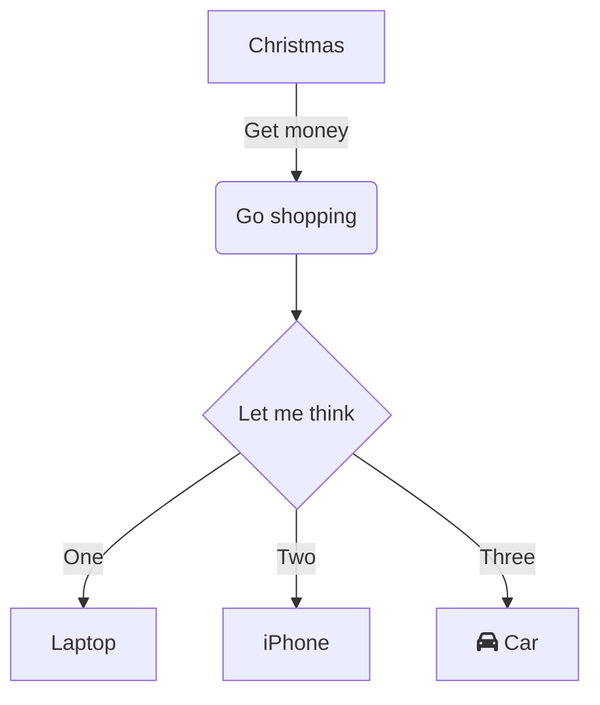
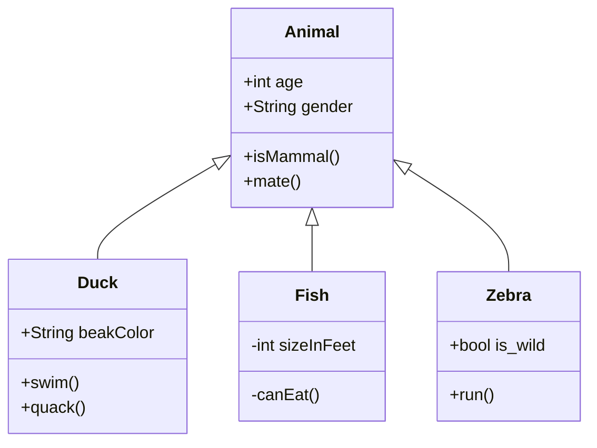
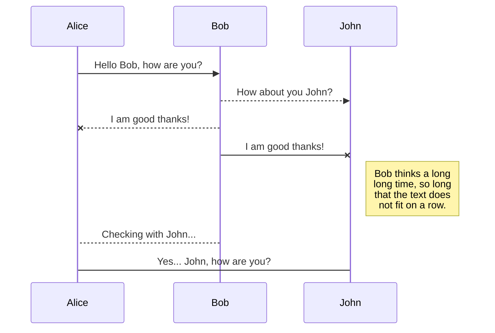
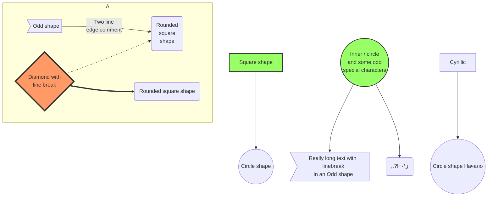
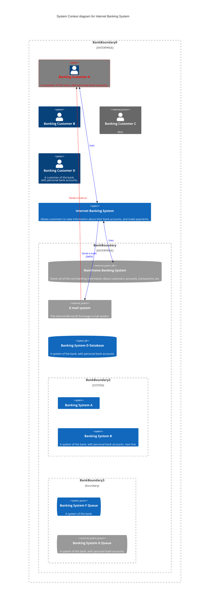

# Mermaid: 코드로 그리는 다이어그램

Mermaid는 간단한 텍스트 형식의 코드를 통해 다양한 다이어그램을 생성할 수 있는 강력한 도구입니다. 특히, 개발자들에게 큰 이점을 제공하며, 프로젝트 문서화 작업에서 필수적인 역할을 할 수 있습니다. 이번 글에서는 Mermaid가 어떤 이점을 가지고 있는지, 그리고 이를 활용하여 프로젝트 문서화를 어떻게 개선할 수 있는지에 대해 설명드리겠습니다.

## 코드 베이스 관리의 큰 이점

Mermaid의 가장 큰 이점 중 하나는 **코드 베이스 관리의 용이성**입니다. 다이어그램을 코드로 관리하면 다음과 같은 장점이 있습니다:

- **유지보수성**: 다이어그램이 코드로 작성되어 있기 때문에, 코드와 함께 버전 관리 시스템에서 추적할 수 있어 변경 이력을 쉽게 관리할 수 있습니다. 새로운 기능 추가나 수정이 있을 때 다이어그램을 업데이트하는 것도 매우 간단합니다.
- **수정의 용이성**: GUI로 그려진 다이어그램은 수정이 어렵고 시간이 많이 걸리지만, Mermaid는 텍스트 기반이므로 코드를 수정하는 것만으로 빠르게 다이어그램을 변경할 수 있습니다.
- **검색의 용이성**: 코드로 작성된 다이어그램은 텍스트 파일이기 때문에 프로젝트 내에서 검색이 가능하여, 유지보수 작업을 더 쉽게 할 수 있습니다.

## Markdown에서 직접 사용 가능

Mermaid는 **Markdown 프리뷰 플러그인**을 제공하기 때문에, Markdown 문서 내에서 다이어그램을 바로 작성하고 확인할 수 있습니다. 이는 프로젝트의 **README 파일**에 다이어그램을 포함시켜 팀원들이 쉽게 접근할 수 있도록 만들어줍니다. 문서화를 프로젝트의 중심에서 관리할 수 있어 **프로젝트의 가독성과 접근성을 크게 향상**시킬 수 있습니다.

## 다양한 다이어그램 형식 제공

Mermaid는 다양한 다이어그램 형식을 제공합니다. 몇 가지 주요 다이어그램 유형은 다음과 같습니다:

### Flowchart

프로세스 흐름을 나타내는 데 적합합니다.

### Class Diagram

객체지향 프로그램의 클래스 구조를 표현할 수 있습니다.

### Sequence Diagram

시퀀스 다이어그램은 시스템의 상호작용을 시각화하는 데 유용합니다.

### Graph Diagram

그래프 다이어그램은 다양한 형태의 노드와 관계를 표현하는 데 사용됩니다.

### System Context Diagram (C4 Model)

시스템의 전반적인 컨텍스트를 나타내는 데 유용합니다.

## Mermaid Live: 실시간 다이어그램 작성

Mermaid는 **Mermaid Live Editor**라는 웹 기반 도구를 제공하여 실시간으로 다이어그램을 작성하고 미리 볼 수 있습니다. 이 도구를 사용하면 빠르게 다이어그램을 시각화할 수 있으며, 다양한 **템플릿**도 제공되어 누구나 쉽게 시작할 수 있습니다. 복잡한 다이어그램도 빠르게 그릴 수 있기 때문에 협업 시에 유용하게 활용될 수 있습니다.

## 마무리

Mermaid는 코드 기반의 다이어그램 도구로서, 유지보수성, 수정의 용이성, 그리고 프로젝트 문서화의 접근성을 크게 향상시킵니다. Markdown과 통합하여 프로젝트 문서에 쉽게 다이어그램을 포함시킬 수 있으며, 다양한 다이어그램 형식을 통해 개발 과정에서 발생하는 다양한 시각적 요구를 충족시킬 수 있습니다. Mermaid Live를 통해 실시간으로 다이어그램을 작성하고 협업할 수 있는 기능도 매우 유용합니다.

프로젝트 문서화 작업에서 Mermaid를 활용해 보세요. 코드와 문서의 통합을 통해 더 나은 협업과 유지보수를 경험할 수 있을 것입니다.

## 출처

* [Mermaid Live Editor](https://mermaid.live/)
* [Mermaid Documentation](https://mermaid.js.org/intro/)