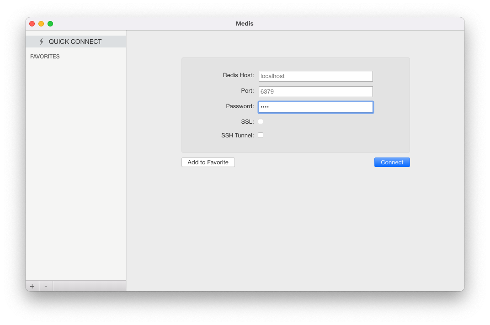
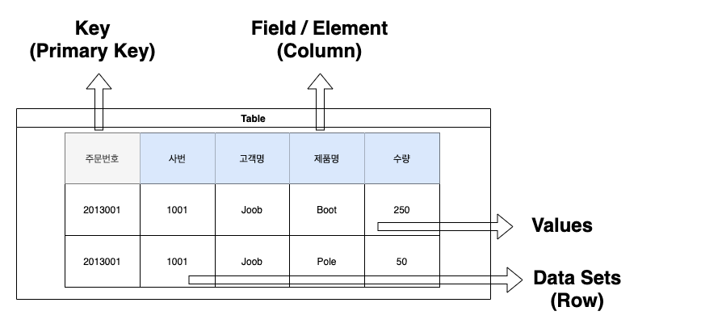
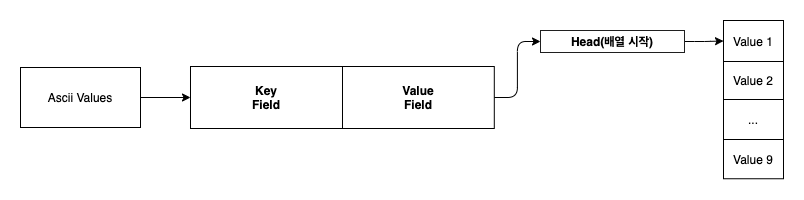
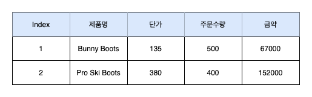
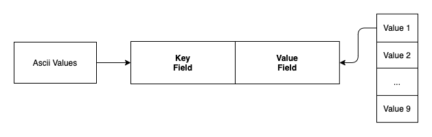

# Redis

* [ ] Redis 자로형
* [ ] Data Redis
* [ ] Redis ㅇㅇㅇ?
* [ ] @RedisHash("people" , timeToLive= "1000")
* [ ] Serialize Jackson
* [ ] Serialize Object
* [ ] CurdRepository saveAll 단건


# Getting Started Redis (Srping Data Redis)

Redis에 대한 내용을 최대한 간략하게 설명한 포스팅입니다.

## Redis 설치 (Docker)

```yml
version: '3.7'

services:
    redis:
        image: redis:6.2
        command: redis-server --requirepass 1234 --port 6379
        restart: always
        ports:
            - 6379:6379
```

```
$ docker-compose up -d
```

### Client 접속



[Medis](https://github.com/luin/medis)를 이용해서 Redis Client 접속을 진행

## Redis 용어 설명



용어 | 설명
---|---
Table | 하나의 DB에서 데이터를 저장하는 논리적인 구조
Data Sets | 테이블을 구성하는 논리적단위, 하나의 Data-Set은 하나의 Key와 한 개 이상의 FIELD/ELEMENT로 구성
Key | 하나의 Key는 하나 이상의 조합된 갓으로 펴현 가능 ex 주문번호, 주문번호+순번, 년월일+순번
Values | 해당 Key에 대한 구체적인 데이터를 값으로 표현합니다.

## 데이터 CURD

종류 | 내용
---|---
set | 데이터를 저장(Key, Value)
get | 저장된 데이터를 조회
rename | 저장된 데이터 값을 변경할 때
Keys | 지정된 모든 Key를 조회
exits | 검색 대상 Key가 존재하는지 여부를 확인
mset/mget | 여러 개의 Key와 Value를 한번 저장하고 검색할 때 사용

## 실습

```
redis:6379> set 1111 "Yun" # 해당 키값으로 벨류 저장
redis:6379> get 1111 # 해당 키에대한 데이터 검색
redis:6379> keys * # 저장되어 있는 모든 key 출력
redis:6379> keys *2 # 저장되어 있는 key 중에 2로 끝나는 key 검색 
redis:6379> rename 1111 1112 # key 1111 -> 1112 변경
redis:6379> rename 1111 1112 # key 1111 -> 1112 변경
redis:6379> randomkey # 현재 key중에서 랜덤 key 검색
redis:6379> exists 1116 # 키존재 여부 존재하는 경우 1
redis:6379> strlen 1111 # 해당 키 값의 value 길이길이
redis:6379> flushall # 저장되어 있는 모든 key 삭제
redis:6379> setex 123 30 "Test" # 일정시간 동안만 저장
redis:6379> ttl 123 # 현재 남아있는 시간
redis:6379> mset 111 "111" 123 "123" # 여러 개 필드를 한 번에 저장
redis:6379> mget 111 123 # Mset에 저장된 값을 한번에 다중 검색
1) "111"
2) "123"
redis:6379> mget 111 123 11 nonexisting # 존재하지 않는 경우 nil 출력
1) "111"
2) "123"
3) (nil)
4) (nil)
redis> mset seq_no 201909001 -> 영속번호 발행을 위한 key/value 저장
OK
redis> incr seq_no -> Incremental 증가 +1
201909002
redis> decr seq_no -> Incremental 감소 -1
201909003
redis> incrby seq_no 10 -> Incremental 증가 + 10
201909004
redis> decrby seq_no 10 -> Incremental 감소 -10
201909005
redis:6379> append 111 "asdasd" # 현재 value에 value 추가
(integer) 9
redis:6379> get 111
"111asdasd"
redis:6379> save # 현재 입력한 key/value 값을 파일로 저장
OK
redis:6379> info # Redis 서버 설정 상태 조회
# Server
redis_version:6.2.1
```

## 데이터 타입

데이터 타입 | 내용
-------|---
strings | 문자, Binary 유형 데이터를 저장
List | 하나의 Key에 여러 개의 배열 값을 저장
Hash | 하나의 Key에 여러 개의 Fields와 Value로 구성된 테이블을 저장
Bitmaps | 0,1로 표현하는 데이터 타입
HyperLogLogs | Element 중에 Unique 한 개수의 Element 만 계산
Geospatial | 좌표 데이터를 저장 및 관리하는 데이터 타입

본 포스팅에서는 `strings`, `List`, `Hash`만 살펴볼 예정입니다.

### Hash


하나의 Key와 하나 이상의 `Field/Element` 값으로 저장할 수 있으며, Value에는 기본적으로 strings 데이터를 저장할 수 있습니다. 타입의 데이터들은 지정할 수 있으며 해당 컨테이너 타입에는 Hash, List,
Set/Sorted SEt 4가지 유형이 있습니다.

* Hash 타입은 기존 관계형 DB에서 Primary-Key와 하나 이상의 칼럼으로 구성된 테이블 구조와 매우 흡사한 데이터 유형
* 하나의 Key는 오브젝트명과 하나 이상의 필드 값을 콜론 `:` 기호로 결합하여 표현할 수 있습니다. ex ex order:201809123, order_detail:201809123:01
* 문자 값을 저장할 때는 인용부호 `""`를 사용하며 숫자 값을 저장할 떄는 인용부호가 필요 하지 않습니다.
* 기본적으로 필드 개수는 제한 없습니다.
* Hash 타입의 데이터를 처리할 때는 `hmset`, `hget`, `hgetall`, `hkey`, `hlen` 명령어를 사용합니다.


```
hmset order:201809123 customer_name "Woman & Sports" emp_name "Magee" total 601100 payment_type "Credit" order_filled "Y" ship_date 20180925

redis> hget order:201809123 customer_name -> order:201809123 key에대한 customer_name 값 검색
Woman & Sports

redis> hgetall order:201809123 -> order:201809123 key에 대한 모든 필드와 valu 검색
customer_name Woman & Sports
emp_name Magee
total 601100
payment_type Credit
order_filled Y
ship_date 20180925

redis> hexists order:201809123 product_name -> product_name field가 존재하는지 여부 획인
0
redis> hexists order:201809123 customer_name -> customer_name field가 존재하는지 여부 획인
1


redis> hdel order:201809123 ship_date -> ship_date 필드 제거
1

redis> hgetall order:201809123 -> ship_date 필드 제거 확인
customer_name Woman & Sports
emp_name Magee
total 601100
payment_type Credit
order_filled Y

redis> hmset order:201809123 ship_date 20180925 -> ship_date 다시 추가
OK
redis> hmgetall

redis> hgetall order:201809123
customer_name Woman & Sports
emp_name Magee
total 601100
payment_type Credit
order_filled Y
ship_date 20180925

redis> hkeys order:201809123 -> key에 대한 모든 Field 출력
0 customer_name
1 emp_name
2 total
3 payment_type
4 order_filled
5 ship_date


redis> hvals order:201809123 -> key에 대한 모든 Value 출력
0 Woman & Sports
1 Magee
2 601100
3 Credit
4 Y
5 20180925

hmget order:201809123 emp_name totla -> 해당 필드의 value만 조회
0 Magee
1 601100
```

### List 타입



* List 타입은 기존의 관계형 테이블에는 존재하지 않은 데이터 유형이며 일반적인 프로그래밍 언어에서 데이터를 처리할 때 사용되는 array 변수와 유사한 데이터 구조 입니다.
* 기본저긍로 Strings 타입의 경우 배열에 저장할 떄는 데이터 크기는 512MB 입니다.
* List 타입의 데이터를 처리할 떄는 lpush, lrange, rpush, rpop. llen, index 명령어를 사용합니다.



```
# Deta Format을 JOSN으로 저장
lpush order_detail:201809123 "{item_id: 1, product_name: Bunny Boots, item_price: 135, qty: 500, price: 67000}" "{item_id: 2, product_name: Pro Ski Boots, item_price: 380, qty: 400, price: 152000}"

# Index 0~1 레인지 검색
redis> lrange order_detail:201809123 0 1
0
{item_id: 2, product_name: Pro Ski Boots, item_price: 380, qty: 400, price: 152000}
1
{item_id: 1, product_name: Bunny Boots, item_price: 135, qty: 500, price: 67000}

# 가장 이전 인덱스 제거
redis> rpop order_detail:201809123
{item_id: 1, product_name: Bunny Boots, item_price: 135, qty: 500, price: 67000}

# 저장된 value count
redis> llen order_detail:201809123
1

# 데이터 추가
lpush order_detail:201809123 "{item_id: 1, product_name: Bunny Boots, item_price: 135, qty: 500, price: 67000}"
```

### Set 타입



* List 타입은 하나의 필드에 여러 개의 배열 값을 저장할 수 있는 데이터 구조라면 Set 타입은 배열 구조가 아닌 여러 개의 엘리먼트로 데이터 값을 표현하는 구조 입니다.
* Set 타입의 데이터를 처리할 떄는 `sadd`, `smemebers`, `scard`, `sdiif`, `sunion` 명령어를 사용할 합니다.

```
SADD product "id:11, product_name:Sky Pole, item_prifce:55, qty:100, price: 5500" "id:12, product_name:Bunny Boots, item_prifce:135, qty:500, price: 67000"

# product에 저장되 있는 Element(Value Sets) 조회
redis> SMEMBERS product
0 id:12, product_name:Bunny Boots, item_prifce:135, qty:500, price: 67000
1 id:11, product_name:Sky Pole, item_prifce:55, qty:100, price: 5500

# 저장된 value count
redis> SCARD product
2

SADD product_old "id:91, product_name: Old Sky Pole"

# product, product_old중 product에 만 있는 Value 검색
redis> sdiff product product_old
0 id:12, product_name:Bunny Boots, item_prifce:135, qty:500, price: 67000
1 id:11, product_name:Sky Pole, item_prifce:55, qty:100, price: 5500

# product, product_old중 product_old에 만 있는 Value 검색
redis> sdiff product_old product
0 id:91, product_name: Old Sky Pole

# union
redis> SUNION  product product_old
0 id:12, product_name:Bunny Boots, item_prifce:135, qty:500, price: 67000
1 id:11, product_name:Sky Pole, item_prifce:55, qty:100, price: 5500
2 id:91, product_name: Old Sky Pole

SUNIONSTORE  product_new product product_old

# union 결과를 product_new에 저장
redis> SUNIONSTORE  product_new product product_old
3

# Ramdom 제거
redis> SPOP product_new 1
0 id:11, product_name:Sky Pole, item_prifce:55, qty:100, price: 5500
```

### Sorted Set 타입

* Sorted Set 타입은 Set 타입과 동일한 데이터 구조이며 차이점은 저장된 데이터 값이 Sorting된 상태이면 Sroted Set 이라고 합니다.
* 데이터를 처리할 떄는 `zadd`, `zragne,` `zcard`, `zcount`, `zrank` `zerverank` 명령어를 사용합니다.

```

# Sorted된 값으로 데이터 저장
redis> ZADD order_detail:201809124 1 "{item_id: 1, product_name: Bunny Boots, item_price: 135, qty: 500, price: 67000}" 2 "{item_id: 2, product_name: Pro Ski Boots, item_price: 380, qty: 400, price: 152000}"

# 전체 조회
redis> ZRANGE order_detail:201809124 0 -1
0 {item_id: 1, product_name: Bunny Boots, item_price: 135, qty: 500, price: 67000}
1 {item_id: 2, product_name: Pro Ski Boots, item_price: 380, qty: 400, price: 152000}

# count 조회
redis> ZCARd order_detail:201809124
redis> ZCOUNT order_detail:201809124
2

# 제거
redis> ZREM order_detail:2018091234 {item_id: 1, product_name: Bunn
y Boots, item_price: 135, qty: 500, price: 67000}
```

## Spring Data Redis

### Dependency 설정

```
dependencies {
    implementation("org.springframework.boot:spring-boot-starter-data-redis")
}

```

### yml 설정

```yml
spring:
    redis:
        host: localhost
        port: 6379
        password: root

logging:
    level:
        root: INFO
        redis.clients: TRACE
        org.springframework.data: TRACE
```

## 참고

* [빅데이터 저장 및 분석을 위한 NoSQL & Redis](http://m.yes24.com/goods/detail/71131862)
* [Spring Data Redis Reference Documentation](https://docs.spring.io/spring-data/data-redis/docs/current/reference/html/#reference)
* [https://sabarada.tistory.com/105](Reference Documentation)