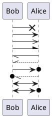
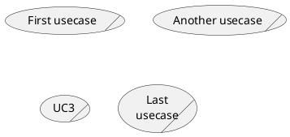
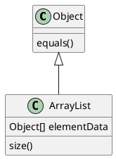
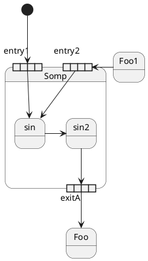
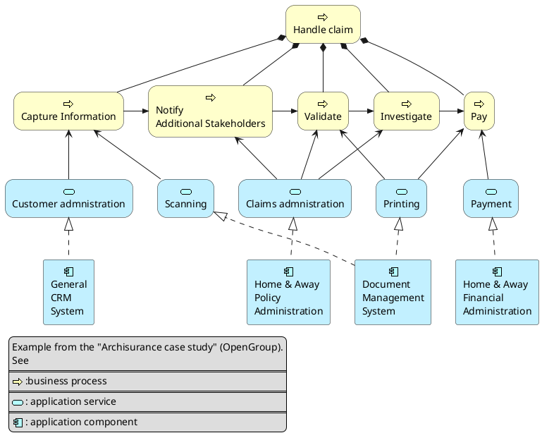
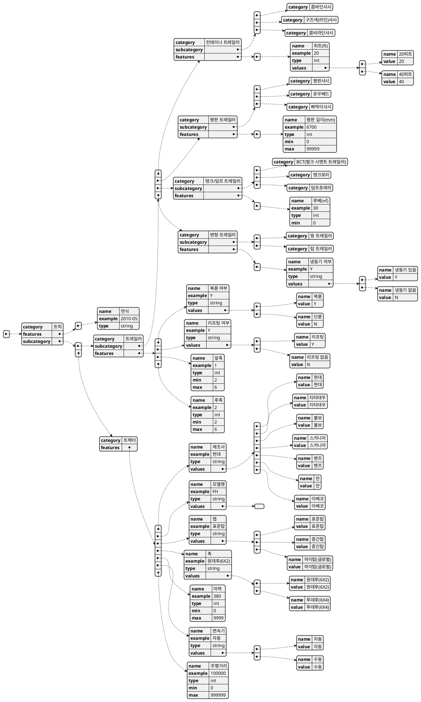

plantuml

```plantuml
@startuml
Bob ->x Alice
Bob -> Alice
Bob ->> Alice
Bob -\ Alice
Bob \\- Alice
Bob //-- Alice

Bob ->o Alice
Bob o\\-- Alice

Bob <-> Alice
Bob <->o Alice
@enduml
```

```plantuml
@startuml

(First usecase)/
(Another usecase)/ as (UC2)
usecase/ UC3
usecase/ (Last\nusecase) as UC4

@enduml
```

```plantuml
@startuml
Object <|-- ArrayList

Object : equals()
ArrayList : Object[] elementData
ArrayList : size()

@enduml

```

```plantuml
@startuml
state Somp {
  state entry1 <<expansionInput>>
  state entry2 <<expansionInput>>
  state sin
  entry1 --> sin
  entry2 -> sin
  sin -> sin2
  sin2 --> exitA <<expansionOutput>>
}

[*] --> entry1
exitA --> Foo
Foo1 -> entry2
@enduml

```

```plantuml
@startuml
skinparam rectangle<<behavior>> {
	roundCorner 25
}
sprite $bProcess jar:archimate/business-process
sprite $aService jar:archimate/application-service
sprite $aComponent jar:archimate/application-component

rectangle "Handle claim"  as HC <<$bProcess>><<behavior>> #Business
rectangle "Capture Information"  as CI <<$bProcess>><<behavior>> #Business
rectangle "Notify\nAdditional Stakeholders" as NAS <<$bProcess>><<behavior>> #Business
rectangle "Validate" as V <<$bProcess>><<behavior>> #Business
rectangle "Investigate" as I <<$bProcess>><<behavior>> #Business
rectangle "Pay" as P <<$bProcess>><<behavior>> #Business

HC *-down- CI
HC *-down- NAS
HC *-down- V
HC *-down- I
HC *-down- P

CI -right->> NAS
NAS -right->> V
V -right->> I
I -right->> P

rectangle "Scanning" as scanning <<$aService>><<behavior>> #Application
rectangle "Customer admnistration" as customerAdministration <<$aService>><<behavior>> #Application
rectangle "Claims admnistration" as claimsAdministration <<$aService>><<behavior>> #Application
rectangle Printing <<$aService>><<behavior>> #Application
rectangle Payment <<$aService>><<behavior>> #Application

scanning -up-> CI
customerAdministration  -up-> CI
claimsAdministration -up-> NAS
claimsAdministration -up-> V
claimsAdministration -up-> I
Payment -up-> P

Printing -up-> V
Printing -up-> P

rectangle "Document\nManagement\nSystem" as DMS <<$aComponent>> #Application
rectangle "General\nCRM\nSystem" as CRM <<$aComponent>>  #Application
rectangle "Home & Away\nPolicy\nAdministration" as HAPA <<$aComponent>> #Application
rectangle "Home & Away\nFinancial\nAdministration" as HFPA <<$aComponent>>  #Application

DMS .up.|> scanning
DMS .up.|> Printing
CRM .up.|> customerAdministration
HAPA .up.|> claimsAdministration
HFPA .up.|> Payment

legend left
Example from the "Archisurance case study" (OpenGroup).
See
====
<$bProcess> :business process
====
<$aService> : application service
====
<$aComponent> : application component
endlegend
@enduml

```

```plantuml

@startjson
[
	{
		"category": "트럭",
		"features": [
			{
				"name": "연식",
				"example": "2010-05",
				"type": "string"
			}
		],
		"subcategory": [
			{
				"category": "트레일러",
				"subcategory": [
					{
						"category": "컨테이너 트레일러",
						"subcategory": [
							{
								"category": "콤바인샤시"
							},
							{
								"category": "구즈넥(라인)샤시"
							},
							{
								"category": "콤비라인샤시"
							}
						],
						"features": [
							{
								"name": "피트(ft)",
								"example": "20",
								"type": "int",
								"values": [
									{
										"name": "20피트",
										"value": "20"
									},
									{
										"name": "40피트",
										"value": "40"
									}
								]
							}
						]
					},
					{
						"category": "평판 트레일러",
						"subcategory": [
							{
								"category": "평판샤시"
							},
							{
								"category": "로우베드"
							},
							{
								"category": "삐딱이샤시"
							}
						],
						"features": [
							{
								"name": "평판 길이(mm)",
								"example": "6700",
								"type": "int",
								"min": 0,
								"max": 99999
							}
						]
					},
					{
						"category": "탱크/덤프 트레일러",
						"subcategory": [
							{
								"category": "BCT(벌크 시멘트 트레일러)"
							},
							{
								"category": "탱크로리"
							},
							{
								"category": "덤프츄레라"
							}
						],
						"features": [
							{
								"name": "루베(㎥)",
								"example": "30",
								"type": "int",
								"min": 0
							}
						]
					},
					{
						"category": "밴형 트레일러",
						"subcategory": [
							{
								"category": "윙 트레일러"
							},
							{
								"category": "탑 트레일러"
							}
						],
						"features": [
							{
								"name": "냉동기 여부",
								"example": "Y",
								"type": "string",
								"values": [
									{
										"name": "냉동기 있음",
										"value": "Y"
									},
									{
										"name": "냉동기 없음",
										"value": "N"
									}
								]
							}
						]
					}
				],
				"features": [
					{
						"name": "복륜 여부",
						"example": "Y",
						"type": "string",
						"values": [
							{
								"name": "복륜",
								"value": "Y"
							},
							{
								"name": "단륜",
								"value": "N"
							}
						]
					},
					{
						"name": "리프팅 여부",
						"example": "Y",
						"type": "string",
						"values": [
							{
								"name": "리프팅",
								"value": "Y"
							},
							{
								"name": "리프팅 없음",
								"value": "N"
							}
						]
					},
					{
						"name": "앞축",
						"example": "1",
						"type": "int",
						"min": 2,
						"max": 6
					},
					{
						"name": "후축",
						"example": "2",
						"type": "int",
						"min": 2,
						"max": 6
					}
				]
			},
			{
				"category": "트랙터",
				"features": [
					{
						"name": "제조사",
						"example": "현대",
						"type": "string",
						"values": [
							{
								"name": "현대",
								"value": "현대"
							},
							{
								"name": "타타대우",
								"value": "타타대우"
							},
							{
								"name": "볼보",
								"value": "볼보"
							},
							{
								"name": "스카니아",
								"value": "스카니아"
							},
							{
								"name": "벤츠",
								"value": "벤츠"
							},
							{
								"name": "만",
								"value": "만"
							},
							{
								"name": "이베코",
								"value": "이베코"
							}
						]
					},
					{
						"name": "모델명",
						"example": "FH",
						"type": "string",
						"values": []
					},
					{
						"name": "캡",
						"example": "표준탑",
						"type": "string",
						"values": [
							{
								"name": "표준탑",
								"value": "표준탑"
							},
							{
								"name": "중간탑",
								"value": "중간탑"
							},
							{
								"name": "하이탑(글로벌)",
								"value": "하이탑(글로벌)"
							}
						]
					},
					{
						"name": "축",
						"example": "원데후(6X2)",
						"type": "string",
						"values": [
							{
								"name": "원데후(6X2)",
								"value": "원데후(6X2)"
							},
							{
								"name": "투데후(6X4)",
								"value": "투데후(6X4)"
							}
						]
					},
					{
						"name": "마력",
						"example": "380",
						"type": "int",
						"min": 0,
						"max": 9999
					},
					{
						"name": "변속기",
						"example": "자동",
						"type": "string",
						"values": [
							{
								"name": "자동",
								"value": "자동"
							},
							{
								"name": "수동",
								"value": "수동"
							}
						]
					},
					{
						"name": "주행거리",
						"example": "100000",
						"type": "int",
						"min": 0,
						"max": 999999
					}
				]
			}
		]
	}
]
@endjson

```