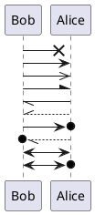
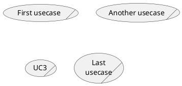
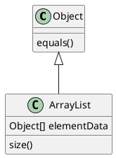
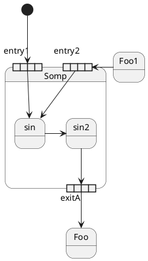
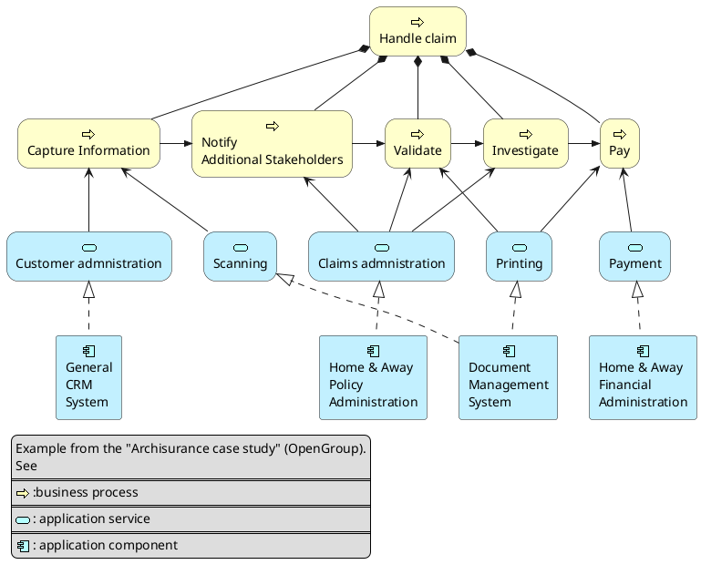

plantuml

```plantuml
@startuml
Bob ->x Alice
Bob -> Alice
Bob ->> Alice
Bob -\ Alice
Bob \\- Alice
Bob //-- Alice

Bob ->o Alice
Bob o\\-- Alice

Bob <-> Alice
Bob <->o Alice
@enduml
```

```plantuml
@startuml

(First usecase)/
(Another usecase)/ as (UC2)
usecase/ UC3
usecase/ (Last\nusecase) as UC4

@enduml
```

```plantuml
@startuml
Object <|-- ArrayList

Object : equals()
ArrayList : Object[] elementData
ArrayList : size()

@enduml

```

```plantuml
@startuml
state Somp {
  state entry1 <<expansionInput>>
  state entry2 <<expansionInput>>
  state sin
  entry1 --> sin
  entry2 -> sin
  sin -> sin2
  sin2 --> exitA <<expansionOutput>>
}

[*] --> entry1
exitA --> Foo
Foo1 -> entry2
@enduml

```

```plantuml
@startuml
skinparam rectangle<<behavior>> {
	roundCorner 25
}
sprite $bProcess jar:archimate/business-process
sprite $aService jar:archimate/application-service
sprite $aComponent jar:archimate/application-component

rectangle "Handle claim"  as HC <<$bProcess>><<behavior>> #Business
rectangle "Capture Information"  as CI <<$bProcess>><<behavior>> #Business
rectangle "Notify\nAdditional Stakeholders" as NAS <<$bProcess>><<behavior>> #Business
rectangle "Validate" as V <<$bProcess>><<behavior>> #Business
rectangle "Investigate" as I <<$bProcess>><<behavior>> #Business
rectangle "Pay" as P <<$bProcess>><<behavior>> #Business

HC *-down- CI
HC *-down- NAS
HC *-down- V
HC *-down- I
HC *-down- P

CI -right->> NAS
NAS -right->> V
V -right->> I
I -right->> P

rectangle "Scanning" as scanning <<$aService>><<behavior>> #Application
rectangle "Customer admnistration" as customerAdministration <<$aService>><<behavior>> #Application
rectangle "Claims admnistration" as claimsAdministration <<$aService>><<behavior>> #Application
rectangle Printing <<$aService>><<behavior>> #Application
rectangle Payment <<$aService>><<behavior>> #Application

scanning -up-> CI
customerAdministration  -up-> CI
claimsAdministration -up-> NAS
claimsAdministration -up-> V
claimsAdministration -up-> I
Payment -up-> P

Printing -up-> V
Printing -up-> P

rectangle "Document\nManagement\nSystem" as DMS <<$aComponent>> #Application
rectangle "General\nCRM\nSystem" as CRM <<$aComponent>>  #Application
rectangle "Home & Away\nPolicy\nAdministration" as HAPA <<$aComponent>> #Application
rectangle "Home & Away\nFinancial\nAdministration" as HFPA <<$aComponent>>  #Application

DMS .up.|> scanning
DMS .up.|> Printing
CRM .up.|> customerAdministration
HAPA .up.|> claimsAdministration
HFPA .up.|> Payment

legend left
Example from the "Archisurance case study" (OpenGroup).
See
====
<$bProcess> :business process
====
<$aService> : application service
====
<$aComponent> : application component
endlegend
@enduml

```