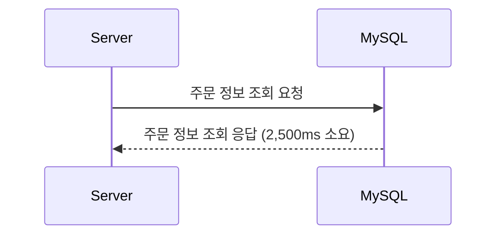
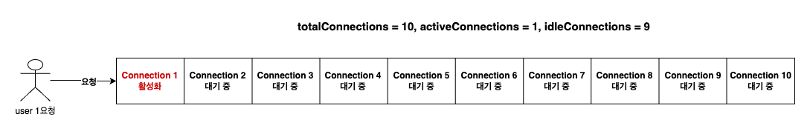
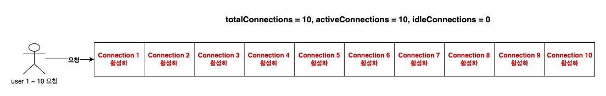

# Redis Lettuce 커넥션 풀의 진짜 역할: 실제 시나리오로 이해하기

Redis는 기본적으로 싱글 스레드로 동작하는 인메모리 데이터베이스입니다. 이러한 특성 때문에 많은 개발자들은 Redis 클라이언트인 Lettuce에서 제공하는 커넥션 풀이 실제로 얼마나 유용한지, 그리고 그것이 애플리케이션에 어떤 이점을 가져다줄 수 있는지에 대해 의문을 가질 수 있습니다. 특히 "Redis는 싱글 스레드인데, 굳이 여러 개의 커넥션을 유지하는 것이 의미가 있을까?"라는 질문은 자주 듣는 질문 중 하나입니다.

Redis의 싱글 스레드 구조는 서버가 동시에 여러 클라이언트의 요청을 처리하는 것이 아니라, 각 요청을 순차적으로 처리한다는 것을 의미합니다. 즉, 많은 요청이 들어와도 Redis는 각 요청을 차례차례 처리하기 때문에 일반적인 데이터베이스처럼 병렬적으로 여러 쿼리를 동시에 실행할 수 있는 구조가 아닙니다. 그래서 많은 개발자들이 "그렇다면 Redis 클라이언트 측에서 커넥션 풀을 사용하는 것이 성능에 어떤 영향을 줄 수 있을까?"라는 의문을 가지게 되는 것입니다.

하지만 Redis의 클라이언트 측, 특히 애플리케이션 레벨에서의 커넥션 관리 방식은 Redis 서버의 동작 방식과는 또 다른 관점을 제공합니다. Lettuce 클라이언트는 기본적으로 비동기 및 넌블로킹 I/O를 지원하며, 커넥션 풀을 통해 여러 개의 커넥션을 관리함으로써 애플리케이션의 성능을 최적화할 수 있는 기회를 제공합니다. 이를 통해 Redis의 싱글 스레드 특성에도 불구하고 애플리케이션의 전반적인 응답성을 향상시킬 수 있습니다. 이번 글에서는 Lettuce 커넥션 풀이 애플리케이션 성능에 미치는 영향을 실제 시나리오를 통해 자세히 알아보겠습니다.

## JDBC Hikari Connection Pool 동작 방식

Redis Lettuce 커넥션 풀의 역할을 이해하기 위해, 먼저 전통적인 데이터베이스 커넥션 풀의 대표적인 예인 **JDBC Hikari Connection Pool**을 살펴보겠습니다.

전통적인 Hikari Connection Pool에서는 애플리케이션이 주문 정보를 조회하기 위해 커넥션 풀에서 하나의 커넥션을 가져옵니다. 예를 들어, **idleConnections**가 10개라면, 그 중 하나의 커넥션을 가져와 **activeConnections**로 전환하게 됩니다. 이 경우 **idleConnections**는 9개로 줄고, **activeConnections**는 1개가 됩니다. 전체 **totalConnections**는 변하지 않고 유지됩니다.

만약 요청이 많이 들어와 응답이 지연되고 있는 경우를 생각해 봅시다. **maximum-pool-size**가 10개인 상황에서, 모든 10개의 커넥션이 **activeConnections**로 전환되어 사용 중이라면, 추가적인 요청은 **threadsAwaitingConnection**으로 들어가 대기하게 됩니다. 즉, 사용 가능한 커넥션이 없기 때문에 요청 스레드는 커넥션이 반환될 때까지 기다려야 합니다.

이와 같이 전통적인 커넥션 풀의 개념에서는, **요청 스레드마다 활성화된 커넥션을 사용**하며, 해당 스레드가 작업을 끝내기 전까지는 **커넥션을 점유**하게 됩니다. 이는 데이터베이스의 동시 연결 수와 처리 능력을 효과적으로 관리할 수 있는 방법이지만, 커넥션이 사용 중일 때 대기하는 요청들이 발생할 수 있다는 단점이 있습니다.

이제 이러한 전통적인 커넥션 풀과 비교하여, **Redis Lettuce Connection Pool**이 어떻게 다른 방식으로 동작하는지에 대해 알아보겠습니다.

