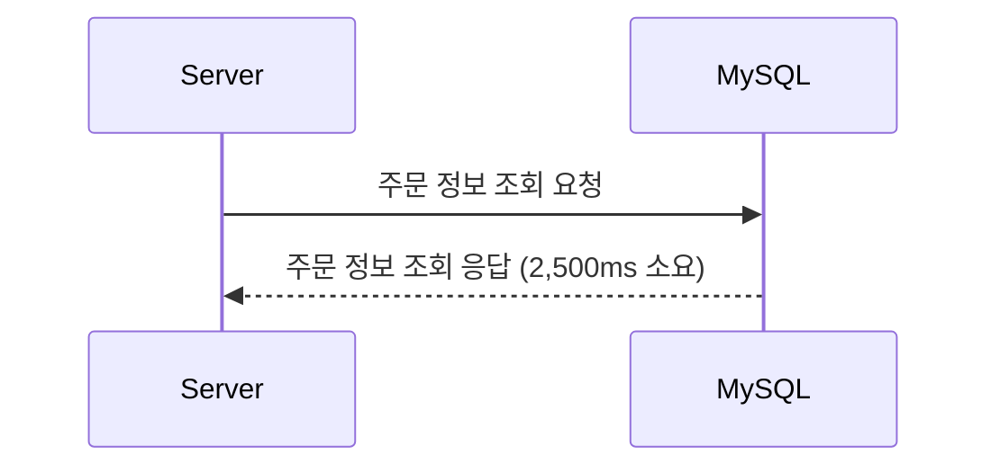
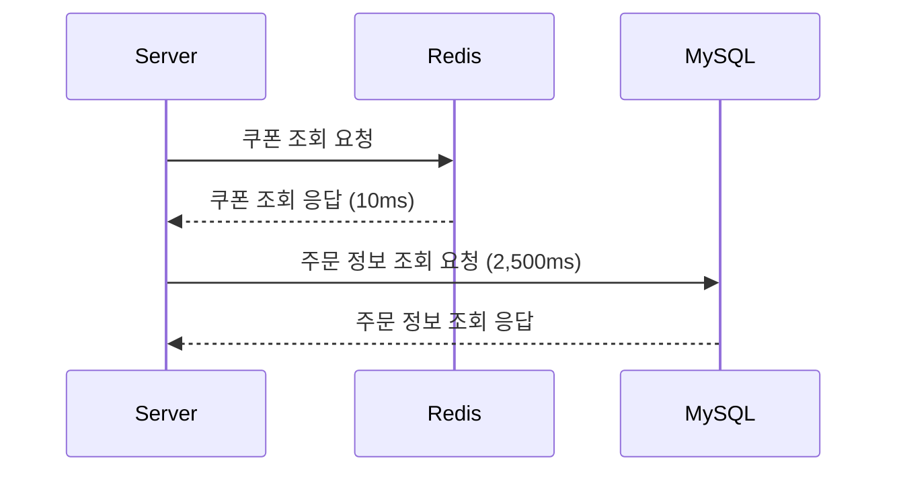
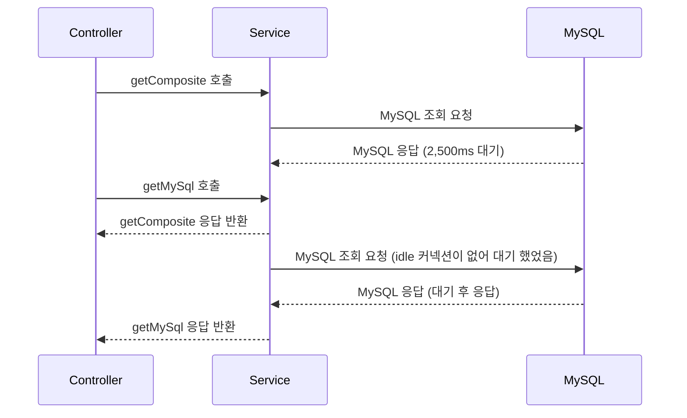
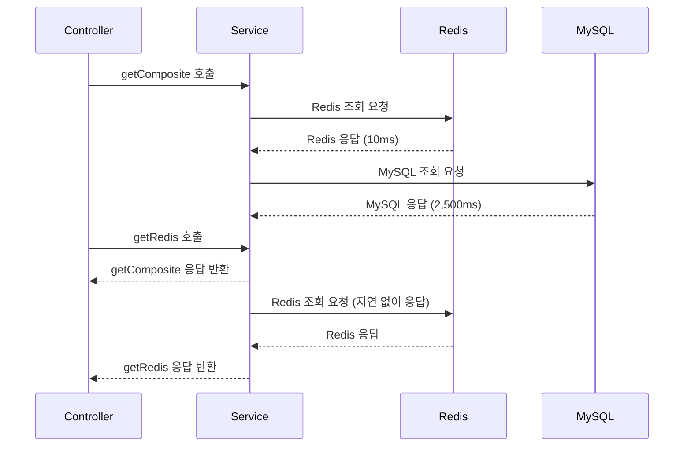

# Hikari와 비교하며 알아보는 Redis Lettuce 커넥션 풀의 특징

Redis는 기본적으로 싱글 스레드로 동작하는 인메모리 데이터베이스입니다. 이러한 특성 때문에 많은 개발자들은 Redis 클라이언트인 Lettuce에서 제공하는 커넥션 풀이 실제로 얼마나 유용한지, 그리고 그것이 애플리케이션에 어떤 이점을 가져다줄 수 있는지에 대해 의문을 가질 수 있습니다. 특히 "**Redis는 싱글 스레드인데, 굳이 여러 개의 커넥션을 유지하는 것이 의미가 있을까?**"라는 질문은 자주 듣는 질문 중 하나입니다.

Redis의 싱글 스레드 구조는 서버가 동시에 여러 클라이언트의 요청을 처리하는 것이 아니라, 각 요청을 순차적으로 처리한다는 것을 의미합니다. **즉, 많은 요청이 들어와도 Redis는 각 요청을 차례차례 처리하기 때문에 일반적인 데이터베이스처럼 병렬적으로 여러 쿼리를 동시에 실행할 수 있는 구조가 아닙니다. 그래서 많은 개발자들이 "그렇다면 Redis 클라이언트 측에서 커넥션 풀을 사용하는 것이 성능에 어떤 영향을 줄 수 있을까?"라는 의문을 가지게 되는 것입니다.**

하지만 Redis의 클라이언트 측, 특히 애플리케이션 레벨에서의 커넥션 관리 방식은 Redis 서버의 동작 방식과는 또 다른 관점을 제공합니다. **Lettuce 클라이언트는 기본적으로 비동기 및 넌블로킹 I/O를 지원하며, 커넥션 풀을 통해 여러 개의 커넥션을 관리함으로써 애플리케이션의 성능을 최적화할 수 있는 기회를 제공합니다. 이를 통해 Redis의 싱글 스레드 특성에도 불구하고 애플리케이션의 전반적인 응답성을 향상시킬 수 있습니다.** 이번 글에서는 Lettuce 커넥션 풀이 애플리케이션 성능에 미치는 영향을 실제 시나리오를 통해 자세히 알아보겠습니다.

## JDBC Hikari Connection Pool의 동작 방식

Redis Lettuce 커넥션 풀의 역할을 이해하기 위해, 먼저 전통적인 데이터베이스 커넥션 풀의 대표적인 예인 **JDBC Hikari Connection Pool**을 살펴보겠습니다.



전통적인 Hikari Connection Pool에서는 애플리케이션이 주문 정보를 조회하기 위해 커넥션 풀에서 하나의 커넥션을 가져옵니다. 아래 그림에서 볼 수 있듯이, **idleConnections**가 10개라면, 그 중 하나의 커넥션을 가져와 **activeConnections**로 전환하게 됩니다. 이 경우 **idleConnections**는 9개로 줄고, **activeConnections**는 1개가 됩니다. 전체 **totalConnections**는 변하지 않고 유지됩니다.


만약 요청이 많이 들어와 응답이 지연되고 있는 경우를 생각해 봅시다. 아래 그림처럼 **maximum-pool-size**가 10개인 상황에서, 모든 10개의 커넥션이 **activeConnections**로 전환되어 사용 중이라면, 추가적인 요청은 **threadsAwaitingConnection**으로 들어가 대기하게 됩니다. 즉, 사용 가능한 커넥션이 없기 때문에 요청 스레드는 커넥션이 반환될 때까지 기다려야 합니다.


이와 같이 전통적인 커넥션 풀의 개념에서는, **요청 스레드마다 활성화된 커넥션을 사용**하며, 해당 스레드가 작업을 끝내기 전까지는 **커넥션을 점유**하게 됩니다. 이는 데이터베이스의 동시 연결 수와 처리 능력을 효과적으로 관리할 수 있는 방법이지만, 커넥션이 사용 중일 때 대기하는 요청들이 발생할 수 있다는 단점이 있습니다.

이제 이러한 전통적인 커넥션 풀과 비교하여, **Redis Lettuce Connection Pool**이 어떻게 다른 방식으로 동작하는지에 대해 알아보겠습니다.

## Redis Lettuce Connection Pool의 동작 방식

Redis Lettuce Connection Pool의 동작 방식을 이해하기 위해, **Redis 조회와 MySQL 조회가 함께 사용되는 시나리오**를 살펴보겠습니다.



위의 시나리오에서 애플리케이션은 먼저 Redis에서 쿠폰 정보를 조회한 후, MySQL에서 주문 정보를 조회합니다. Redis 쿠폰 조회는 10ms 만에 응답이 오지만, 이후 이어지는 MySQL 조회는 2,500ms가 걸립니다. 이 상황에서 Redis Lettuce 커넥션 풀이 어떻게 동작하는지를 이해하는 것이 중요합니다.

Redis에 쿠폰 조회 요청을 보내면, 10ms 내에 쿠폰 정보가 응답됩니다. 여기서 Lettuce 커넥션 풀이 1개만 있다고 가정해 보겠습니다. 만약 이 상황이 전통적인 커넥션 풀 구조였다면, MySQL 데이터 조회(2,500ms)가 완료되기 전까지 하나뿐인 Redis 커넥션이 블록되어 Redis에 대한 추가적인 요청을 처리할 수 없었을 것입니다. 이는 Redis 서버가 이미 응답을 완료했음에도 불구하고, 애플리케이션 측에서 더 이상 Redis에 대한 요청을 처리할 수 없게 된다는 문제를 야기합니다.

그러나 Redis Lettuce의 경우 비동기적으로 동작할 수 있습니다. Redis 서버에서 응답을 내린 후 해당 커넥션이 즉시 반환된다면, MySQL 조회가 진행 중이더라도 Redis에 대한 새로운 요청을 처리할 수 있게 됩니다. 이는 Redis 서버가 싱글 스레드로 동작하더라도 Lettuce 클라이언트 측에서는 추가적인 요청을 계속해서 보낼 수 있는 가능성을 열어줍니다. 그렇다면 실제로 Redis Lettuce가 이러한 방식으로 동작하는지, 아니면 다른 방식으로 동작하는지 **코드를 통해 더 자세히 살펴보겠습니다**.

```kotlin
@RestController
@RequestMapping
class MemberController(
    private val redisConnectionPoolSample: RedisConnectionPoolSample,
) {

    @GetMapping("/api/redis")
    fun getRedis(@RequestParam("id") id: String) = redisConnectionPoolSample.getRedis(id)

    @GetMapping("/api/mysql")
    fun getMySql(@RequestParam("id") id: Long) = redisConnectionPoolSample.getMySql(id)

    @GetMapping("/api/composite")
    fun getRedis2(@RequestParam("id") id: String) = redisConnectionPoolSample.getComposite(id)
}

@Service
class RedisConnectionPoolSample(
    private val couponRepository: CouponRepository,
    private val orderRepository: OrderRepository

) {

    fun getRedis(id: String): Coupon? {
        return couponRepository.findByIdOrNull(id)
    }


    fun getMySql(id: Long): Order? {
        printHikariConnection()
        return orderRepository.findByIdOrNull(id)
    }

    fun getComposite(id: String): Pair<Coupon?, Order?> {
        val coupon = couponRepository.findByIdOrNull(id)
        val order = orderRepository.findByIdOrNull(id.toLong())
        Thread.sleep(2500) // 2.5초 대기
        printHikariConnection()
        return Pair(coupon, order)
    }

    private fun printHikariConnection() {
        val targetDataSource = dataSource.unwrap(HikariDataSource::class.java)
        val hikariDataSource = targetDataSource as HikariDataSource
        val hikariPoolMXBean = hikariDataSource.hikariPoolMXBean
        val hikariConfigMXBean = hikariDataSource.hikariConfigMXBean

        val log = buildString {
            append("totalConnections: ${hikariPoolMXBean.totalConnections}, ")
            append("activeConnections: ${hikariPoolMXBean.activeConnections}, ")
            append("idleConnections: ${hikariPoolMXBean.idleConnections}, ")
            append("threadsAwaitingConnection: ${hikariPoolMXBean.threadsAwaitingConnection}")
        }
        println(log)
    }
}
```

위의 코드에서 `/api/redis`는 단순히 Redis에서 쿠폰 정보를 조회하는 API입니다. `/api/mysql`은 MySQL에서 주문 정보를 조회하는 API이며, `/api/composite`는 Redis 조회 후 MySQL 조회를 수행하고 2.5초 동안 대기한 후 응답을 반환하는 API입니다.

특히 `/api/composite`는 Redis에서 쿠폰을 조회한 후 MySQL 조회를 수행하며, 이때 `Thread.sleep(2500)`으로 인해 2.5초 동안 대기하게 됩니다. 이 상황에서 Lettuce의 커넥션 풀이 어떻게 동작하는지 살펴볼 수 있습니다.

## 시나리오별 Hikari와 Lettuce의 차이점

이 섹션에서는 Hikari와 Lettuce의 동작 방식을 서로 비교하면서 각 시나리오에서 어떤 차이점이 발생하는지에 대해 구체적으로 살펴보겠습니다. 이를 통해 각 커넥션 풀이 어떤 차이점을 갖고 있는지 명확히 이해할 수 있습니다.

### 시나리오: getComposite 호출 이후 getMySql 호출

Hikari 설정은 maximum-pool-size가 1이고, minimum-idle이 1로 되어 있으며, `getComposite` 호출 시 사용 가능한 1개의 커넥션 중 하나를 사용하여 작업을 진행합니다.

이때 로그:

```txt
totalConnections: 1, activeConnections: 1, idleConnections: 0, threadsAwaitingConnection: 0
```

위 로그를 통해 알 수 있듯이, 하나의 커넥션이 사용 중이며, 대기 중인 스레드는 없습니다.

이 상태에서 `getMySql` 호출을 시도하면, 사용 가능한 **idle 커넥션**이 없기 때문에 `getComposite` 호출이 끝난 후 반환된 커넥션을 사용해야 합니다. 이로 인해 **threadsAwaitingConnection** 상태에서 대기하게 되고, 지연이 발생합니다. 이후 **threadsAwaitingConnection**에서 대기하던 요청이 **activeConnections**로 전환되면, `getMySql` 호출에서 해당 커넥션을 사용할 수 있게 됩니다.

이때 로그:

```txt
totalConnections: 1, activeConnections: 1, idleConnections: 0, threadsAwaitingConnection: 1
```

위 로그는 `getComposite` 호출로 인해 커넥션이 점유된 상태에서 `getMySql` 호출이 대기 중인 상황을 보여줍니다.

실제 응답 시간을 확인해보면, `/api/mysql`만 호출하는 경우 응답 시간이 매우 빠른 것을 확인할 수 있습니다. 예를 들어:

```
Response code: 200; Time: 24ms (24 ms); Content length: 64 bytes (64 B)
```

그러나 `/api/composite`를 호출한 이후에 `/api/mysql`를 호출하게 되면, 응답 시간이 느려지는 것을 확인할 수 있습니다.

```
Response code: 200; Time: 1112ms (1 s 112 ms); Content length: 64 bytes (64 B)
```

정리하면 다음과 같이 동작합니다.



이는 Hikari 커넥션 풀이 스레드를 블록 시키는 방식으로 동작하기 때문이며, idle한 커넥션이 없을 경우 `threadsAwaitingConnection`에 대기 요청이 쌓이고, 앞선 커넥션들이 반환되어야 비로소 다시 `activeConnections`로 전환될 수 있기 때문입니다.

그렇다면 Redis Lettuce 커넥션 풀은 어떻게 동작하는지 살펴보겠습니다. Lettuce에서도 동일하게 스레드를 블록 시킨다면 지연이 발생할 것이며, 반대로 블록하지 않는다면 MySQL의 지연과 상관없이 추가적인 Redis 호출에 대해 빠르게 응답할 수 있을 것입니다.

### 시나리오: getComposite 호출 이후 getRedis 호출

Lettuce 설정은 max-active가 1, max-idle이 1, min-idle이 1로 되어 있으며, `getComposite` 호출 시 사용 가능한 1개의 커넥션 중 하나를 사용하여 작업을 진행합니다.

`/api/composite`를 호출한 이후에 `/api/redis`를 호출하면 응답 시간이 매우 빠른 것을 확인할 수 있습니다.

```
Response code: 200; Time: 8ms (8 ms); Content length: 56 bytes (56 B)
```

이후 `/api/redis`만 호출한 경우에도 응답 시간이 빠른 것을 확인할 수 있습니다.

```
Response code: 200; Time: 6ms (6 ms); Content length: 56 bytes (56 B)
```

정리하면 다음과 같이 동작합니다.



이를 통해 지연이 없는 것을 볼 때, Lettuce 커넥션 풀은 스레드를 블록하지 않고, 추가적인 요청에 대해 빠르게 응답할 수 있음을 확인할 수 있습니다. 이는 MySQL의 Hikari 커넥션 풀이 스레드를 블록하여 대기 시간이 발생하는 것과 대비됩니다. Hikari에서는 커넥션이 반환될 때까지 대기해야 하므로 지연이 발생할 수 있지만, Lettuce는 이러한 지연 없이 추가 요청에 신속하게 응답할 수 있습니다.

### Hikari와 Lettuce의 차이점

1. **동작 방식의 차이**:
    - Hikari Connection Pool은 **전통적인 동기식 동작**을 기반으로 하며, 스레드 블로킹이 발생합니다. MySQL 같은 관계형 데이터베이스와 함께 사용하는 경우, 데이터 조회 시 커넥션이 점유된 상태로 유지되므로 다른 요청들은 사용 가능한 커넥션이 없어 대기하게 됩니다.
    - Redis Lettuce Connection Pool은 **비동기 및 넌블로킹 I/O**를 지원하여, Redis 서버에서 응답을 받은 후에도 바로 커넥션을 반환할 수 있습니다. 이를 통해 **커넥션 점유 시간이 짧아져** Redis에 대한 다른 요청들도 빠르게 처리될 수 있습니다.
2. **커넥션 풀의 활용도**:
    - Hikari Connection Pool은 **threadsAwaitingConnection**을 관리하며, 커넥션 풀이 모두 사용 중일 경우 새 요청들은 대기하게 됩니다. 따라서 **커넥션 풀 크기 설정**이 성능에 큰 영향을 미칩니다.
    - Redis Lettuce Connection Pool은 커넥션을 빠르게 반환하기 때문에, **커넥션 풀 크기를 크게 설정하지 않아도 효율적으로 동작**할 수 있습니다. Redis의 비동기 처리 덕분에 서버의 응답이 빠르다면, 적은 수의 커넥션으로도 많은 요청을 처리할 수 있습니다.
3. **특정 상황에서의 블로킹 차이**:
    - Hikari Connection Pool은 요청이 지연되면, 다른 커넥션이 점유되지 않는 한 **대기 스레드**가 계속 늘어날 수 있습니다. 이는 높은 동시성에서 성능 저하를 야기할 수 있습니다.
    - Redis Lettuce는 비동기적이며, Redis 서버로부터 응답을 받은 후에는 **커넥션을 빠르게 반환**하므로, **서버 응답 시간**이 Lettuce의 성능에 직접적인 영향을 미칩니다. 즉, Redis 명령어가 복잡하고 시간이 오래 걸리면(예: `keys *` 사용), 그 시간 동안 다른 요청들이 블록될 수 있습니다.
4. **블로킹/넌블로킹의 영향**:
    - Hikari의 경우 **스레드 블로킹**이 빈번히 발생하는 반면, Lettuce는 넌블로킹으로 **추가적인 스레드 리소스를 사용하지 않고도** 더 많은 요청을 처리할 수 있는 장점이 있습니다.
    - 이는 특히 **IO 작업이 많은 환경**에서 Lettuce가 더 효율적으로 동작하도록 만듭니다. 반면, Hikari는 **동기적 처리**로 인해 CPU 자원을 더 많이 사용하게 되며, 이는 고비용의 대기 시간이 발생할 가능성을 증가시킵니다.