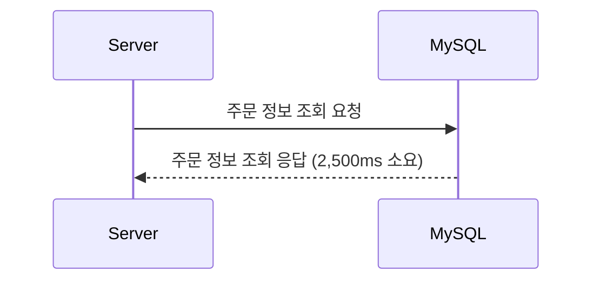
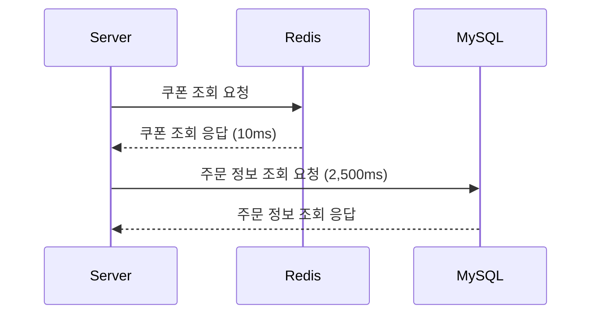
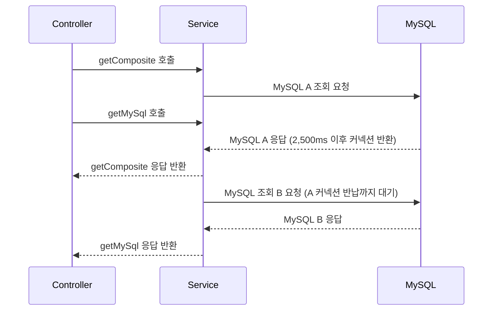
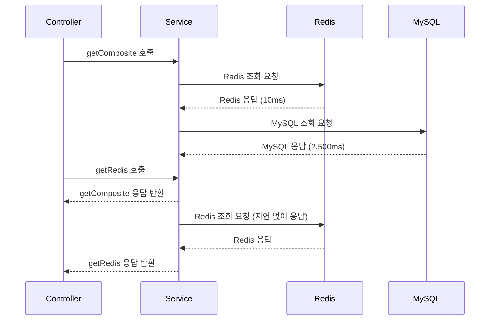

# Hikari와 비교하며 알아보는 Redis Lettuce 커넥션 풀의 특징

Redis는 기본적으로 싱글 스레드로 동작하는 인메모리 데이터베이스입니다. 이러한 특성 때문에 많은 개발자들은 Redis 클라이언트인 Lettuce에서 제공하는 커넥션 풀이 실제로 얼마나 유용한지, 그리고 그것이 애플리케이션에 어떤 이점을 가져다줄 수 있는지에 대해 의문을 가질 수 있습니다. 특히 "**Redis는 싱글 스레드인데, 굳이 여러 개의 커넥션을 유지하는 것이 의미가 있을까?**"라는 질문은 자주 듣는 질문 중 하나입니다.

Redis의 싱글 스레드 구조는 서버가 동시에 여러 클라이언트의 요청을 처리하는 것이 아니라, 각 요청을 순차적으로 처리한다는 것을 의미합니다. **즉, 많은 요청이 들어와도 Redis는 각 요청을 차례차례 처리하기 때문에 일반적인 데이터베이스처럼 병렬적으로 여러 쿼리를 동시에 실행할 수 있는 구조가 아닙니다. 그래서 많은 개발자들이 "그렇다면 Redis 클라이언트 측에서 커넥션 풀을 사용하는 것이 성능에 어떤 영향을 줄 수 있을까?"라는 의문을 가지게 되는 것입니다.**

하지만 Redis의 클라이언트 측, 특히 애플리케이션 레벨에서의 커넥션 관리 방식은 Redis 서버의 동작 방식과는 또 다른 관점을 제공합니다. **Lettuce 클라이언트는 기본적으로 비동기 및 넌블로킹 I/O를 지원하며, 커넥션 풀을 통해 여러 개의 커넥션을 관리함으로써 애플리케이션의 성능을 최적화할 수 있는 기회를 제공합니다. 이를 통해 Redis의 싱글 스레드 특성에도 불구하고 애플리케이션의 전반적인 응답성을 향상시킬 수 있습니다.** 이번 글에서는 Lettuce 커넥션 풀이 애플리케이션 성능에 미치는 영향을 실제 시나리오를 통해 자세히 알아보겠습니다.

## JDBC Hikari Connection Pool의 동작 방식

Redis Lettuce 커넥션 풀의 역할을 이해하기 위해, 먼저 전통적인 데이터베이스 커넥션 풀의 대표적인 예인 **JDBC Hikari Connection Pool**을 살펴보겠습니다.



전통적인 Hikari Connection Pool에서는 애플리케이션이 주문 정보를 조회하기 위해 커넥션 풀에서 하나의 커넥션을 가져옵니다. 아래 그림에서 볼 수 있듯이, **idleConnections**가 10개라면, 그 중 하나의 커넥션을 가져와 **activeConnections**로 전환하게 됩니다. 이 경우 **idleConnections**는 9개로 줄고, **activeConnections**는 1개가 됩니다. 전체 **totalConnections**는 변하지 않고 유지됩니다.


만약 요청이 많이 들어와 응답이 지연되고 있는 경우를 생각해 봅시다. 아래 그림처럼 **maximum-pool-size**가 10개인 상황에서, 모든 10개의 커넥션이 **activeConnections**로 전환되어 사용 중이라면, 추가적인 요청은 **threadsAwaitingConnection**으로 들어가 대기하게 됩니다. 즉, 사용 가능한 커넥션이 없기 때문에 요청 스레드는 커넥션이 반환될 때까지 기다려야 합니다.


이와 같이 전통적인 커넥션 풀의 개념에서는, **요청 스레드마다 활성화된 커넥션을 사용**하며, 해당 스레드가 작업을 끝내기 전까지는 **커넥션을 점유**하게 됩니다. 이는 데이터베이스의 동시 연결 수와 처리 능력을 효과적으로 관리할 수 있는 방법이지만, 커넥션이 사용 중일 때 대기하는 요청들이 발생할 수 있다는 단점이 있습니다.

이제 이러한 전통적인 커넥션 풀과 비교하여, **Redis Lettuce Connection Pool**이 어떻게 다른 방식으로 동작하는지에 대해 알아보겠습니다.

## Redis Lettuce Connection Pool의 동작 방식

Redis Lettuce Connection Pool의 동작 방식을 이해하기 위해, **Redis 조회와 MySQL 조회가 함께 사용되는 시나리오**를 살펴보겠습니다.



위의 시나리오에서 애플리케이션은 먼저 Redis에서 쿠폰 정보를 조회한 후, MySQL에서 주문 정보를 조회합니다. Redis 쿠폰 조회는 10ms 만에 응답이 오지만, 이후 이어지는 MySQL 조회는 2,500ms가 걸립니다. 이 상황에서 Redis Lettuce 커넥션 풀이 어떻게 동작하는지를 이해하는 것이 중요합니다.

Redis에 쿠폰 조회 요청을 보내면, 10ms 내에 쿠폰 정보가 응답됩니다. 여기서 Lettuce 커넥션 풀이 1개만 있다고 가정해 보겠습니다. 만약 이 상황이 전통적인 커넥션 풀 구조였다면, MySQL 데이터 조회(2,500ms)가 완료되기 전까지 하나뿐인 Redis 커넥션이 블록되어 Redis에 대한 추가적인 요청을 처리할 수 없었을 것입니다. 이는 Redis 서버가 이미 응답을 완료했음에도 불구하고, 애플리케이션 측에서 더 이상 Redis에 대한 요청을 처리할 수 없게 된다는 문제를 야기합니다.

그러나 Redis Lettuce의 경우 비동기적으로 동작할 수 있습니다. Redis 서버에서 응답을 내린 후 해당 커넥션이 즉시 반환된다면, MySQL 조회가 진행 중이더라도 Redis에 대한 새로운 요청을 처리할 수 있게 됩니다. 이는 Redis 서버가 싱글 스레드로 동작하더라도 Lettuce 클라이언트 측에서는 추가적인 요청을 계속해서 보낼 수 있는 가능성을 열어줍니다. 그렇다면 실제로 Redis Lettuce가 이러한 방식으로 동작하는지, 아니면 다른 방식으로 동작하는지 **코드를 통해 더 자세히 살펴보겠습니다**.

## Redis Lettuce와 Hikari 동작 비교를 위한 코드

```kotlin
@RestController
@RequestMapping
class MemberController(
    private val redisConnectionPoolSample: RedisConnectionPoolSample,
) {

    @GetMapping("/api/redis")
    fun getRedis(@RequestParam("id") id: String) = redisConnectionPoolSample.getRedis(id)

    @GetMapping("/api/mysql")
    fun getMySql(@RequestParam("id") id: Long) = redisConnectionPoolSample.getMySql(id)

    @GetMapping("/api/composite")
    fun getRedis2(@RequestParam("id") id: String) = redisConnectionPoolSample.getComposite(id)
}

@Service
class RedisConnectionPoolSample(
    private val couponRepository: CouponRepository,
    private val orderRepository: OrderRepository

) {

    fun getRedis(id: String): Coupon? {
        return couponRepository.findByIdOrNull(id)
    }


    fun getMySql(id: Long): Order? {
        printHikariConnection()
        return orderRepository.findByIdOrNull(id)
    }

    fun getComposite(id: String): Pair<Coupon?, Order?> {
        val coupon = couponRepository.findByIdOrNull(id)
        val order = orderRepository.findByIdOrNull(id.toLong())
        Thread.sleep(2500) // 2.5초 대기
        printHikariConnection()
        return Pair(coupon, order)
    }

    private fun printHikariConnection() {
        val targetDataSource = dataSource.unwrap(HikariDataSource::class.java)
        val hikariDataSource = targetDataSource as HikariDataSource
        val hikariPoolMXBean = hikariDataSource.hikariPoolMXBean
        val hikariConfigMXBean = hikariDataSource.hikariConfigMXBean

        val log = buildString {
            append("totalConnections: ${hikariPoolMXBean.totalConnections}, ")
            append("activeConnections: ${hikariPoolMXBean.activeConnections}, ")
            append("idleConnections: ${hikariPoolMXBean.idleConnections}, ")
            append("threadsAwaitingConnection: ${hikariPoolMXBean.threadsAwaitingConnection}")
        }
        println(log)
    }
}
```

위의 코드에서 `/api/redis`는 단순히 Redis에서 쿠폰 정보를 조회하는 API입니다. `/api/mysql`은 MySQL에서 주문 정보를 조회하는 API이며, `/api/composite`는 Redis 조회 후 MySQL 조회를 수행하고 2.5초 동안 대기한 후 응답을 반환하는 API입니다.

특히 `/api/composite`는 Redis에서 쿠폰을 조회한 후 MySQL 조회를 수행하며, 이때 `Thread.sleep(2500)`으로 인해 2.5초 동안 대기하게 됩니다. 이 상황에서 Lettuce의 커넥션 풀이 어떻게 동작하는지 살펴볼 수 있습니다.

## 시나리오별 Hikari와 Lettuce의 차이점

이 섹션에서는 Hikari와 Lettuce의 동작 방식을 서로 비교하면서 각 시나리오에서 어떤 차이점이 발생하는지에 대해 구체적으로 살펴보겠습니다. 이를 통해 각 커넥션 풀이 어떤 차이점을 갖고 있는지 명확히 이해할 수 있습니다.

### 시나리오: getComposite 호출 이후 getMySql 호출

Hikari 설정은 `maximum-pool-size=1`, `minimum-idle=1`로 구성되어 있으며, `getComposite` 호출 시 사용 가능한 단 하나의 커넥션을 사용하여 작업이 진행됩니다. 이번 테스트의 목적은 **`/api/composite` 호출 이후 `getMySql` 호출의 응답 속도를 확인**하는 것입니다. 만약 Hikari Connection Pool이 블로킹 방식으로 동작한다면 `getComposite` 호출 중 MySQL 조회 요청으로 점유된 커넥션이 반환되지 않아 `getMySql` 요청은 대기 상태에 놓이고 응답 시간이 지연될 것입니다. 반대로 MySQL 조회 요청이 빠르게 완료되거나, 추가적인 idle 커넥션이 있다면 `getMySql` 요청은 지연 없이 처리될 수 있습니다.

이때 로그:

```txt
totalConnections: 1, activeConnections: 1, idleConnections: 0, threadsAwaitingConnection: 0
```

위 로그를 통해 알 수 있듯이, 하나의 커넥션이 사용 중이며, 대기 중인 스레드는 없습니다.

이 상태에서 `getMySql` 호출을 시도하면, 사용 가능한 **idle 커넥션**이 없기 때문에 `getComposite` 호출이 끝난 후 반환된 커넥션을 사용해야 합니다. 이로 인해 **threadsAwaitingConnection** 상태에서 대기하게 되고, 지연이 발생합니다. 이후 **threadsAwaitingConnection**에서 대기하던 요청이 **activeConnections**로 전환되면, `getMySql` 호출에서 해당 커넥션을 사용할 수 있게 됩니다.

#### 테스트 결과

1. `/api/mysql` 단독 호출 시:
   ```
   # Connection totalConnections: 1, activeConnections: 1, idleConnections: 0, threadsAwaitingConnection: 0
   # HTTP 응답 Response code: 200; Time: 24ms (24 ms); Content length: 64 bytes (64 B)
   ```

2. `/api/composite` 호출 이후 바로 `/api/mysql`를 호출한 경우:
   ```
   # Connection totalConnections: 1, activeConnections: 1, idleConnections: 0, threadsAwaitingConnection: 1
   # HTTP 응답 Response code: 200; Time: 1112ms (1 s 112 ms); Content length: 64 bytes (64 B)
   ```

테스트 결과, `/api/composite` 호출 이후 `getMySql` 요청은 대기 상태에 놓이며, MySQL 조회 작업이 완료되어 커넥션이 반환된 이후에 처리되는 것을 확인할 수 있었습니다. 이는 Hikari Connection Pool이 동기적이며, 사용 중인 커넥션이 반환될 때까지 대기 상태에 놓이는 블로킹 방식으로 동작하기 때문입니다.

#### 동작 흐름



Hikari Connection Pool의 동작 방식은 아래와 같습니다.

1. **`getComposite` 호출**:  
   `Service`는 MySQL A 조회를 요청하고, 사용 가능한 idle 커넥션을 가져옵니다. 이 요청은 2,500ms가 소요되며, 해당 커넥션은 점유된 상태로 유지됩니다.
2. **`getMySql` 호출**:  
   `Controller`는 `Service`로 `getMySql` 호출을 보냅니다. 그러나 MySQL A 조회 요청이 아직 진행 중이므로 사용 가능한 커넥션이 없습니다. 이에 따라 요청은 **threadsAwaitingConnection** 상태로 대기하게 됩니다.
3. **MySQL A 응답 반환**:  
   MySQL A 조회 요청이 완료되면서 커넥션이 반환됩니다. 반환된 커넥션은 대기 중이던 `getMySql`의 MySQL B 조회 요청에서 다시 사용됩니다.
4. **MySQL B 조회 요청 및 응답**:  
   반환된 커넥션을 사용해 MySQL B 조회 요청이 처리됩니다. B 조회는 지연 없이 완료되며, 응답이 반환됩니다.
5. **최종 응답 반환**:  
   `getComposite`와 `getMySql` 요청이 순차적으로 완료되며, 최종적으로 각각의 결과가 `Controller`로 반환됩니다.

#### 블로킹 방식의 한계

이 시나리오에서 Hikari Connection Pool의 블로킹 특성으로 인해 다음과 같은 한계가 발생합니다:

- MySQL A 조회 요청이 완료되기 전까지 커넥션이 반환되지 않으므로, `getMySql` 호출은 대기 상태에 놓이게 됩니다.
- 동시 요청 수가 많아지면 **threadsAwaitingConnection** 상태가 증가하여 대기 시간이 길어질 가능성이 높습니다.

그렇다면 Redis Lettuce 커넥션 풀은 어떻게 동작하는지 살펴보겠습니다. Lettuce에서도 동일하게 스레드를 블록 시킨다면 지연이 발생할 것이며, 반대로 블록하지 않는다면 MySQL의 지연과 상관없이 추가적인 Redis 호출에 대해 빠르게 응답할 수 있을 것입니다.

### 시나리오: getComposite 호출 이후 getRedis 호출

Lettuce 설정은 `max-active=1`, `max-idle=1`, `min-idle=1`로 구성되어 있으며, `getComposite` 호출 시 사용 가능한 단 하나의 커넥션을 사용하여 작업이 진행됩니다. 이번 테스트의 목적은 **`/api/composite` 호출 이후 `getRedis` 호출의 응답 속도를 확인**하는 것입니다. 만약 Lettuce가 블록되는 방식으로 동작한다면 `getComposite` 호출 중 Redis 조회 요청으로 점유된 커넥션이 MySQL 작업이 끝날 때까지 반환되지 않아 `getRedis` 요청은 대기 상태에 놓이고 응답 시간이 지연될 것입니다. 반대로 Lettuce가 비동기적이며 블로킹되지 않는 방식으로 동작한다면 `getComposite` 호출 중에도 커넥션이 Redis 요청 응답 후 즉시 반환되므로, `getRedis` 요청이 지연 없이 처리될 것입니다.

#### 테스트 결과

1. `/api/composite` 호출 이후 바로 `/api/redis`를 호출한 경우:
   ```
   Response code: 200; Time: 8ms (8 ms); Content length: 56 bytes (56 B)
   ```
2. `/api/redis` 단독 호출 시:
   ```
   Response code: 200; Time: 6ms (6 ms); Content length: 56 bytes (56 B)
   ```

테스트 결과, `/api/composite` 호출 중에도 `/api/redis` 요청은 지연 없이 빠르게 응답하는 것을 확인할 수 있었습니다. 이는 Lettuce가 비동기적으로 동작하며, 스레드를 블록하지 않음을 시사합니다.

#### 동작 흐름



1. **`getComposite` 호출**:  
   `Controller`가 `getComposite` 요청을 보냅니다. `Service`는 먼저 Redis 조회를 수행하며, 이 작업은 10ms 만에 완료되고 커넥션은 즉시 반환됩니다. 이후 MySQL 조회를 시작하며, MySQL 조회 작업은 2,500ms가 소요됩니다.
2. **`getRedis` 호출**:  
   MySQL 조회가 진행 중인 상태에서 `Controller`가 `getRedis` 요청을 보냅니다. Redis는 MySQL 작업과는 독립적으로 동작하므로, Redis 조회 요청은 지연 없이 처리됩니다. 반환된 Redis 커넥션이 즉시 재사용되어 `getRedis` 요청이 빠르게 완료됩니다.
3. **`getComposite` 응답 반환**:  
   MySQL 작업이 완료되면 `getComposite` 응답이 반환됩니다.
4. **`getRedis` 응답 반환**:  
   Redis 조회 요청이 완료된 후 응답이 반환됩니다. Redis 작업이 MySQL 작업의 지연과 상관없이 즉시 처리되었기 때문에 빠른 응답 시간을 유지합니다.

#### 논블로킹의 장점

테스트 결과를 통해 Lettuce가 비동기적이고 논블로킹 방식으로 동작한다는 것을 확인할 수 있었습니다. Redis 조회는 10ms 만에 응답을 완료하고 커넥션을 즉시 반환하므로, MySQL 작업이 진행 중이라도 Redis 커넥션이 점유된 상태로 남아있지 않습니다. 결과적으로, 추가적인 Redis 요청(`getRedis`)은 MySQL의 작업 지연과 관계없이 빠르게 처리됩니다.

이는 MySQL의 Hikari Connection Pool이 스레드를 블록하여 대기 시간을 유발하는 방식과 대비됩니다. Hikari에서는 커넥션이 반환될 때까지 다른 요청이 대기 상태에 놓이지만, Lettuce는 커넥션 반환이 즉시 이루어져 이러한 지연 없이 요청을 처리할 수 있습니다.

Redis의 비동기 I/O와 Lettuce의 설계가 결합되어 높은 동시성 환경에서도 안정적인 성능을 유지할 수 있음을 보여주는 사례라 할 수 있습니다. 이러한 특성은 Redis와 같이 빠른 응답성을 요구하는 환경에서 Lettuce가 얼마나 효율적인지를 잘 보여줍니다.

### Hikari와 Lettuce의 차이점 정리

1. **동작 방식의 차이**:
    - Hikari Connection Pool은 **전통적인 동기식 동작**을 기반으로 하며, 스레드 블로킹이 발생합니다. MySQL 같은 관계형 데이터베이스와 함께 사용하는 경우, 데이터 조회 시 커넥션이 점유된 상태로 유지되므로 다른 요청들은 사용 가능한 커넥션이 없어 대기하게 됩니다.
    - Redis Lettuce Connection Pool은 **비동기 및 넌블로킹 I/O**를 지원하여, Redis 서버에서 응답을 받은 후에도 바로 커넥션을 반환할 수 있습니다. 이를 통해 **커넥션 점유 시간이 짧아져** Redis에 대한 다른 요청들도 빠르게 처리될 수 있습니다.
2. **커넥션 풀의 활용도**:
    - Hikari Connection Pool은 **threadsAwaitingConnection**을 관리하며, 커넥션 풀이 모두 사용 중일 경우 새 요청들은 대기하게 됩니다. 따라서 **커넥션 풀 크기 설정**이 성능에 큰 영향을 미칩니다.
    - Redis Lettuce Connection Pool은 커넥션을 빠르게 반환하기 때문에, **커넥션 풀 크기를 크게 설정하지 않아도 효율적으로 동작**할 수 있습니다. Redis의 비동기 처리 덕분에 서버의 응답이 빠르다면, 적은 수의 커넥션으로도 많은 요청을 처리할 수 있습니다.
3. **특정 상황에서의 블로킹 차이**:
    - Hikari Connection Pool은 요청이 지연되면, 다른 커넥션이 점유되지 않는 한 **대기 스레드**가 계속 늘어날 수 있습니다. 이는 높은 동시성에서 성능 저하를 야기할 수 있습니다.
    - Redis Lettuce는 비동기적이며, Redis 서버로부터 응답을 받은 후에는 **커넥션을 빠르게 반환**하므로, **서버 응답 시간**이 Lettuce의 성능에 직접적인 영향을 미칩니다. 즉, Redis 명령어가 복잡하고 시간이 오래 걸리면(예: `keys *` 사용), 그 시간 동안 다른 요청들이 블록될 수 있습니다.
4. **블로킹/넌블로킹의 영향**:
    - Hikari의 경우 **스레드 블로킹**이 빈번히 발생하는 반면, Lettuce는 넌블로킹으로 **추가적인 스레드 리소스를 사용하지 않고도** 더 많은 요청을 처리할 수 있는 장점이 있습니다.
    - 이는 특히 **IO 작업이 많은 환경**에서 Lettuce가 더 효율적으로 동작하도록 만듭니다. 반면, Hikari는 **동기적 처리**로 인해 CPU 자원을 더 많이 사용하게 되며, 이는 고비용의 대기 시간이 발생할 가능성을 증가시킵니다.

## Lettuce Connection Pool 설정과 의미

### Lettuce Connection Pool Properties

Spring Data Redis에서는 `application.yml` 파일을 통해 Lettuce Connection Pool의 설정을 손쉽게 구성할 수 있습니다. 아래는 주요 프로퍼티와 그 설명입니다:

```yaml
spring:
    redis:
        lettuce:
            pool:
                max-active: 1
                max-idle: 1
                min-idle: 1
                enabled: true
                max-wait: 1000ms
                time-between-eviction-runs: 1000ms
```

| 설정 항목                        | 설명                                                                  | 기본 값         |
|------------------------------|---------------------------------------------------------------------|--------------|
| `max-active`                 | Connection Pool에서 사용할 수 있는 최대 커넥션 수로, 동시 연결 수를 제한합니다.               | 8            |
| `max-idle`                   | Connection Pool에서 유지할 수 있는 최대 유휴 커넥션 수입니다. 이 값을 초과하는 유휴 커넥션은 폐기됩니다. | 8            |
| `min-idle`                   | Connection Pool에서 유지할 최소 유휴 커넥션 수입니다. 유휴 커넥션이 부족하면 새 커넥션을 생성합니다.    | 0            |
| `enabled`                    | Lettuce Connection Pool 사용 여부를 설정합니다. `true`로 설정 시 Pool이 활성화됩니다.    | `false`      |
| `max-wait`                   | 커넥션이 사용 중일 때 새로운 요청이 대기할 수 있는 최대 시간입니다. 설정된 시간이 초과되면 예외가 발생합니다.     | -1 (무제한 대기)  |
| `time-between-eviction-runs` | 유휴 커넥션 검사 및 제거 작업의 주기를 설정합니다. (단위: 밀리초)                             | -1 (검사하지 않음) |

이러한 설정은 Lettuce Connection Pool의 동작을 세부적으로 제어하며, 애플리케이션의 요구 사항에 맞게 성능과 리소스 사용량을 조정할 수 있습니다. 특히, `max-active`, `min-idle`, `max-wait`와 같은 설정은 TPS가 높은 환경이나 트래픽 변동이 큰 상황에서 애플리케이션의 안정성을 보장하는 데 중요한 역할을 합니다.

### Lettuce Connection Pool의 개수가 갖는 의미

Redis Lettuce Connection은 비동기 방식으로 동작하며, 요청을 처리한 후 커넥션을 즉시 반환하는 구조를 가지고 있습니다. 이는 적은 수의 커넥션으로도 높은 효율을 발휘할 수 있다는 점에서 큰 장점입니다. 하지만, Hikari와 같은 전통적인 동기 커넥션 풀처럼 미리 커넥션을 확보하여 동시성을 처리하는 방식은 아니기 때문에, "Lettuce Connection Pool의 개수가 많다고 해서 이점이 있을까?"라는 의문을 가질 수 있습니다.

사실, Lettuce Connection Pool의 개수는 TPS가 높아지고 Redis 서버의 응답이 느려질 때 중요한 의미를 가집니다. 다음은 Lettuce Connection Pool의 개수가 많을 때 가지는 이점을 설명합니다.

1. **Redis 응답 지연 시 동시 요청 처리 가능**:  
   Redis 서버가 응답을 지연하는 경우, 요청이 커넥션을 점유하는 시간이 길어집니다. 이때 Connection Pool의 크기가 작다면 모든 커넥션이 점유된 상태에서 새로운 요청이 대기 상태로 전환될 가능성이 높습니다. 하지만 Connection Pool 크기가 충분히 크다면, 지연된 요청과 별개로 다른 요청을 처리할 여유를 확보할 수 있습니다. 이는 TPS가 몰리는 상황에서도 전체 시스템의 성능 저하를 방지합니다.

2. **Burst 트래픽에서의 안정성 확보**:  
   트래픽이 순간적으로 폭증하는 경우, Pool 크기가 충분히 크면 새로운 요청을 대기시키지 않고 처리할 수 있습니다. 이는 특히 Redis 응답 시간이 일관되지 않은 상황에서 더욱 중요한데, Pool 크기가 충분하지 않으면 요청 처리 시간이 예측 불가능하게 증가할 수 있습니다.

3. **멀티 인스턴스 활용 가능성**:  
   Redis는 싱글 스레드로 동작하지만, 애플리케이션 인스턴스가 여러 개일 경우 각 인스턴스에서 동시에 Redis에 접근합니다. Pool 크기가 충분히 크다면, 여러 인스턴스가 Redis와 병렬로 통신하면서도 효율적으로 커넥션을 재사용할 수 있습니다.

4. **비동기 요청 처리 속도 향상**:  
   Lettuce는 비동기적으로 여러 요청을 처리할 수 있지만, Pool 크기가 제한적이라면 커넥션 재사용의 병목이 발생할 수 있습니다. Pool 크기를 늘리면 이러한 병목을 완화하고, Redis 서버의 응답 속도에 따라 더 많은 요청을 처리할 수 있습니다.

5. **장시간 실행되는 명령어의 영향 완화**:  
   일부 Redis 명령어(예: `zrange`, `keys`)는 실행 시간이 길어질 수 있습니다. Pool 크기가 작다면 이런 명령이 다른 요청 처리에 직접적인 영향을 미치지만, 충분한 Pool 크기는 이런 상황에서도 다른 요청을 지연 없이 처리할 수 있도록 합니다.

Lettuce Connection Pool의 개수는 TPS와 Redis 서버의 응답 지연이 증가하는 상황에서 중요한 역할을 합니다. 비록 Lettuce가 비동기적이고 효율적인 구조를 가졌더라도, Pool 크기를 적절히 설정하지 않으면 요청 대기가 발생할 수 있습니다.

따라서 Lettuce Connection Pool의 개수는 단순히 많은 요청을 처리하기 위한 것이 아니라, Redis 서버 응답 시간의 변동성, Burst 트래픽, 그리고 장시간 실행되는 명령어 처리와 같은 다양한 상황에 대비하기 위한 안정성을 제공한다고 볼 수 있습니다. Connection Pool 크기를 TPS와 트래픽 패턴에 맞게 조정하는 것이 Lettuce의 효율성을 극대화하는 핵심 전략입니다.

## 결론

논블로킹 방식이 항상 절대적으로 좋은 것은 아닙니다. Redis Lettuce와 Hikari Connection Pool은 서로 다른 특성과 장점을 가지고 있으며, 각 환경에 따라 적절히 선택해야 합니다.

Lettuce의 경우, Redis 서버로부터 응답을 받으면 커넥션을 즉시 반환하고 다음 요청을 처리할 준비를 합니다. 이는 커넥션 점유 시간이 짧아져 더 작은 풀 크기로 효율적인 요청 처리가 가능하다는 큰 장점이 있습니다. 하지만 Redis 서버 자체가 응답을 지연한다면, 다른 요청이 대기 상태에 놓이게 되어 성능 저하로 이어질 수 있습니다. 이러한 상황에서는 Lettuce의 비동기적 특성이 한계를 보일 수 있습니다.

반면, Hikari Connection Pool은 유휴 커넥션이 있는 경우 한 요청이 오래 걸리더라도 다른 커넥션을 사용하여 추가적인 요청을 처리할 수 있습니다. 이는 Redis와 같은 싱글 스레드 구조가 아닌, 다중 커넥션을 사용하는 데이터베이스 환경에 잘 맞는 전략입니다. 그러나 Hikari는 요청 중 커넥션이 블록되는 방식으로 동작하기 때문에, 풀 크기가 제한적이거나 동시 요청이 많아지면 대기 시간이 길어질 가능성이 있습니다.

이러한 차이는 Redis가 싱글 스레드로 모든 요청을 처리하도록 설계된 서버라는 점에서 기인합니다. Lettuce는 Redis 서버의 메커니즘과 잘 맞는 전략을 선택하여 구현되었으며, 비동기와 논블로킹을 통해 Redis의 성능 특성을 최대한 활용합니다. 이는 Hikari Connection Pool과는 다른 접근 방식으로, Redis 서버와의 높은 호환성을 유지하며 효율적인 자원 관리를 가능하게 합니다.

소프트웨어 개발에서는 항상 트레이드오프가 존재합니다. 특정 기술이 모든 상황에서 우월하다고 말할 수는 없습니다. Lettuce와 Hikari의 차이는 각기 다른 환경에 적합한 도구를 제공하며, 사용자는 자신의 애플리케이션 요구사항에 따라 적합한 전략을 선택해야 합니다. 결국, 어떤 도구가 "좋다"라고 단정짓기보다는, 각 기술의 장단점을 이해하고 상황에 맞게 활용하는 것이 중요합니다.