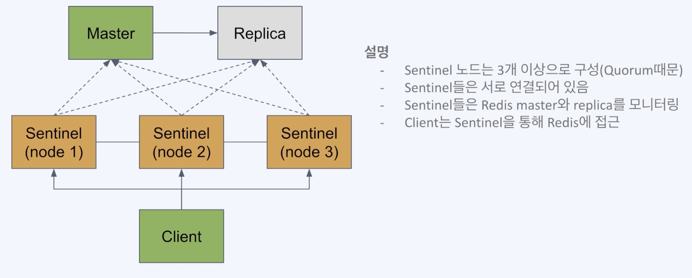
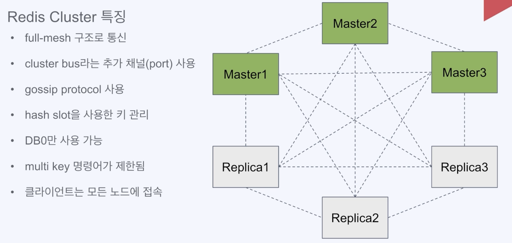
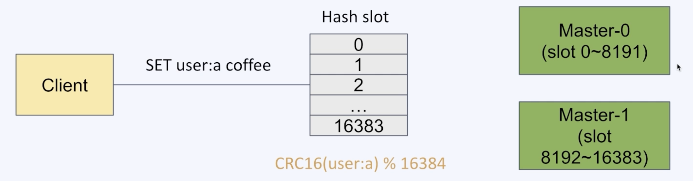
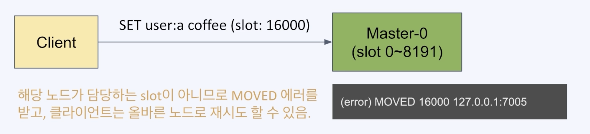
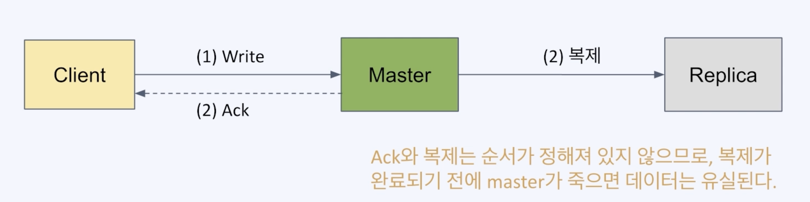
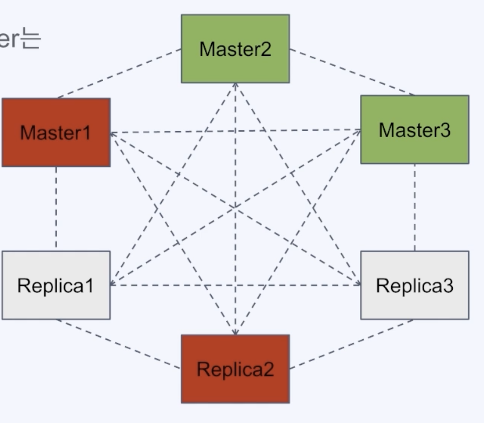
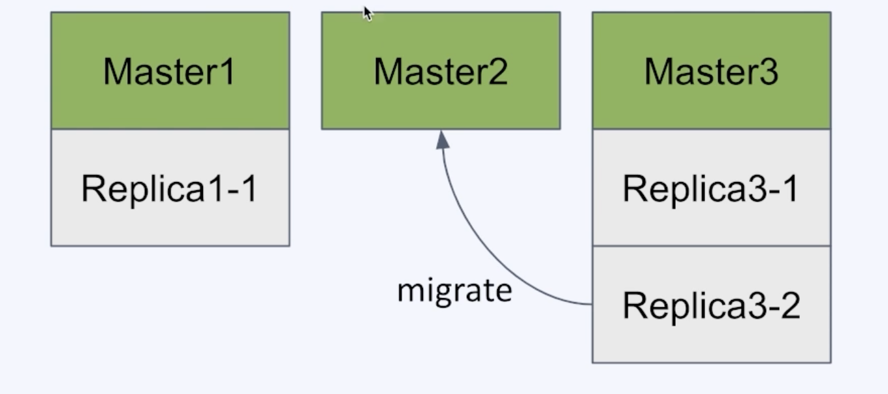
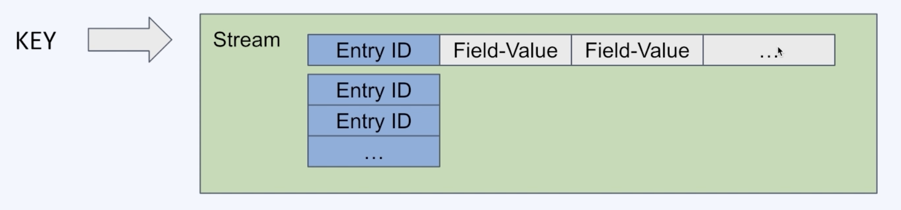
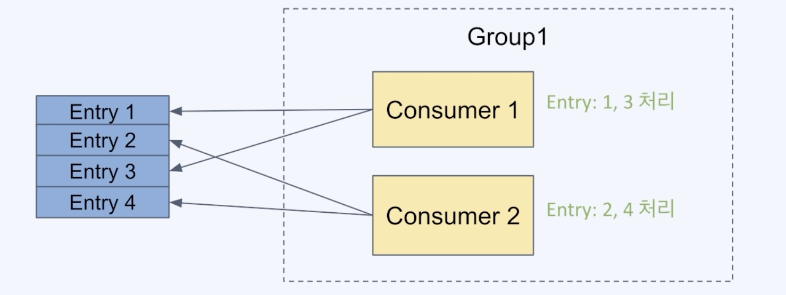

# Redis 소개와 특징

# Redis Data Type 이해

## Strings

* 가장 기본적인 데이터 타입 제일 많이 사용됨
* 바이트 배열 저장
* 바이너리로 변환할 수 있는 모든 데이터를 저장 가능
* 최대 크기는 512MB

### 주요 명령어

| 명령어  | 기능                              | 에졔                          |
|------|---------------------------------|-----------------------------|
| SET  | 특정 키에 문자열 값을 저장한다.              | SET say hello               |
| GET  | 특정 키의 문자열 값을 얻어 온다.             | GET say                     |
| INCR | 특정 키의 값을 Integer로 취급하여 1 증가시킨다. | INCR mycount                |
| DECR | 특정 키의 값을 Integer로 취급하여 1 감소시킨다. | DECR mycount                |
| MSET | 여러 키에 대한 값을 한번에 저장한다.           | MSET mine milk yours coffee |
| MGET | 여러 키에 대한 값을 한번에 얻어 온다.          | MSET mine yours             |

<details>
<summary>접기/펼치기</summary>

```
set key1 1
get key1

set mycount 10
incr mycount
decr mycount
get mycount

mset key1 hi key2 hello
mget key1 key2
```

</details>

## Lists

* Linked-list 형태의 자료구조(인덱스 접근은 느리지만 데이터 추가/삭제가 빠름)
* Queue와 Stack으로 사용할 수 있음

| 명령어    | 기능                              | 에졔                  |
|--------|---------------------------------|---------------------|
| LPUSH  | 리스트의 왼쪽(head)에 새로운 값을 추가한다.     | LPUSH mylist apple  |
| RPUSH  | 리스트의 오른쪽(tail)에 새로운 값을 추가한다.    | RPUSH mylist banana |
| LLEN   | 리스트에 들어있는 아이템 개수를 반환한다.         | LLEN mylist         |
| LRANGE | 리스트의 특정 범위를 반환한다.               | LRANGE mysql 0 -1   |
| LPOP   | 리스트의 왼쪽(head)에서 값을 삭제하고 반환한다.   | LPOP mylist         |
| RPOP   | 리스트이 오른쪽(tail)에서 값을 삭제 하고 변환한다. | RPOP mylist         |

<details>
<summary>접기/펼치기</summary>

```
LPUSH mylist apple
LPUSH mylist banana

LLEN mylist

LRANGE mylist 0 -1
LRANGE mylist 0 -2

LPOP mylist
RPOP mylist
```

</details>

## Sets

* 순서가 없는 유니크한 값의 집합
* 검색이 빠름
* 개별 접근을 위한 인덱스가 존재하지 않고, 집합 연산이 가능(교집합, 합집합)

| 명령어       | 기능                         | 예제                    |
|-----------|----------------------------|-----------------------|
| SADD      | Set에 데이터를 추가한다.            | SADD myset apple      |
| SREM      | Set에 데이터를 삭제한다.            | SRM myset apple       |
| SCARD     | Set에 저장된 아이템 개수를 반환한다.     | SCARD myset           |
| SMEMBERS  | Set에 저장된 아이템을 반환한다.        | SMEMBERS myset        |
| SISMEMBER | 특정 값이 Set에 포함되어 있는지를 반환한다. | SISMEMBER myset apple |

<details>
<summary>접기/펼치기</summary>

```
SADD myset apple
SADD myset banana

SCARD myset
SMEMBERS myset

SISMEMBER myset apple
SISMEMBER myset grape
```

</details>

## Hashes

* 하나의 key 하위에 여러개의 field-value 쌍을 저장
* 여러 필드를 가진 객체를 저장하는 것으로 생각할 수 있음
* HINCRBY 명령어를 사용해 카운터로 활용 가능

| 명령어     | 기능                                     | 예제                         |
|---------|----------------------------------------|----------------------------|
| HSET    | 한개 또는 다수의 필드에 값을 저장한다.                 | HSET user name bear age 10 |
| HGET    | 특정 필드의 값을 반환한다.                        | HGET user1 name            |
| HMGET   | 한개 이상의 필드 값을 반환한다.                     | HMGET user1 name age       |
| HINCRBY | 특정 필드 값을 Integer로 취급하여 저장한 숫자를 증가 시킨다. | HINCRBY user1 viewcount 1  |
| HDEL    | 한개 이상의 필드를 삭제한다.                       | HDEL user1 name age        |

<details>
<summary>접기/펼치기</summary>

```
HSET user name bear age 10
HGET user name

HMGET user name age

HSET user viewcount 15

HGET user viewcount

HINCRBY user viewcount 3

HKEYS user

HDEL user name age

HKEYS user
```

</details>

## SortedSets

* Set과 유사하게 유니크한 값의 집합
* 각 값은 연관된 score를 가지고 정렬되어 있음
* 정렬된 상태이기에 빠르게 최소/최대값을 구할 수 있음
* 순위 계산, 리더보드 구현 등에 활용

| 명령어      | 기능 제                            | 예제                             |
|----------|---------------------------------|--------------------------------|
| ZADD     | 한개 또는 다수의 값을 추가 또는 업데이트 한다.     | ZADD myrank 10 apple 20 banana |
| ZRANGE   | 특정 범위의 값을 반환한다.(오름차순으로 정렬된 기준)  | ZRANGE myrank 0 1              |
| ZRANK    | 특정 값의 위치(순위)를 반환한다.(오름차순으로 정렬된) | ZRANK myrank apple             |
| ZREVRANK | 특정 값의 위치(순위)를 반환한다.(내림차순으로 정렬된) | ZREVRANK myrank apple          |
| ZREM     | 한개 이상의 값을 삭제한다.                 | ZREM myrank apple              |

<details>
<summary>접기/펼치기</summary>

```
ZADD myrank 10 apple 20 banana 30 grape

ZRANGE myrank 0 1

ZREVRANK myrank apple

ZRANK myrank apple
```

</details>

# 게임 리더 보드 만들기

## 리더보드의 특성과 기능 요구사항

* 게임이나 경쟁에서 상위 참가자의 랭킹과 점수를 보여주는 기능
* 순위로 나타낼 수 있는 다양한 대상에 응용

### 리더보드의 동작 API

* 점수 생성/업데이트 -> SetScore(userid, score)
* 상위 랭킹 조회 -> getRange(1~10)
* 특정 대상 순위 조회 -> getrank(userId)

### RDBMS 사용시 문제

* 한 행에만 접근하므로 비교적 빠름
* 랭킹 범위나 특정 대상의 순위 조회
  * 데이터 정렬하거나 count등의 집계 함수연산을 수행하므로 데이터가 많아질수록 속도가 느려짐

### Redis 사용시 장점

* 순위 데이터에 적합한 sorted-set 자료구조를 사용하면 socre를 통해 자동을 정렬됨
* 용도에 특회된 오퍼레이션이 존재하므로 사용이 간단함
* 자료구조의 특성으로 데이터 조회가 빠름
* 빈번한 액세스에 유리한 In-memory DB의 속도

# Pub/Sub을 이용해 손쉽게 채팅방 기능 구현하기

## Pub/Sub 패턴

* 메시징 모델 중 하나로 발행과 구독 역할로 개념화 한 형태
* 발생자와 구독자는 서로에 대한 정보 없이 특정 토픽 or 채널을 매개로 송수신

## 메시지미들웨어 사용의 장점

* 비동기: 통신의 비동기 처리
* 낮은 결합도: 송신자와 수신자 직접 서로 의존하지 않고 공통 미들웨어에 의존
* 탄력성: 구성원들간에 느슨한 연결로 인해 일부 장애가 생겨도 영향이 최소화됨

## Redis의 Pub/Sub 특징

* 메시지가 큐에 저장되지 않음
* Kafka의 컨슈머의 그룹같은 분산처리 개념이 없음
* 메시지 발행 시 push 방식으로 subscriber들에게 전송
* subscriber가 늘어날수록 성능저하

## Redis의 Pub/Sub의 유즈케이스

* 실시간으로 빠르게 전송되야 하는 메시지
* 메시지 유실을 감내할 수 있는 케이스
* 최대 1회 전송 패턴이 적합한 경우
* Subscriber들이 다양한 채널을 유동적으로 바꾸면서 한시적으로 구독하는 경우

# Redis의 백업과 장애 복구

## RDB를 사용한 백업

* RDB = Redis Database를 사용한 백업
* 특정 시점의 스냅샷으로 데[이터를 저장
* 재시작 시 RDB 파일이 있으면 읽어서 복구
  * dump.rdb

### RDB 사용의 장단점

* 장점
  * 작은 파일 사이즈로 백업 관리가 용이
  * fork를 이용해 백업하므로 서비스 중인 프로세스는 성능에 영향 없음
  * 데이터 스냅샷 방식으로 빠른 복구 가능
* 단점
  * 스냅샷을 저장하는 시점 사이의 데이터 변경사항을 유실될 수 있음
  * fork를 이용하기 떄문에 오래 걸릴 수 있고, cpu와 메모리 자원을 많이 소모
  * 데이터 무결성이나 정합성에 대한 요구가 크지 않은 경우 사용 가능(마지막 백업 시 에러 발생 등의 문제)

### RDB 설정

* 설정파일이 없어도 기본 값으로 RDB를 활성화되어 있음
* 설정 파일 만드는 템를릿을 받아서 사용 [https:://redis.io/docs/management/config](https:://redis.io/docs/management/config)

```
# 저장 주기 설정(60초 마다 10개 이상의 변경이 있을 떄 수행)
save 60 10

# 스냅샷저장할 파일 이름
dbfilename dump.rdb

# 수동으로 스냅샷 저장
bgsave
```

## AOF를 사용한 백업

### AOF를 사용한 사용한 백업

* 모든 쓰기 요청에 대한 로그를 저장
* 재시작 시 AOF에 기록된 동작을 재수행해서 데이터를 복구

### AOF 사용의 장단점

* 장점
  * 모든 변경사항이 기록되므로 RDB 방식 대비 안정적으로 데이터 백업 가능
  * AOF 파일을 append-only 방식으로 백업 파일이 손상될 위험이 적음
  * 실제 수행된 명령어가 저장되어 있으므로 사람이 보고 이해할 수 있고 수정도 가능
* 단점
  * RDB 방식보다 파일 사이즈 커짐
  * RDB 방식 대비 백업&복구 속도가 느림(백업 성능은 fsync 정책에 따라 조절 가능)

### AOF 설정 예시

```
# AOF 사용 (기본 값은 no)
appendonly yes

# AOF 파일 이름
appendfilename appendonly.aof

# fsync 정책 설정 (always, everysec, no)
appendfsync everysec
```

### fsync 정책

* fsync() 호출은 OS에게 데이터를 디스크에 쓰도록 함
* 가능한 옵션과 설명
  * always: 새로운 커맨드가 춫가될 떄마다 수행, 가장 한전하지만 가장 느림
  * everyonesec: 1초마다 수행, 성능은 RDB 수준에 접근
  * no: OS에 맡김, 가장 빠르지만 덜 안전한 방법(커덜마다 수행 시간이 다를 수 있음)

### AOF 관련 개념

* Log rewriting: 최종 상태를 만들기 위한 최소한의 로그만 남기기기 위해 일부를 새로씀
* multi part AOF: Redis 7.0 부터 AOF가 파일에 저장되지 않고 여러 개가 사용됨
  * base file: 마지막 rewirte 시 스냅샷을 저장
  * incremental file: 마지막으로 base file이 생성된 이후의 변경사항이 쌓임
  * manifest file: 파일들을 관리하기 위한 메타 데이터를 저장

### Redis의 replication(복제)

* 백업만으로 장애 대비에 부족함(백업 실패 가능성, 복구에 소요되는 시간)
* redis로 복제를 통해 가용성을 확보하고 빠른 장애조치가 가능
* master가 죽었을 경우 replica 중 하나를 master로 전환해 즉시 서비스 정상화 가능
* 복제본(replica)은 read-only 노드로 사용 가능하므로 traffic 분산도 가능

### Redis 복제 사용

````
# replica로 동작하도록 설정
replicaof 127.0.0.1 6379

# replica는 read-only로 설정
replica-read-only
````

**master 노드는 RDB나, AOF를 이용한 백업 기능 활성화가 필수, 재시작 후에 비어있ㅎ는 데이터 상태가 복제 되지 않도록**

## Redis Setntinel를 이용한 자동 장애 조치

* Redis에서 HA를 제공하기 위한 장치
* master-replica 구조에서 master가 다운 시 replica를 master로 승격시키기는 auto-failover를 수행
* Setntinel의 기능
  * 모니터링
  * 알림
  * 자동 장애 복구
  * 환경 설정 제공자

### Redis Sentinel 실제 구성



### Redis Sentinel 특징

* SDOWN과 ODOWN의 2가지 판단이 있음
  * SDOWN: Sentinel 1대가 down으로 판단(주관적)
  * ODOWN: 정족수가 충족되어 down으로 판단(객관적)
* master 노드가 down 된걸 판단되기 위해서는 Sentinel 노드들이 정족수(Quorum)을 충족해야함
* 클라이언트는 Sentineld을 통해 master의 주소를 얻어내야 함

# 확장성과 가용성을 위한 클러스터

## 확장과 분산

## Redis Cluster

### Redis Cluster 란?

* 여러 노드에 자동적인 데이터 분산
* 일부 노드의 실패나 통신 단절에도 계속 작동하는 가용성
* 고성능을 보장하면서 선형 확장성을 제공

### Redis Cluster 특징



### Sentinel 과의 차이점

* 클러스터는 데이터 분산을 제공함
* 클러스터는 자동 장애조치를 위한 모니터링 노드를 추가 배치할 필요가 없음
* 클러스터에서 Multi key 오퍼레이션이 제한됨
* Sentinel은 비교적 단순하고 소규모의 시스템에서 Hㅁ가 필요할 때 채택

## 데이터 분산과 Key 관리

### 데이터를 분산하는 기준

* 특정 Key의 데이터가 어느 노드에 속할 것인지 결정하는 메커니즘이 있어야함
* 보통 분산 시스템에서 해싱이 사용됨
* 단순 해싱으로는 노드의 개수가 변할 떄 모든 매핑이 새로 계산되야 하는 문제가 있음

### Hash Slot를 이용한 데이터 분산

* Redis는 16384개의 hssh slot으로 key 공간을 나누어 관리
* 각 키는 CRC16 해싱 후 16384로 modulo 연산을 해 각 hash slot에 매핑
* hash slot은 각 노드들에게 나누어 분배됨



### 클라이언트의 데이터 접근

* 클라이언트 노드는 요청이 온 Key에 해당하는 노드로 자동 redirect를 해주지 않음
* 클라이언트는 MOVED 에러를 받으면 해당 노드로 다시 요청해야 함



### 성능과 기용성

#### 클러스터를 사용할 때의 성능

* 클라이언트가 MOVED 에러에 재요청을 해야 문제
  * 클라이언트(라이브러리)는 key-node 맵을 캐싱하므로 대부분의 경우 발생하지 않음
* 클라이언는 단일 인스턴스의 Redis를 이용할 때와 같은 성능으로 이용 가능
* 분산 시스템에서 성능은 데이터 일관성과 trade-off가 있음
  * Redis Cluster는 고성능 확장성을 제공하면서 적절한 수준의 데이터 안정성과 가용성을 유지하는 것을 목표로 설계됨

### 클러스터의 데이터 일관성

* Redis Cluster는 strong consistency를 제공하지 않음
* 높은 성능을 위해 비동기 복제를 하기 때문



### 클러스터의 가용성 - Auto failover

* 일부 노드(master)가 실패(또는 네트워크 단절)하더라도 과반수 이상의 master가 남아있고, 사라진 master의 replica들이 있다면 클러스터는 failover되어 가용한 상태가된다.
* node timeout 동안 과반수의 master와 통신하지 못한 master는 스스로 error state로 빠지고 write 요청을 받지 않음



* master 1과 replica2가 죽더라도, 2/3의 master가 남아있고, master1이 커버하던 hash slot은 replica1이 master로 승격되어 커버할 수있다.

### 클러스터의 가용성 - Replica migration



* replica가 다른 master로 migrate 해서 가용성을 높빈다.
* master3은 replica 1개를 빼도 1개가 남기 때문에 replica3-2는 다른 master로 migrate 가능

## 클러스터의 제약 사항

### 클러스터에스는 DB0만 사용 가능

* Redis는 한 인스턴스에 여러 데이터베이스를 가질 수 있으며 디폴트는 16
* Multi DB는 용도별로 분리해서 관리를 용이하게 하기 위한 목적
* 클러스터에서는 해당 기능을 사용할 수 없고 DB0으로 고정된다.

### Multi key operation 사용의 제약

* key들이 각각 다른 노드에 저장되있으므로 MSET과 같은 multi-key operation은 기본적으로 사용할 수 없다
* 같은 노드 안에 속한 key들에 대해서는 multi-key operation 가능
* hash tags 기능을 사용하면 여러 key들이 같은 hash slot에 속하게 할 수 있음
  * `MSET {user:a}:age 20 {user:a}:city seoul`

### 클라이언트 구현의 강제

* 클라이언트는 클러스터의 모든 노드에 접속해야함
* 클라이언트는 redirect 기능을 구현해야함 (MOVED 에러의 대응)
* 클라이언트 구현이 잘 된 라이브러리가 없는 환경도 있을 수 있음

# 클러스터 구성 실습

## 클러스터 설정 파일 이해하기

### 클러스터 설정 파일

* cluster-enabled <yes/no>: 클러스터 모드로 실행할지 여부를 결정
* cluster-config-file <filename>: 해당 노드의 클러스터를 유지하기 위한 설정을 저장하는 파일로, 사용자가 수정하지 않음
* cluster-node-timeout <milliseconds>
  * 특정 노드가 정상이 아닌 것으로 판단하는 기준 시간
  * 이 시간동안 감지되지 않는 master는 replica에 의해 failover가 이루어짐
* cluster-replica-validity-factor <factor>
  * master와 통신한지 오래된 replica가 failover를 수행하지 않게 하기 위한 설정
  * (cluster-node-timeout * factor)만큼 master와 통신이 없었던 replica는 failover 대상에서 제외된다.
* cluster-migration-barrier <count>
  * 한 masster가 유지해야 하는 최소 replica의 개수
  * 이 개수를 충족하는 선에서 일부 replica는 replica를 가지지 않는 masterdml replica로 migrate될 수 있다.
* cluster-require-full-coverage <yes/no>
  * 일루 hash slot이 커버되지 않을 때 write 요청이 받지 않을지 여부
  * no로 설정하게 되면 일부 노드에 장애가 생겨 해당 hash slot이 정상 동작하지 않더라도 나머지 hash slot에 대해서는 작동하도록 할 수 있다.
* cluster-allow-reads-when-down <yes/no>
  * 클러스가 정상 상태가 아닐 때도 read 요청은 받도록 할지 여부
  * 어플리케이션에서 read 동작이 consistency가 중요치 않는 경우에 yes로 설정할 수 있다.

# Redis 성능 튜닝

## 적절한 Eviction 정책 설정하기

### Redis의 메모리 관리

```
# memory 사용 한도 설정 -> 지정하지 않으면 32bit 3, 64bit에서는 0(무제한)으로 설정됨
maxmemory 100mb

# maxmemory 도달한 경우 eviction 정책 설정
maxmemory-policy noeviction
```

### maxmemory-policy 옵션

| 옵션              | 설명                                                              |
|-----------------|-----------------------------------------------------------------|
| noeviction      | eviction 없음. 추가 데이터는 저장되지 않고 에러 발생(replication 사용시 master에 적용됨) |
| allkeys-lru     | 가장 최근에 사용된 키들을 남기고 나머지를 삭제(LRU: Least Recently Used)            |
| allkeys-lfu     | 가장 빈번하게 사용된 키들을 남기고 나머지를 삭제(LFU: Least Frequently Used)         |
| volatile-lru    | LRU를 사용하되 expire field가 true로 설정된 항목들 중에서만 삭제                   |
| volatile-lfu    | LFU를 사용하되 expire field가 true로 설정된 항목들 중에서만 삭제                   |
| allkeys-random  | 랜덤하게 삭제                                                         |
| volatile-random | expire field가 true로 설정된 항목들 중에서 랜덤하게 삭제                         |
| volatile-ttl    | expire field가 true로 설정된 항목들 중에서 짧은 TTL 순으로 삭제                   |

## 시스템 튜닝

### Redis 성능 측정

* redis-benchmark 유틸리티를 이용해 Redis의 성능을 측정할 수 있음.

```
redis-benchmark [-h host] [-p port] [-c clients] [-n requests]
```

### Redis 성능에 영향을 미치는 요소들

* Network bandwidth & latency: Redis의 throughput은 주로 network에 의해 결정되는 경우가 많음. 운영 환경에 런치하기 전에 배포 환경의 network 대역폭과 실제 throughput을 체크하는 것이 좋음.
* CPU: 싱글 스레드로 동작하는 Redis 특성 상 CPU 성능이 중요. 코어 수보다는 큰 cache를 가진 빠른 CPU가 선호됨.
* RAM 속도 & 대역폭: 10KB 이하 데이터 항목들에 대해서는 큰 영향이 없음.
* 가상화 환경의 영향: VM에서 실행되는 경우 개별적인 영향이 있을 수 있음(non-local disk, 오래된 hypervisor의 느린 fork 구현 등)

### 성능에 영향을 미치는 Redis 설정

* rdbcompression <yes/no>: RDB 파일을 압축할지 여부로, CPU를 절약하고 싶은 경우 no 선택
* rdbchecksum <yes/no>: 사용시 RDB의 안정성을 높일 수 있으나 파일 저장/로드 시에 10% 정도의 성능 저하 있음
* save: RDB 파일 생성시 시스템 자원이 소모되므로 성능에 영향이 있음

## SLOWLOG 설정

* 수행시간이 설정한 기준 시간 이상인 쿼리의 로그를 보여줌
* 측정 기준인 수행시간은 I/O 동작을 제외함

```
# 로깅되는 기준 시간(microseconds)
slowlog-log-slower-than 10000

# 로그최대길이
slowlog-max-len 128
```

# MSA와 Event-Driven 아키텍처

## Redis Stream 이해



* append-only log를 구현하는 자료 구조
* 하나의 key로 식별되는 하나의 stream에 엔티티가 계속 추가되는 구조
* 하나의 엔트리는 entity id + (key-value 리스트로) 구성
* 추가된 데이터는 사용자가 삭제하지 않는 한 지워지지 않음

### Redis Streams의 활용

* 센서 모니터링(지속적으로 변하는 데이터 시간 별 날씨 수집 등)
* 유저별 알림 데이터 저장
* 이벤트 저장소

### Redis Streams의 명령어: 엔트리 추가

```
XADD: 특정 key의 stream에 엔트리를 추가한다.
XADD [key] [id] [field-value]

# user-notifications라는 stream에 1개의 엔트리를 추가하여 2개의 field-value 쌍을 넣음
XADD user-notifications * user-a hi user-b hello
```

### Redis Streams의 명령어: 엔트리 읽기(범위 기반)

```
# XRANGE: 특정 ID 범위의 엔트리를 변환한다.
XRANGE [key] [start] [end]

# user-notifications의 모든 범위를 조회
XRANGE user-notifications - +
```

### Redis Streams의 명령어: 엔트리 읽기(offset 기반) - 1

```
# XREAD: 한 개 이상의 key에 대해 특정 ID 이후의 엔트리를 반환한다.(동기 수행 가능)
XREAD BLOCK [milliseconds] STREAMS [key] [id]

# user-notifications의 모든 범위를 조회
XREAD BLOCK 0 STREAMS user-notifications 0
```

### Redis Streams의 명령어: 엔트리 읽기(offset 기반) - 2

```
# user-notifications에서 새로 들어오는 엔트리를 동기 방식으로 조회
# 앞으로 들어올 데이터 동기 방식으로 조회하여 event listener와 같은 방식으류 사용 가능
XREAD BLOCK 0 STREAMS user-notifications $
```

### Redis Streams의 명령어: Consumer Group



* 한 stream을 여러 consumer가 분산 처리할 수 있는 방식
* 하나의 그룹에 속한 consumer가 서로 다른 엔트리들을 조회하게 됨

### Redis Streams의 명령어: Consumer Group - 1

```
# XGROUP CREATE: Consumer group을 생성
XGROUP CREATE [key] [group name] [id]

# user-notifications에 group1 이라는 consumer group 생성
XGROUP CREATE user-notifications group1 $
```

### Redis Streams의 명령어: Consumer Group - 2

```
# XREADGROUP: 특정 key의 stream을 조회하되, 특정 consumer group에 속한 consumer로 읽음
XREADGROUP GROUP [group name] [consumer name] COUNT [count] STREAMS [key] [id]

# user-notifications에서 group1 그룹으로 2개의 컨슈머가 각각 1개씩 조회
XREADGROUP GROUP group1 consumer2 COUNT 1 STREAMS user-notifications
```