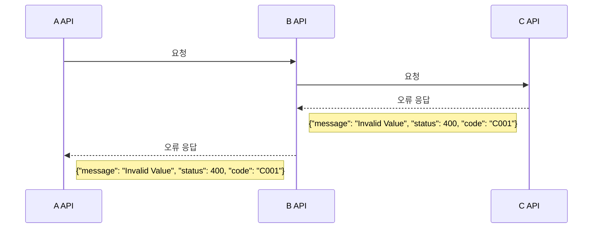

# MSA 환경에 효율적인 HTTP 클라이언트 설계 방법

현대의 애플리케이션 아키텍처에서는 하나의 서비스가 독립적으로 모든 기능을 처리하기보다는, 여러 서버들이 상호작용하며 각각의 역할을 수행하곤 합니다. 이러한 상호작용 과정에서 HTTP 통신은 서버 간의 협력을 위한 주요한 수단으로 자주 사용됩니다. 이때, 효율적이고 안정적인 HTTP 클라이언트 코드의 작성은 매우 중요한 고려사항이 됩니다. 따라서, 본 포스팅에서는 이러한 컨텍스트 하에 HTTP 클라이언트 코드를 설계하는 방법에 대해 자세히 살펴보고자 합니다. 특히 HTTP 통신에서는 실패 케이스가 불가피하므로, 실패 시 유연한 대처를 가능하게 하는 코드 설계, 통신 실패 및 다양한 시나리오에 대응하는 직관적이고 효과적인 방법에 대해서 다루어보겠습니다.

## HTTP 클라이언트 설계 시 고려해야 할 점

HTTP 클라이언트 코드를 작성할 때 주의 깊게 고려해야 할 세부 사항들을 살펴보도록 하겠습니다.

### 다양한 예외적인 케이스에 대한 고려

HTTP 클라이언트 코드를 작성할 때는 성공적인 요청뿐만 아니라, **다양한 실패 상황에 대해서도 충분히 고려하는 것이 중요합니다.** 이는 예기치 못한 오류에 대응하고, 더 견고하고 안정적인 애플리케이션을 구축하는 데 필수적입니다.

```kotlin
data class MemberResponse(
     val id: Long,
     val name: String,
     val email: String
)

@Service
class MemberClient(
        private val restTemplate: RestTemplate
) {

    fun getMember(memberId: Long): MemberResponse {
        val url = "http://example.com/api/members/$memberId"
        return restTemplate.getForObject(url, MemberResponse::class.java)!!
    }
}
```

코드 예제는 `getMember` 함수는 회원의 ID를 인자로 받아 해당 회원의 정보를 조회합니다. 응답은 JSON 형태로 반환되며, 이를 `MemberResponse` 객체로 역직렬화여 객체를 리턴하는 단순한 코드입니다. 하지만 해당 코드를 사용하는 곳에서는 HTTP 4xx, 5xx 응답과 같은 비정상적인 케이스도 염두를 해야하기 때문에 단순하지만은 않습니다. 어떤 점들을 고려해야할지 살펴 보겠습니다.

```kotlin
fun `memberResponse 응답이 필수인 경우`(memberId: Long) {
    try {
        // 비즈니스로직 처리에 member 객체가 필수 값이다.
        val member: MemberResponse = memberClient.getMember(memberId)
    } catch (e: Exception) {
        throw IllegalArgumentException("....")
    }
}
```

`MemberResponse` 객체가 비즈니스 로직에 필수적일 때, 4xx나 5xx 같은 비정상적인 HTTP 응답 또는 기타 예외 상황이 발생하면 `getMember()` 함수로부터 `MemberResponse`를 받을 수 없게 됩니다. 이 경우, `try-catch` 블록을 사용하여 이러한 예외 상황을 처리하고, 발생한 오류를 명시적인 예외 메시지로 알리는 것이 한 가지 해결 방법입니다. 그러나 이로 인해 **`getMember` 함수를 사용하는 모든 코드 부분에 `try-catch` 블록을 적용하고, 각 상황에 맞는 예외를 던지는 책임이 사용자에게 전가됩니다.** 이 문제를 해결하기 위한 간단한 방법은 `MemberClient` 내에 아래와 같은 메서드를 제공하는 것입니다.

```kotlin
fun getMember(memberId: Long): MemberResponse? {
    // ..
    // 예외 케이스인 경우 null 리턴
    if (xxx) {
        return null
    }
    // 정상 케이스면 memberResponse 응답 
    return memberResponse
}

fun getMemberOrThrow(memberId: Long): MemberResponse {
    // ..
    // 예외 케이스인 경우 Exception 발생
    if (xxx) {
        throw IllegalArgumentException("...")
    }
    // 정상 케이스면 memberResponse 응답 
    return memberResponse
}
```

그러나 세부적인 예외 처리가 필요한 경우, 이러한 메서드들만으로는 충분하지 않습니다. 오류 응답에 따른 추가적인 복구 정책과 예외 처리가 필요한 상황에서 단순한 null 반환 또는 예외 발생 방식은 불충분합니다. *
*즉, 클라이언트 코드가 구체적인 예외 처리 전략을 수립할 수 있도록, 오류에 대한 충분한 컨텍스트 정보를 제공하는 것이 필요합니다.**

### 라이브러리 교체시 변경 사항을 최소화 고려

HTTP 클라이언트 라이브러리는 다른 라이브러리에 비해 자주 교체될 가능성이 높으므로, 이에 따른 영향 범위를 최소화하는 설계가 중요합니다. 예를 들어, `RestTemplate`을 사용할 때 `ResponseEntity<T>`를 리턴 타입으로 사용하는 것은 라이브러리에 대한 의존성을 높이게 됩니다. 이는 HTTP 상태 코드를 포함하여 요청의 성공 여부를 판단하는 데 사용되지만, 라이브러리 교체 시 영향을 받는 코드 범위가 넓어지며, 특히 멀티 모듈 프로젝트에서는 교체 비용이 더욱 증가합니다.


예를 들어, 다음과 같은 코드에서 `getMember()` 메서드의 리턴 타입이 `ResponseEntity<Member>`로 되어 있을 경우, 라이브러리 교체가 필요할 때 모든 관련 코드에 변경이 필요하게 됩니다.

```kotlin
fun order(memberId: Long): Order {
    // 주문을 진행시 유저 정보 조회
    val memberResponse: ResponseEntity<Member> = memberClient.getMember(memberId)
    // ... 비즈니스 로직
    return order
}
```

이 문제를 해결하기 위해서는 HTTP 통신을 담당하는 모듈이 이러한 의존성을 내부적으로 관리하도록 설계해야 합니다. 이렇게 하면 모듈을 사용하는 다른 부분에서는 변경의 영향을 받지 않으므로, 전체적인 시스템 설계에서 책임과 역할을 적절하게 배분할 수 있습니다. 따라서 HTTP 클라이언트 라이브러리의 교체 가능성을 염두에 두고 특정 라이브러리에 직접적으로 의존하지 않는 코드 설계가 바람직합니다.

### MSA 환경에서의 오류 전달 및 핸들링 고려



MSA(마이크로서비스 아키텍처) 환경에서 특정 비즈니스 로직을 수행하기 위해 다수의 서비스들이 HTTP 통신을 통해 협력하는 경우가 많습니다. 이 과정에서 연속된 호출 흐름 중 오류가 발생할 경우, 그 오류 응답을 최초의 호출지까지 전달해야 할 필요성이 생깁니다. 이는 정확한 오류 메시지를 통해 문제를 식별하고 해결하여 후속 로직을 진행할 수 있도록 하기 위함입니다.

```kotlin
// B API Sample Code
fun getXXX(): Triple<Int, xxxResponse?, ErrorResponse?> {
    // .. HTTP 통신 이후 Status Code를 기준으로 응답 객채 or 오류 객체 전달
    return Triple(
         first = response.statusCodeValue,
         second = body,
         third = errorResponse
    )
}

// 클라이언트를 사용하는 코드에서 예외 핸들링
fun xxx() {
    val response = cClient.getXXX()
    if (response.is2xxSuccessful) {
        // 성공인 경우, Body Notnull 으로 단언
        val body = response.second!!
    } else {
        // 2xx가 아닌 경우의 Error Response Notnull 으로 단언
        val errorResponse = response.third!!
        throw Exception(errorResponse)
    }
}
```

예를 들어, C API 서버에서 오류가 발생했을 때, B API 서버는 오류 응답을 그대로 전달하기 위해 Triple 객체를 사용합니다. 이 객체는 HTTP 상태 코드, 응답 본문, 오류 응답을 포함하며, 호출하는 곳에서는 이 정보를 바탕으로 상세한 제어를 할 수 있습니다. 성공적인 응답과 오류 응답은 각각 본문과 오류 객체에 대한 Notnull 단언을 통해 처리됩니다. 오류 발생 시, B 서버는 C 서버로부터 전달받은 오류 메시지를 그대로 전달합니다.
**그러나 이 방식은 직관적이지 않으며, nullable 처리와 오류 핸들링에 대한 책임이 외부로 전가되어 중복 코드와 과도한 부담을 야기합니다.**

### 고려해야 할 점 정리

1. **항상 고려해야 할 실패 케이스**: HTTP 2xx 이외의 실패 케이스에 대해 항상 주의를 기울여야 합니다.
2. **비즈니스 로직에 맞는 핸들링 제공**: 호출하는 곳에서 각각의 비즈니스 로직에 적합하게, 간결하고 일관된 방식으로 오류를 핸들링할 수 있도록 기능을 제공해야 합니다.
3. **라이브러리 교체시 영향 최소화**: HTTP 클라이언트 라이브러리를 교체할 때 발생할 수 있는 영향을 외부 객체나 모듈에 미치지 않도록 격리해야 합니다.
4. **분산 환경에서의 오류 메시지 전달**: 분산 환경에서 여러 API 호출이 이루어질 때, 오류를 정확하게 파악하고 메시지를 효과적으로 전달할 수 있어야 합니다.

## 고려 사항을 준수하는 HTTP 클라이언트 코드 만들기

고려해야 할 사항들을 기반으로, 효과적인 HTTP 클라이언트 코드를 개발할 계획입니다. 비즈니스 요구사항에 따라 같은 HTTP 요청일지라도 후속 전략이 다를 수 있습니다. 이에 따라, HTTP 클라이언트는 사용처에서 각각의 요구사항에 맞게 유연하게 핸들링할 수 있도록 설계되어야 합니다. 또한, HTTP 클라이언트는 비즈니스 로직의 책임을 지지 않고 오로지 HTTP 통신에 관한 책임만을 담당합니다. 예를 들어, 특정 멤버 ID에 해당하는 멤버가 없는 경우와 같은 비즈니스 로직에 대한 예외 처리는 HTTP 클라이언트의 역할이 아니며, 클라이언트는 DNS 문제와 같은 통신 관련 이슈에 대해서만 예외 처리를 진행합니다.

### 코틀린 Result 개념을 활용한 ResponseResult

코틀린의 `Result` 타입은 함수의 결과가 성공적이었는지, 아니면 예외가 발생했는지를 포장하는 데 사용됩니다. 이 타입을 통해, 함수는 예외를 던지는 대신 성공 또는 실패의 결과를 나타내는 객체를 반환하게 되어, 오류 처리를 간결하고 안전하게 할 수 있습니다. 이러한 개념을 HTTP 응답 객체에 적용함으로써, HTTP 통신 후의 성공이나 실패에 따른 조치를 더 안전하고 간결하게 할 수 있습니다. 이를 위해, 코틀린의 `Result` 개념을 활용한 `ResponseResult<T>` 객체를 만들어 보겠습니다.

```kotlin
sealed class ResponseResult<out T> {

    /**
     * HTTP 2xx 정상 응답을 나타내는 데이터 클래스.
     *
     * @param body 응답 본문.
     */
    data class Success<out T>(val body: T) : ResponseResult<T>()

    /**
     * HTTP 4xx, 5xx 오류 응답을 나타내는 데이터 클래스.
     *
     * @param errorResponse 오류 응답 정보.
     */
    data class Failure(val errorResponse: ErrorResponse) : ResponseResult<Nothing>()

    // 성공 여부를 확인하는 속성.
    val isSuccess: Boolean
        get() = this is Success

    // 실패 여부를 확인하는 속성.
    val isFailure: Boolean
        get() = this is Failure

    /**
     * Success 상태일 때 실행될 콜백 함수.
     *
     * @param action 성공 시 실행할 액션.
     */
    inline fun onSuccess(action: (T) -> Unit): ResponseResult<T> {
        if (this is Success) {
            action(body)
        }
        return this
    }

    /**
     * Failure 상태일 때 실행될 콜백 함수.
     *
     * @param action 실패 시 실행할 액션.
     */
    inline fun onFailure(action: (ErrorResponse) -> Unit): ResponseResult<T> {
        if (this is Failure) {
            action(errorResponse)
        }
        return this
    }

    /**
     * Failure 상태일 경우 null을 반환하며, 그 외의 경우 주어진 액션을 수행한다.
     */
    fun getOrNull(): T? = if (this is Success) body else null


    /**
     * Failure 상태인 경우 주어진 default 값을 반환하며, Success 상태일 경우 주어진 변환 함수를 적용한다.
     *
     * @param default 기본 반환 값.
     * @param transform 변환 함수.
     */
    inline fun getOrThrow(action: (T) -> @UnsafeVariance T): T {
        when (this) {
            is Success -> return action(body)
            is Failure -> {
                when {
                    errorResponse.status.isClientError() -> throw ServiceException(errorResponse = errorResponse, code = ErrorCode.INVALID_INPUT_VALUE)
                    else -> throw ServiceException(errorResponse = errorResponse, code = ErrorCode.SERVER_ERROR)
                }
            }
        }
    }

    /**
     * [Failure] 상태인 경우 [default] 기반으로 반환하고, [Success] 경우 반환 진행
     */
    inline fun <R> getOrDefault(default: R, transform: (T) -> R): R {
        return when (this) {
            is Success -> transform(body)
            is Failure -> default
        }
    }
}

/**
 * 내부 서비스에서 공통으로 사용하는 오류 응답 객체
 */
data class ErrorResponse(
     val message: String,
     val code: String,
     val status: Int
)
```

`ResponseResult`는 코틀린에서 사용되는 `sealed class`로, HTTP 통신 이후의 결과를 나타내는 제네릭 타입 `T`를 사용하는 클래스입니다. 이 클래스는 HTTP 요청의 결과를 처리하고, 그 결과를 분류하여 관리하는 데 사용됩니다. 주요 구성 요소와 기능은 다음과 같습니다:

1. **Success<T> 서브 클래스**:
    - HTTP 통신에서 2xx 성공 응답을 받았을 때 사용됩니다.
    - 성공 응답의 본문을 나타내는 `body` 파라미터를 포함합니다.
    - 이 클래스는 성공적인 결과를 포장하여, 후속 처리에서 이를 활용할 수 있도록 합니다.

2. **Failure 서브 클래스**:
    - HTTP 통신에서 2xx가 아닌 실패 응답을 처리합니다.
    - 실패 응답의 세부 정보를 담은 `ErrorResponse` 객체를 포함합니다.
    - 이 클래스는 오류 상황을 명확하게 나타내어, 적절한 예외 처리나 로직 분기를 가능하게 합니다.

3. **메소드 제공**:
    - `ResponseResult` 클래스는 성공 및 실패 결과에 대한 다양한 메소드를 제공합니다.
    - 예를 들어, `onSuccess`와 `onFailure` 메소드를 통해 성공 또는 실패 결과에 대한 콜백을 처리할 수 있습니다.
    - `getOrNull`, `getOrThrow`, `map`, `flatMap` 등의 메소드는 결과 데이터를 다루는 다양한 방법을 제공합니다.

이 클래스는 HTTP 클라이언트 구현에서 결과 처리를 더 유연하고 안전하게 만들어, 코드의 가독성과 유지 보수성을 향상시킵니다. 또한, 예외 처리 및 결과 처리 로직을 일관되고 간결하게 작성할 수 있도록 도와줍니다.

### HTTP 클라이언트 ResponseResult 적용

`ResponseResult`는 HTTP 클라이언트 라이브러리에 독립적으로 구현되어 있어, 다양한 클라이언트 라이브러리에 쉽게 적용할 수 있습니다. 코틀린 사용자들에게는 [Fuel](https://github.com/kittinunf/fuel)과 [Ktor HttpClient](https://api.ktor.io/ktor-client/ktor-client-core/io.ktor.client/-http-client/index.html) 라이브러리를 추천합니다. Fuel은 간단하고 소규모의 HTTP 작업에 적합하며, Ktor HttpClient은 보다 복잡하고 다양한 HTTP 통신 요구에 부합합니다. 이러한 HTTP 클라이언트 라이브러리에 코틀린의 확장 함수를 사용하여 `ResponseResult`를 통합하고 적용하는 방법을 살펴보겠습니다.

#### 코틀린 확장함수를 이용하여 ResponseResult 적용

RestTemplate, Fuel, Ktor HttpClient 클라이언트 라이브러리에 코틀린의 확장 함수를 활용하여 `ResponseResult`를 적용 시켜보겠습니다.

```kotlin
// Ktor HttpClient 확장 함수
suspend inline fun <reified T> HttpResponse.responseResult(): ResponseResult<T> {
    return when {
        status.isSuccess() -> ResponseResult.Success(body())
        else -> {
            val responseBody = bodyAsText()
            ResponseResult.Failure(
                 when {
                     isErrorResponseDeserializeAble(responseBody) -> defaultObjectMapper.readValue(responseBody, ErrorResponse::class.java)
                     else -> defaultErrorResponse
                 }
            )
        }
    }
}

// RestTemplate 확장 함수
inline fun <reified T> ResponseEntity<String>.responseResult(): ResponseResult<T> {
    return when (this.statusCode.is2xxSuccessful) {
        true -> ResponseResult.Success(defaultObjectMapper.readValue<T>(body!!))
        else -> {
            val responseBody = this.body.toString()
            ResponseResult.Failure(
                 when {
                     isErrorResponseDeserializeAble(responseBody) -> defaultObjectMapper.readValue(responseBody, ErrorResponse::class.java)
                     else -> defaultErrorResponse
                 }
            )
        }
    }
}
```

이 코드의 세부적인 내용을 모두 이해할 필요는 없습니다. 주요 흐름은 다음과 같습니다: 성공적인 2xx 응답의 경우, 받은 데이터를 `<T>` 타입의 객체로 역직렬화 합니다. 2xx가 아닌 다른 응답을 받을 경우, 팀 내에서 정한 표준 `ErrorResponse` 형식으로 역직렬화를 진행합니다. 만약 외부 호출에서 표준 `ErrorResponse` 형식을 따르지 않는 경우, 해당 서버의 `ErrorResponse`에 맞는 객체 타입으로 역직렬화를 수행합니다. 이 방법을 통해, 특정 라이브러리에 종속되지 않고 일관적으로 `ResponseResult`를 사용하여 응답 객체를 효과적으로 처리할 수 있습니다.

#### 표준 ErrorResponse 처리

4xx 및 5xx 응답을 받을 때는 먼저 표준 `ErrorResponse` 객체로의 역직렬화 가능성을 확인합니다. 역직렬화가 가능하면 해당 과정을 진행하고, 그렇지 않은 경우에는 기본 `ErrorResponse`를 반환합니다. 이렇게 함으로써, 서버가 표준 응답을 따르지 않거나 일시적으로 다운된 경우에도 대응할 수 있습니다.

```kotlin
/**
 * 표준 Error Response {"message": "xxx", "code": "C002", "status": 400} 역작렬화 가능여부 확인
 */
fun isErrorResponseDeserializeAble(responseBody: String): Boolean {
    return when (val rootNode = defaultObjectMapper.readTree(responseBody)) {
        null -> false
        else -> rootNode.path("message").isTextual && rootNode.path("status").isNumber && rootNode.path("code").isTextual
    }
}

// 기본 ErrorResponse 객체
val defaultErrorResponse = ErrorResponse(
     code = ErrorCode.INVALID_INPUT_VALUE
)
```

`isErrorResponseDeserializeAble` 함수는 오류 응답 본문(`responseBody`)을 받아 JSON 구조로 파싱합니다. JSON 노드에서 역직렬화에 필요한 필드들의 존재와 타입을 검사하여 가능한 경우는 역직렬화를 진행하며, 그렇지 않은 경우는 `defaultErrorResponse`로  `ErrorResponse` 객체를 정의합니다. 이는 서버 응답이 표준 형식을 따르지 않거나 파싱할 수 없는 경우에 사용됩니다. 이로써 4xx, 5xx 경우 `Failure`의 `ErorrResponse` 객체를 항상 보장 받을 수 있게 됩니다.

## 고려 사항을 준수 확인

### 다양한 예외적인 케이스에 대한 고려 지원

### 라이브러리 교체시 변경 사항을 최소화 지원

### MSA 환경에서의 효율적인 오류 전달 및 핸들링 지원