# 실무에서 적용하는 테스트 코드 작성 방법과 노하우

* 특정 라이브러리의 직접 적인 사용법을 다루지 않음 등등 설명 필요

# 효율적인 Mock Test

효율적인 Mock Test 하는 이유

## 기존 가맹점 등록 Flow


가맹점 관리 시스템 사용자가 가맹점 정보를 등록을 진행합니다. 이 때 사업자명과, 가맹점명을 직접 입력해서 저장하는 단순한 플로우 입니다. 

```kotlin
@Service
class ShopRegistrationService(
    private val shopRepository: ShopRepository
) {

    fun register(
        brn: String
    ): Shop {
        return shopRepository.save(
            Shop(
                brn = brn,
                name = response.body!!.name
            )
        ) 
    }
}
```

해당 플로우를 코드로 구현 하면 입력 받은 값을 그대로 영속화 하는 코드 작성 됩니다.


```kotlin
@Test
fun `Shop 등록 테스트 케이스`() {
    //given
    val brn = "000-00-0000"
    val name = "주식회사 XXX"

    //when
    val shop = shopRegistrationService.register(brn)

    //then
    then(shop.name).isEqualTo(name)
    then(shop.brn).isEqualTo(brn)
}
```

테스트 코드도 입력받은 값이 정상적으로 등록 됐는지 확인 하는 단순한 테스트 코드로 작성됩니다. 여기 까지는 어렵지 않게 테스트 코드를 작성할 수 있습니다.


## 신규 가맹점 등록 Flow

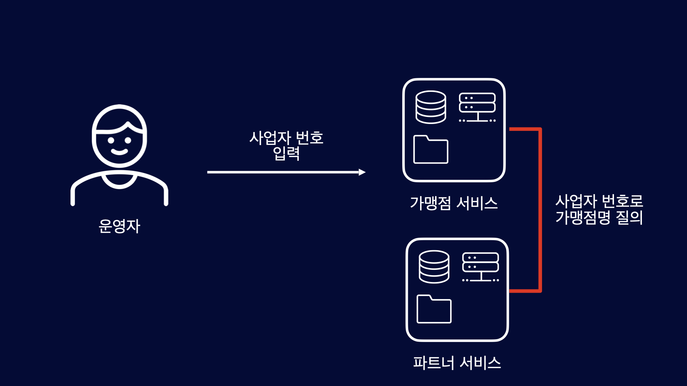

서비스 규모가 점차 커지면서, 파트너 서비스가 독립적인 애플리케이션으로 분리되어, 사업자 번호만 입력하면 가맹점 서비스에서 파트너서비스에 가맹점명을 질의하여 등록하는 플로우로 변경 되었습니다.

```kotlin
@Service
class ShopRegistrationService(
    private val shopRepository: ShopRepository,
    private val partnerClient: PartnerClient
) {

    fun register(
        brn: String,
    ): Shop {
        val partner = partnerClient.getPartnetBy(brn)
        return shopRepository.save(
            Shop(
                brn = brn,
                name = partner.name
            )
        )
    }
}
```

해당 Code 다음과 같이 변경됩니다. PartnerClient 기반으로 파트너 서비스와의 HTTP 통신을 하여 가맹점명을 가져와서 가맹점을 영속화하는 방식으로 변경됩니다. 여기 까지도 어렵지 않게 요구사항에 맞는 코드를 작성할 수 있습니다.


```kotlin

@Test
fun `가맹점 등록 Mock HTTP Test`() {
    //given
    val brn = "000-00-0000"
    val name = "주식회사 XXX"
    mockServer
        .expect(
            requestTo("http://localhost:8080/api/v1/partner/${brn}")
        )
        .andExpect(method(HttpMethod.GET))
        .andRespond(
            withStatus(HttpStatus.OK)
                .contentType(MediaType.APPLICATION_JSON)
                .body(
                    """
                        {
                          "brn": "${brn}",
                          "name": "${name}"
                        }
                    """.trimIndent()
                )
        )

    //when
    val shop = shopRegistrationService.register(brn)
    
    //then
    then(shop.name).isEqualTo(name)
    then(shop.brn).isEqualTo(brn)
}
```

구현 코드가 변경되었으니 테스트 코드도 변경되야 겠죠. 가맹점명을 PartnerClient에 의존했기 때문에 테스트 코드를 작성하기 위해서는 HTTP 통신을 Mocking 하여 테스트 코드를 작성 합니다. 빨간 박스 코드를 보시면 요청할 HTTP url, method, content-type, Request Body를 mocking 합니다. 즉 HTTP  요청/응답 정의 합니다. 

내용 조금더 있어야함

## HTTP Mock Server Test Code의 문제점

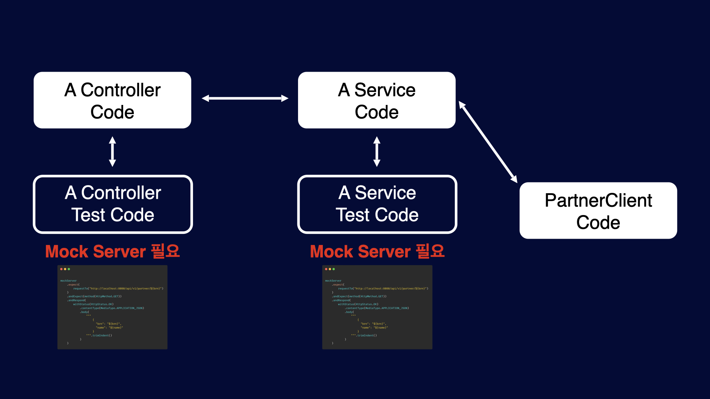

PartnerClient가 수 많은 객체에 직/관접적으로 의존성이 있다고 가정해 봅시다. 그렇게 되면 기존 테스트 코드에 큰 변경이 발생합니다. PartnerClient를 직/간접적으로 의존하는 모든 테스트 코드에 Mock Server의 Mocking 작업이 필요해 집니다. 두 개 클래스 정도는 파이팅으로 해결할 수 있습니다.


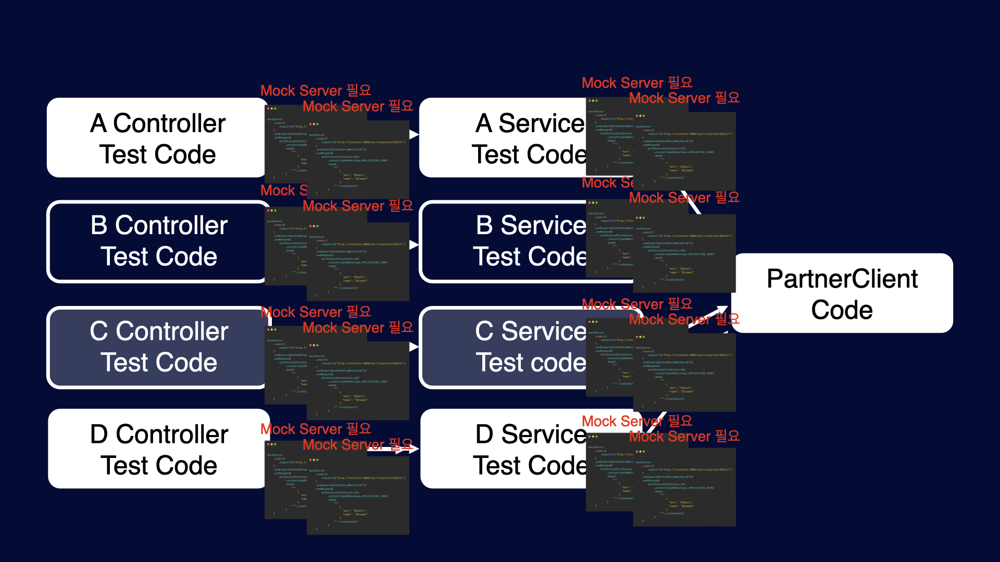

더 큰 파이팅으로 해결하기에는 어렵습니다. 예제 코드의 HTTP 통신은 간단 하지만 실제 구현 코드의 Mocking은 너무 장황합니다. 가장 큰 문제는 테스트 코드 작성이 싫어 진다는 것입니다. PartnerClient만 새로운 요구사항에 맞게 코드를 변경 했지만 그 객체를 직/간 접적으로 의존하는 모든 구간에 찾아가서 HTTP Mocking 관련 코드를 다 심어야 합니다. 특정 요청은 Request Body, Response Body가 몇 백줄은 그냥 넘어가는 코드들을 말이죠

## 신규 가맹점 등록 @MockBean 기반 Test Code


다음 해결 방법으로는 생각한 것은 MockBean을 사용하는 것입니다. MockBean 으로 해당 객체의 행위 자체를 Mocking 하여 HTTP 통신 자체를 Mocking하는 것보다는 비교적 간편하게 Mocking이 가능 합니다. 셈플 코드가 간단해서 그렇지 복잡한 HTTP 목킹과 비교해보면 그 차이가 큽니다.


```kotlin
@MockBean
private lateinit var partnerClient: PartnerClient

@Test
fun `register mock bean test`() {
    //given
    val brn = "000-00-0000"
    val name = "주식회사 XXX"
    given(mockPartnerClientService.getPartner(brn))
        .willReturn(
            ResponseEntity(
                PartnerResponse(brn, name),
                HttpStatus.BAD_REQUEST
            )
        )

    //when
    val shop = shopRegistrationService.register(brn)

    //then
    then(shop.name).isEqualTo(name)
    then(shop.brn).isEqualTo(brn)
}
```

다음 해결 방법으로는 생각한 것은 MockBean을 사용하는 것입니다. MockBean 으로 해당 객체의 행위 자체를 Mocking 하여 HTTP 통신 자체를 Mocking하는 것보다는 비교적 간편하게 Mocking이 가능 합니다. 셈플 코드가 간단해서 그렇지 복잡한 HTTP 목킹과 비교해보면 그 차이가 큽니다.

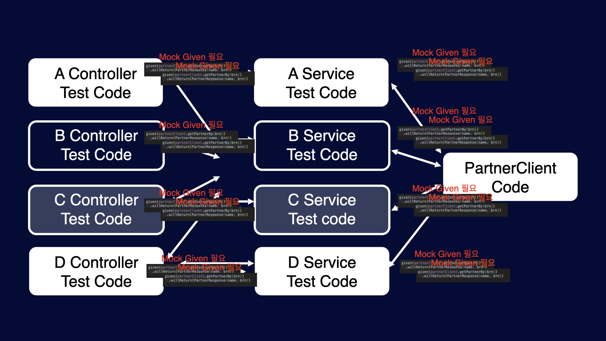


물론 MockBean을 사용해도 관련 의존성에 mocking을 해야 한다는 사실은 변하지 않지만 그것이 테스트 코드를 작성하지 않게 되는 현상 까지로 이어지지 않는 다고 생각합니다. 이렇게 해결이 될거 같았으나…

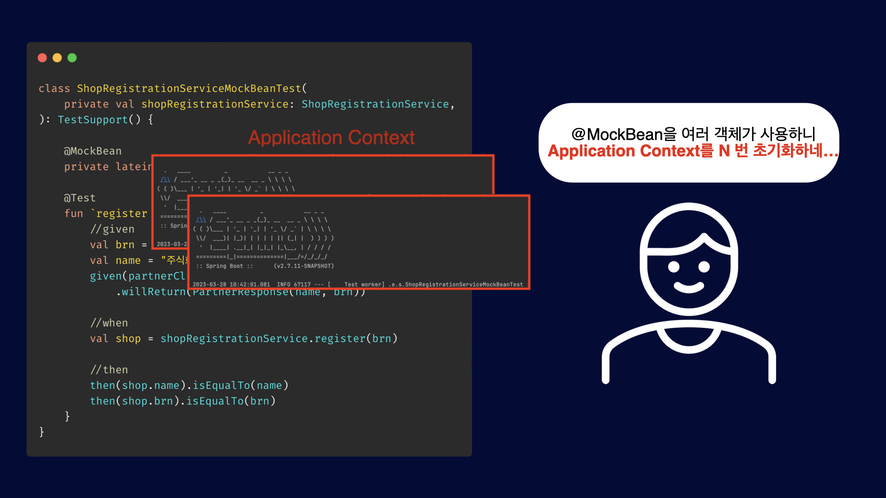

해당 이슈에 가장 큰 원인은 @MockBean 자체가 문제라는 것인데요. 그렇다면 @MockBean을 그냥 @Bean으로 관리하면 쉽게 해결될거 같다는 느낌적인 느낌이 들었습니다. 실천으로 옮겨 봅니다.


```kotlin

@TestConfiguration
class ClientTestConfiguration {

    @Bean
    @Primary
    fun mockPartnerClient() = mock(PartnerClient::class.java)!!
}
```
Mock 객체를 Bean으로 등록 시킵니다. 이때 실제 Bean과 겹칠 수도 있으니 Primary을 통해서 우선 순위를 높입니다. 해당 빈은 Test에서만 사용할 Bean이기 때문에 TestConfiguration 으로 설정합니다.

```kotlin
class ShopRegistrationServiceMockBeanTest(
    private val shopRegistrationService: ShopRegistrationService,
    // @MockBean에서 일반 Bean으로 변경
    private val partnerClient: PartnerClient
) : TestSupport() {
    
    @Test
    fun `register mock bean test`() {
        //given
        val brn = "000-00-0000"
        val name = "주식회사 XXX"
        given(mockPartnerClient.getPartnerBy(brn))
            .willReturn(PartnerResponse(brn, name))

        //when
        val shop = shopRegistrationService.register(brn)

        //then
        then(shop.name).isEqualTo(name)
        then(shop.brn).isEqualTo(brn)
    }
}
```

변경된 코들를 살펴보겠습니다. 기존 @MockBean에서을 통해 주입 했던 것을 생성자 주입으로 변경되었습니다. 실제 Bean이기 때문에 일반적인 생성자 주입으로도 가능해 졌습니다. 여기서 주입받은 mockPartnerClient 객체는 TestConfiguration을 통해 등록된 Bean입니다. 이렇게 하면  Application Context를 불필요한 초기화 작업이 없어져서 문제를 해결 할 수 있었습니다.

## 멀티 모듈에서 적용

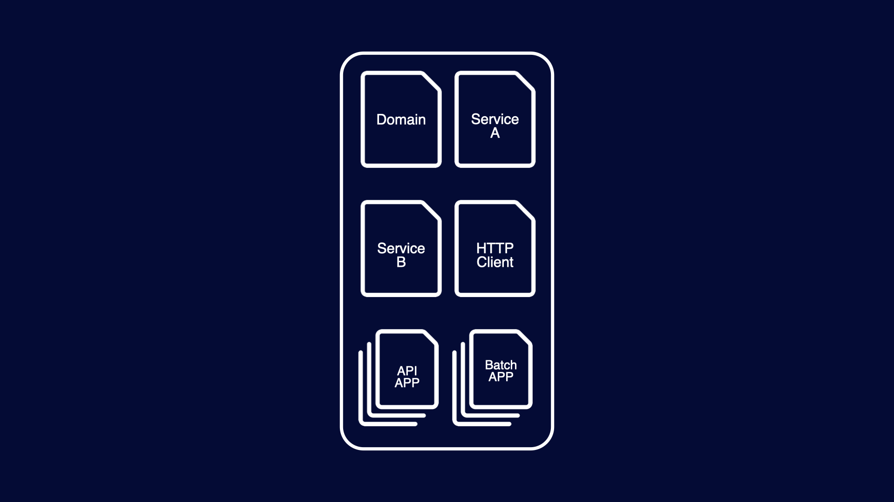

우리 프로젝트는 멀티 모듈로 구성되어 있으니 거기에 맞춰서 적용 해보겠습니다.

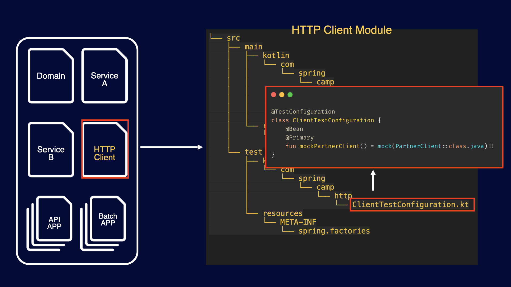

HTTP Client 모듈은 HTTP 통신을 담당하는 모듈로 PartnerClient 객체가 있습니다. ClientTestConfiguration은 테스트 코드에서 사용하는 Bean을 등록 클래스로, 테스트 디렉토리 내에 위치합니다.

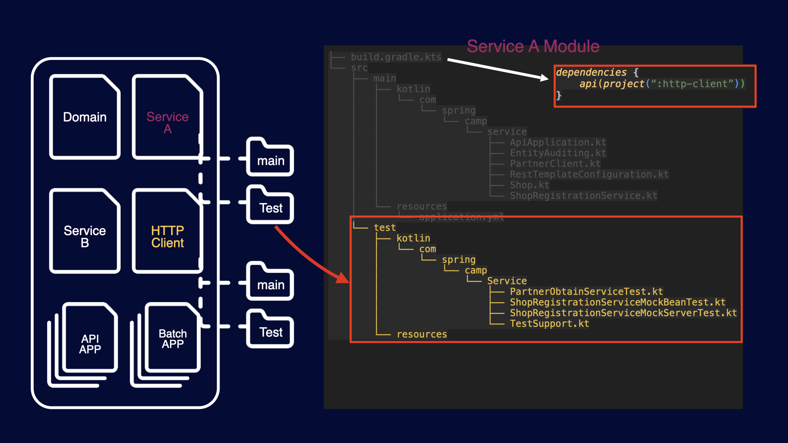

Service A 모듈에서 HTTP Client 모듈의 의존성을 추가했습니다. 추가된 의존성으로 Service A 모듈에서 HTTP Client 모듈을 기반으로한 HTTP 통신이 이루어지게 됩니다. 이제 Service A 모듈에서 테스트 코드를 작성하려고 합니다.


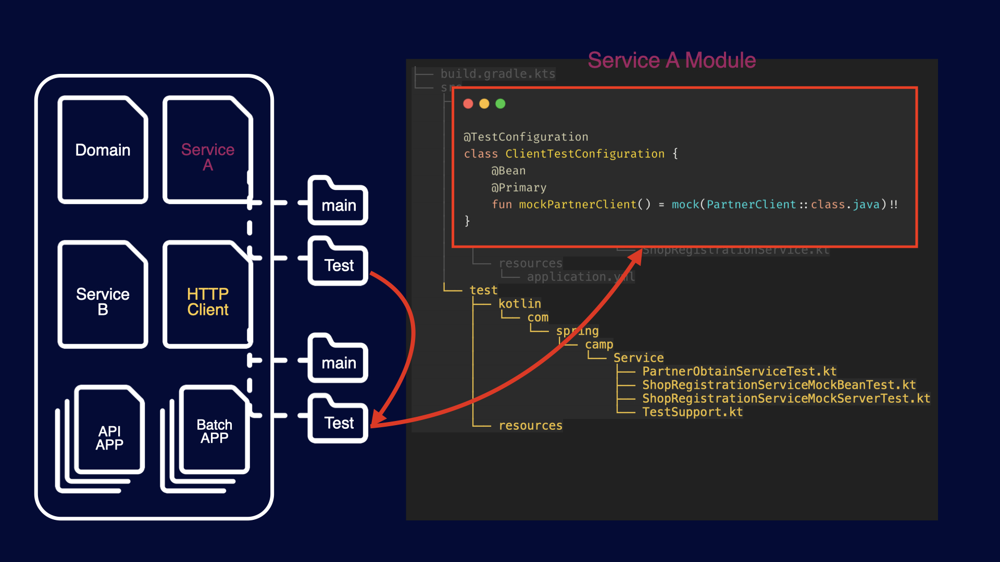

테스트 코드를 작성할 때 HTTP Client 모듈의 테스트 디렉토리의 접근이 필요합니다. 즉 ClientTestConfiguration의 객체가 필요합니다.

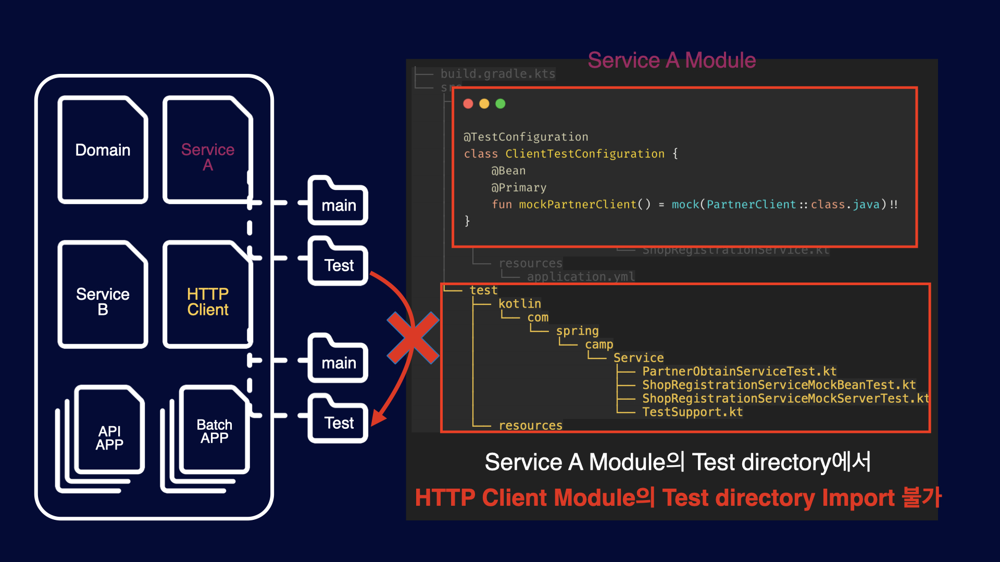

하지만 Service A 모듈의 테스트 디렉토리에서는 HTTP Client 모듈의 테스트 디렉토리에 접근할 수 없기 때문에 테스트 코드를 작성할 수 없습니다.

## fixtures 해결

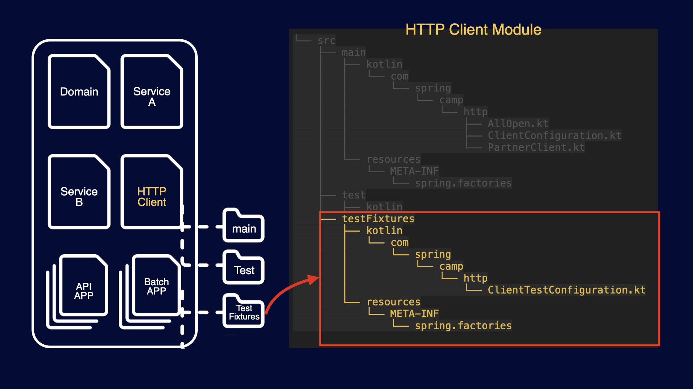

ClientTestConfiguration는 테스트 디렉토리에 위치해 있습니다. java-test-fixtures 플러그인을 사용하면, testFixtures 디렉토리가 생성되며 해당 디렉토리에 ClientTestConfiguration 클래스를 위치 시킵니다.

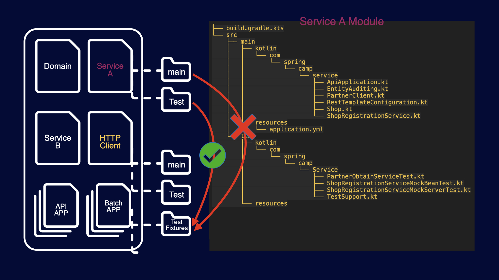

이처럼 의존성을 받게 되면, HTTP Client 모듈의 testFixtures 디렉토리에 있는 객체를 Service A 모듈의 테스트 디렉토리에서 사용할 수 있습니다. 하지만 main 디렉토리에서는 testFixtures 디렉토리에는 접근 할 수 없습니다.

> 꼭 이렇게 어렵게 구성을 해야 할까요?

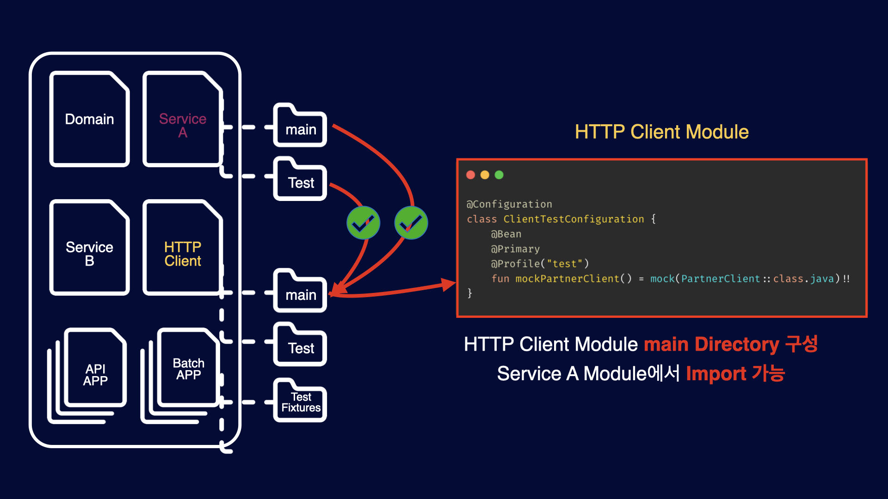

HTTP Client 모듈의 main 디렉토리에 ClientConfiguration을 위치 시킴으로써, 해당 이슈는 쉽게 해결이 가능합니다.  메인 디렉토리에 있으니 당연히 Service A 모듈에서 HTTP Client의 테스트 디렉토리에 접근이 가능합니다. 하지만 문제가 있습니다. 메인 디렉토리에서도 접근이 가능하다는 것입니다. 테스트를 위해 만든 mock 객체인데도 접근이 가능하다는 것은 문제입니다. 테스트 코드를 작성하면서 다음과 같은 의문을 가져야합니다.

> “테스트를 쉽게 하기 위해, 운영 코드 설계를 변경하는 것이 옳은가?”


## 정리

| 방식                 | 장점                                   | 단점                                        |
|--------------------|--------------------------------------|-------------------------------------------|
| Mock Server Test   | HTTP 통신을 실제 진행 하여 서비스 환경과 가장 근접한 테스트 | HTTP 통신 Mocking을 의존하는 모든 구간에 Mocking 필요   |
| @MockBean	         | HTTP Mocking에 비해 비교적 간단하게 Mocking 가능 | Application Context를 재사용 못해 테스트 빌드 속도 저하  |
| @TestConfiguration | Application Context 이슈 해결            | 멀티 모듈 환경에서 @TestConfiguration Bean 사용 어려움 |
| java-test-fixtures | 멀티 모듈에서 환경에서 사용 가능                   | 멀티 모듈이 아닌 경우 불필요                          |

## 테스트할 수 없는 영역 대처 자세

### 테스트 코드 작성이 불가능한 이유는 매우 다양하다.


Redis를 도입하게 되어 각각의 환경을 구성 했지만 테스트 환경을 구축 하지 못했다고 가정해보겠습니다.  테스트 환경의 인프라스트럭처 구성이 되어 있지 못해서 테스트 코드 작성이 불가능합니다. 테스트 코드를 작성이 불가능한 이유는 매우 다양합니다. Redis 테스트 환경 구축에 대한 지식이 아직 없어 못하는 경우도 있을 수 있습니다. 이 처럼 꼭 우리가 제어할수 없는 환경에만 한정된것이 아니며, 경험 부족, 아직은 능력이 부족해서 못하는 경우도 그에 따른 대처가 필요합니다. 테스트할 수 없는 영역은 필연적으로 발생하며 그것을 대처하는 방향성에 대해서 이야기 드리고 싶습니다.


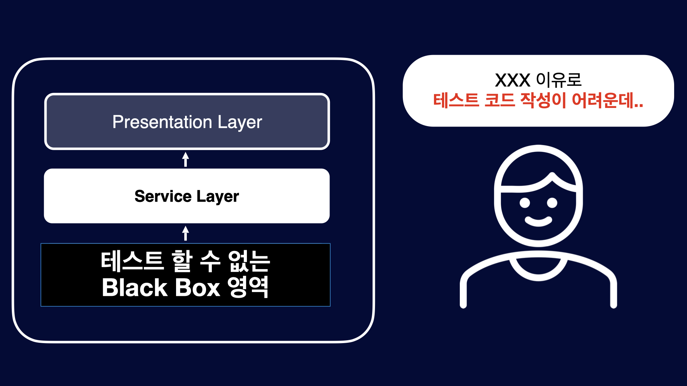

xxx 이유로 테스트 코드 작성이 어려운 영역을 Black Box영역이라 지칭하겠습니다. 이 Black Box영역의 가장 큰 문제점은 이 영역이 전이 된다는 것입니다. Redis 테스트 환경이 없다면 그것을 직/간접적으로 의존하는 구간이 Black Box로 전이 됩니다. 이렇게 전이되다 보면 모든 영역이 테스트 불가능한 Black Box가 됩니다. 이러한 Black Box영역이 전이 되지 않게 격리 시켜야합니다. 설령 그 영역 자체는 테스트를 못하는 한이 있더라도 그 Black Box가 전이되는 것을 막아야합니다. 

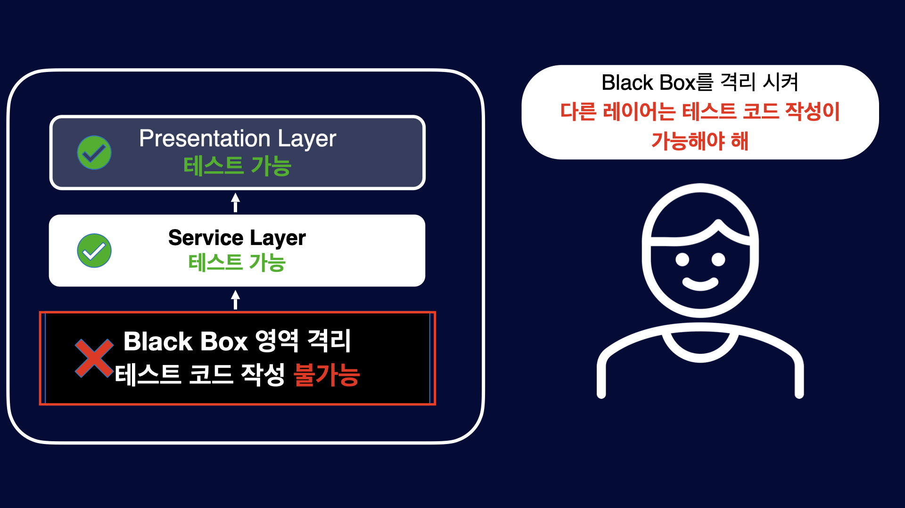


즉, Black Box 영역을 테스트 못하더라도 다른 객체는 여전히 테스트를 진행할 수 있는 환경을 구성 해야합니다. 비단 Mock 관련에 한정된것은 아닙니다. 이러한 설명을 가장 매끄럽게 할 수 있는 것이 Mock이라는 상황 인것이고, 전달 하고자 하는 핵심 메시지는 테스트가 어렵가나, 불가능한 영역이 전이되는 것을 격리 시키는 것입니다. 이렇게 격리 시킴으로써 다른 영역은 테스트가 가능 해진다는 것입니다. 격리 시키는 방법은 다양하게 있으며, 해당 프로젝트에 알맞는 적절한 방법을 적용 해서 사용하면 됩니다.


# 테스트 코드로 부터 피드백 받기


