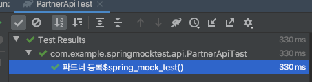
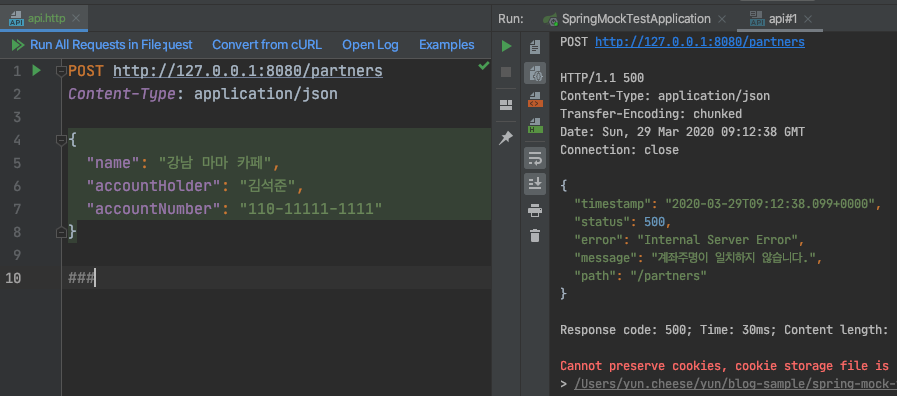
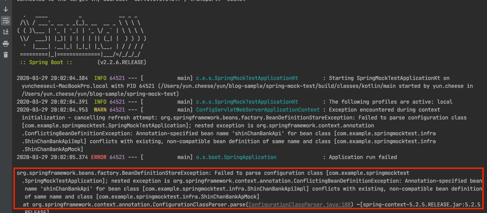
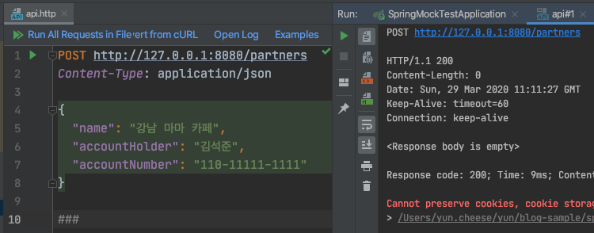

## 외부 인프라스트럭처 테스트
대부분의 애플리케이션은 외부 인프라스트럭처와 통신하면서 진행됩니다. 대표적인 외부 스트럭처는 외부 API들이 있습니다. 이런 외부 인프라스트럭처는 Mocking 해서 원하는 응답 값을 지정하고 검증하고 싶은 부분을 검증을 진행하는 것이 흔한 패턴입니다.

대표적으로 Mockito 프레임워크가 있으며 Mock 테스트는  [Spring Guide - 테스트 전략 : Service 테스트](https://github.com/cheese10yun/spring-guide/blob/master/docs/test-guide.md#mocktest), [RestTemplate Mock 기반 테스트 하기](https://cheese10yun.github.io/rest-template-mock-test/)에서 포스팅한 적 있습니다. 그런데 이런 식의 Mock 테스트 코드는 문제없지만, 실제 구동 환경(Local, Sandbox, Beta)에서는 문제가 있을 수 있습니다.

## 요구사항
* 파트너 등록을 진행한다.
* 파트너 등록 시 계좌 주명, 계좌번호 일치 여부를 검증한다.
  * 계좌 주명 검증은 신한 API를 사용한다.
    * API는 허가된 서버만 호출할 수 있다.
    * API Call 1건당 비용이 발생한다.
  * 계좌 주명, 계좌번호 일치하는 경우 저장한다.
  * 계좌 주명, 계좌번호 일치하지 않은 경우 예외를 발생시킨다.

## Code

```kotlin
@RestController
@RequestMapping("/partners")
class PartnerApi(
    private val partnerRegistrationService: PartnerRegistrationService
) {

    @PostMapping
    fun register(@RequestBody @Valid dto: PartnerRegistrationRequest) {
        partnerRegistrationService.register(dto)
    }
}

data class PartnerRegistrationRequest(
    @field:NotEmpty
    val name: String,
    @field:NotEmpty
    val accountHolder: String,
    @field:NotEmpty
    val accountNumber: String
)

@Service
class PartnerRegistrationService(
    private val partnerRepository: PartnerRepository,
    private val bankClient: ShinhanBankClient
) {

    fun register(dto: PartnerRegistrationRequest): Partner {

        // 은행 코드 검증일 진행한다
        bankClient.verifyAccountHolder(
            accountHolder = dto.accountHolder,
            accountNumber = dto.accountHolder
        )

        return partnerRepository.save(Partner(
            accountNumber = dto.accountNumber,
            accountHolder = dto.accountHolder,
            name = dto.name
        ))
    }
}

@Service
class ShinhanBankClient(
    private val shinChanBankApi: ShinChanBankApi
) {

    // 계좌주명, 계좝번호가 일치하지 않으면 예외 발생
    fun verifyAccountHolder(accountNumber: String, accountHolder: String) {
        val response = shinChanBankApi.checkAccountHolder(accountHolder, accountNumber)
        require(!response.matched.not()) { "계좌주명이 일치하지 않습니다." }
    }
}

@Service
class ShinChanBankApi {

    // 계좌주명, 계좌번호가 하드 코딩된 값과 일치여불르 확인한다.
    fun checkAccountHolder(accountHolder: String, accountNumber: String): AccountHolderVerificationResponse {
        return when {
            accountHolder == "yun" && accountNumber == "110-2222-2222" -> AccountHolderVerificationResponse(true)
            else -> AccountHolderVerificationResponse(false)
        }
    }
}

data class AccountHolderVerificationResponse(
    val matched: Boolean
)
```

예제 코드가 길지만 흐름은 간단합니다. 파트너 등록을 진행할 때 ShinhanBankClient를 통해서 계좌 주명 일치 여부를 검증하고, 일치하지 않은 경우 예외가 발생시켜 파트너 등록을 진행하지 않습니다.

본 포스팅과는 관련 없는 내용이지만 실제 API Call은 `ShinChanBankApi` 클래스에서 진행하고, 일치하지 않은 경우 예외가 발생하는 비즈니스 코드는 `ShinhanBankClient` 클래스에서 진행합니다.

**단순하게 API 통신만 담당하는 객체, API 통신을 담당하는 객체를 이용해서 비즈니스 코드를 만드는 객체** 이렇게 객체의 책임과 역할을 명확하게 나누고 그 크기를 작게 유지하는 것이 좋은 설계 좋은 코드라고 생각합니다.

### Test Code

```kotlin
internal class PartnerApiTest : SpringApiTestSupport() {

    @MockBean
    private lateinit var shinChanBankApi: ShinChanBankApi

    @Test
    internal fun `파트너 등록`() {

        given(shinChanBankApi.checkAccountHolder(anyString(), anyString()))
            .willReturn(AccountHolderVerificationResponse(true))

        mockMvc.post("/partners") {
            contentType = MediaType.APPLICATION_JSON
            content = """
                {
                  "name" : "123",
                  "accountHolder" : "123",
                  "accountNumber" :  "123"
                }
            """.trimIndent()
        }.andExpect {
            status { isOk }
        }
    }
}
```
MockBean을 통해서 가짜 객체를 주입받고 `given()` 메서드를 통해서 일치한다는 가정을 하고 테스트를 진행하게 됩니다.



해당 테스트는 잘 진행되는 것을 볼 수 있습니다.

## 하지만 문제는 ?



**하지만 문제가 있습니다. 실제 구동 환경(Local, Sandbox, Beta...)에서는 해당 API Call을 진행하면 예외가 발생합니다.**

허가된 Production 서버 이외의 조건들은 호출은 가능하지만 API 비용 발생 문제 등이 있어 Production 이외의 환경에서는 막는 것이 적절할 수 있습니다. 그 밖에 다양한 이유들이 있습니다.

* 실제 Email을 호출하는 경우
* 실제 SMS으로 문자가 나가는 경우
* 실제 송금을 진행하는 경우
* 상대 서버에 sandbo, beta 등 production 환경 이외의 테스트 서버가 없는 경우

해당 이유들은 비용상의 문제, 서버 권한 문제 외 적으로 막아야 합니다. **그리고 무엇보다 Production 환경 외에서 해당 API를 사용(테스트) 할 수 없게 되는 것이 가장 큰 문제입니다.**

## 해결 방법


해결 방법은 간단합니다. ShinhanBankClient가 ShinhanBankApi 인터페이스를 의존하게 함으로써 **의존관계를 인터페이스를 통해서 역전시키는 것입니다.** 이것도 [개방 폐쇄의 원칙: Open Close Principle](https://github.com/cheese10yun/spring-SOLID/blob/master/docs/OCP.md)에서 포스팅한 적 이 있습니다.

### Code
```kotlin
interface ShinChanBankApi {
    fun checkAccountHolder(accountHolder: String, accountNumber: String): AccountHolderVerificationResponse
}

@Service("shinChanBankApi")
@Profile("production")
class ShinChanBankApiImpl : ShinChanBankApi {
    // 계좌주명, 계좌번호가 하드 코딩된 값과 일치여불르 확인한다.
    override fun checkAccountHolder(accountHolder: String, accountNumber: String): AccountHolderVerificationResponse {
        return when {
            accountHolder == "yun" && accountNumber == "110-2222-2222" -> AccountHolderVerificationResponse(true)
            else -> AccountHolderVerificationResponse(false)
        }
    }
}

@Service("shinChanBankApi")
@Profile("sandbox", "beta", "local", "test")
private class ShinChanBankApMock : ShinChanBankApi {
    // 어떤 값이 들어 와도 일치 한다고 가정한다
    override fun checkAccountHolder(accountHolder: String, accountNumber: String): AccountHolderVerificationResponse {
        return AccountHolderVerificationResponse(true)
    }
}

@Service
class PartnerRegistrationService(
    private val partnerRepository: PartnerRepository,
    private val bankClient: ShinhanBankClient
) {

    fun register(dto: PartnerRegistrationRequest): Partner {
        // 은행 코드 검증일 진행한다
        bankClient.verifyAccountHolder(
            accountHolder = dto.accountHolder,
            accountNumber = dto.accountHolder
        )

        return partnerRepository.save(Partner(
            accountNumber = dto.accountNumber,
            accountHolder = dto.accountHolder,
            name = dto.name
        ))
    }
}
```
* `@Service("beanName")` beanName을 지정합니다.
* `@Profile` 어노테이션을 통해서 각 환경에 맞는 bean이 등록되게 진행합니다.
* **`PartnerRegistrationService`에서 `ShinChanBankApi` 인터페이스를 의존하게 합니다.**


`@Profile` 잘못 설정해서 Bean이 2개 등록되는 경우 스프링에서 예외를 발생시키며 Bean 하나도 등록 못하는 경우에도 마찬가지로 예외가 발생합니다.

스프링에서 Bean 관련 예외를 명확하게 표시해 주고 있지만 그래도 불안하다고 판단되면 Bean 등록하는 코드를 따로 작성해도 좋습니다.

### Test



`spring.profiles.active=local` 으로 지정하고 해당 API를 호출하면 `Status 200`을 응답받은 것을 확인할 수 있습니다.


`spring.profiles.active=local`환경에서는 `shinhanBankApi`객체에 `ShinhanBankApiMock`이 등록된것을 확인할 수 있습니다.