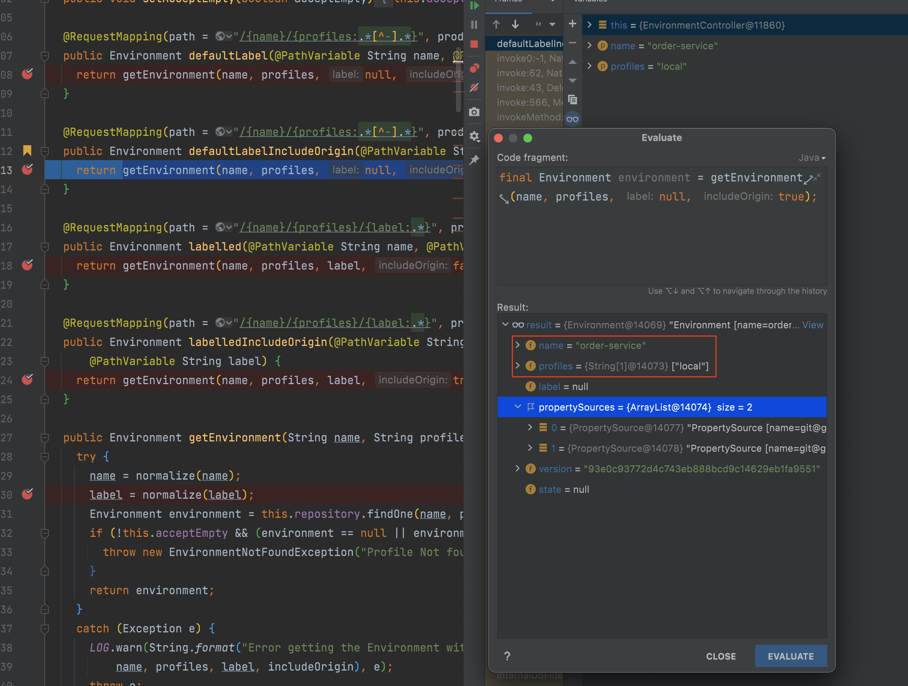
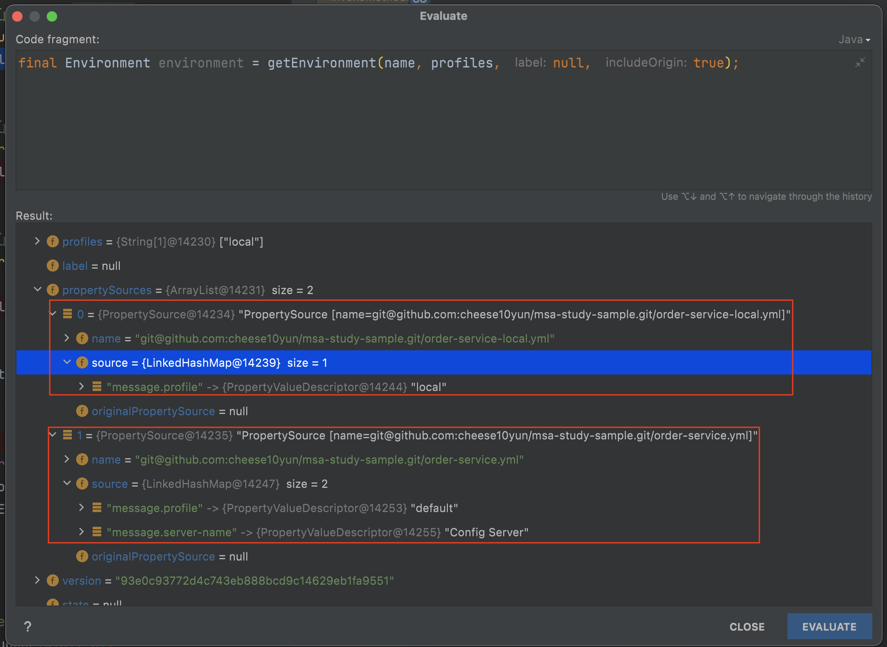

# Spring Conig Client

[Spring Config Server 정리](https://cheese10yun.github.io/spring-config-server/)를 통해서 Config Server에 대해서 알아봤습니다. 이제는 Config Client를 알아보겠습니다. 

각 서비스 애플리케이션은 해당 애플리케이션이 구동시 Config Server에 자신의 Config의 설정 파일을 읽어 오며, **애플리케이션이 구동 중에도 Config 설정을 바꾸고 애플리케이션 재시작 없이 해당 변경 내용을 반영할 수 있습니다.**


## Config Client 구성

```gradle
dependencies {
    implementation("org.springframework.cloud:spring-cloud-starter-config")
    implementation("org.springframework.cloud:spring-cloud-starter-bus-kafka")
}
```
* config: Config Client 의존성
* bus-kafka: Kafka 기반으로 Config 변경을 브로드캐스트로 전달, `1. 애플리케이션 구동시`에서는 사용하지 않을 예정이니 주석 처리하고 `3. Config 설정 및 추가 수정 Push` 할 때 사용 예정

```yml
server:
    port: 8181
spring:
    application:
        name: order-service # (1)

    kafka:
        bootstrap-servers: localhost:29092 # (2)

    config:
        import: "optional:configserver:http://localhost:8888" # (3)

management:
    endpoints:
        web:
            exposure:
                include:
                    - "*" # (4)
                    # - "refresh" # 위 '*'  으로 전체를 공개 해서 주석
                    # - "bus-refresh" # 위 '*'  으로 전체를 공개 해서 주석
    endpoint:
        refresh:
            enabled: true
```

* (1): 애플리케이션 이름을 지정 `spring.application.name` 값을 기준으로 **Config Repositroy 저장소에 있는 Config 파일을 인식해서 가져오기 때문에 반드시 두 값을 일치 시켜야 합니다.**
  * `spring.application.name=order-service`의 경우 `order-service-{evn}.yml`을 Config 파일로 인식함
* (2): 변경사항을 전파하는 카프카 주소 작성
* (3): Config Server 주소 작성, `optional:configserver:{address}`으로 작성
* (4): `actuator`의 속성을 `*`으로 전체 공개, **실제 운영 애플리케이션에서는 필요한 부분만 공개해야 합니다.**

```yml
# order-service.yml
message:
    profile: "default"
    server-name: "Config Server"

# order-service-sandbox.yml
message:
    profile: "sandbox"

# order-service-production.yml
message:
    profile: "production"
```
Config Server 저장소 Gtihub Repository에는 위와 같은 `yml`이 구성되어 있습니다.


## 애플리케이션 구동

`spring.application.name=order-service`, `profile=local` 설정인 애플리케이션 구동했을 때는의 경우로 설명드리겠습니다. 애플리케이션이 구동할 때 Config Server에게 자신의 Config 설정을 가져옵니다. 위 이미지에서는 1, 2번 항목에 해당합니다. 자세히 코드 레벨로 살펴보겠습니다.

서버가 구동하면 `/{name}/{profiles:.*[^-].*}` API를 호출합니다. 해당 API 코드는 아래와 같습니다.


```java
# EnvironmentController.class
@RequestMapping(path = "/{name}/{profiles:.*[^-].*}",   produces = EnvironmentMediaType.V2_JSON)
public Environment defaultLabelIncludeOrigin(@PathVariable String name, @PathVariable String profiles) {
    return getEnvironment(name, profiles, null, true);
}
```



`spring.application.name=order-service`, `profile=local` 설정을 기반으로 Config Server의 API를 호출하여 자신의 애플리케이션을 가져옵니다.

### Order Application 설정 확인

```kotlin
@RestController
@RequestMapping("/orders")
class OrderApi(
    @Value("\${message.profile}") val profile: String
) {
    @GetMapping("/profile")
    fun getRepoProfile(): String {
        return profile
    }
}
```

`message.profile` 설정 확인을 하기 위해서 간단한 API를 만들어 보고 테스트를 진행해 보겠습니다.

```
GET http://localhost:8181/orders/profile

HTTP/1.1 200 
Content-Type: application/json
Content-Length: 5
Date: Sun, 01 Aug 2021 13:15:56 GMT
Keep-Alive: timeout=60
Connection: keep-alive

local

Response code: 200; Time: 198ms; Content length: 5 bytes

```

Config 서버를 통해서 가져온 값이 정상적으로 order application에 가져온 것을 확인할 수 있습니다.




Config Server를 통해해서 가져온 Confg 값을 다시 살펴보겠습니다. `message.profile=local`은 정상적으로 가져온 것을 확인할 수 있으며, local 프로필에는 `message.server-name`값이 없기 때문에 해당 값은 default config인 `order-service.yml`값의 `message.server-name=Config Server`의 설정값을 사용합니다. **즉 default 값도 확인해야 하기 때문에 profile, default profile을 조회합니다.**

### 재시작 없이 Config 변경

Config Server의 가장 큰 장점 중 하나는 서버가 재시작 없이 Config 설정 파일을 바꿀 수 있다는 점입니다. 해당 기능에 대해서 살펴보겠습니다.

`actuator` 설정을 통해서 공개된 `refresh` API를 통해서 애플리케이션 구동 중에 Config 설정을 변경할 수 있습니다.

```kotlin
@RestController
@RequestMapping("/orders")
@RefreshScope // (1)
class OrderApi(
    @Value("\${message.profile}") val profile: String
) {
    @GetMapping("/profile")
    fun getRepoProfile(): String {
        return profile
    }
}
```
```yml
# order-service-local.yml
message:
    profile: "new local" # (2)
```

* (1) `@RefreshScope` 어노테이션을 추가를 합니다. 
* (2) Config Repositroy에 있는 Config 설정을 아래처럼 변경해서 Push 합니다.
* (3) `POST /actuator/refresh` API를 호출하여 변경 내용을 반영합니다.
* (4) `GET /orders/profile`을 호출하여 변경 내용은 확인합니다.


```
POST http://localhost:8181/actuator/refresh

HTTP/1.1 200 
Content-Type: application/vnd.spring-boot.actuator.v3+json
Content-Length: 43
Date: Sun, 01 Aug 2021 14:22:38 GMT
Keep-Alive: timeout=60
Connection: keep-alive

[
  "config.client.version",
  "message.profile"
]

Response code: 200; Time: 6374ms; Content length: 43 bytes
```
`POST /actuator/refresh` API를 호출하면 변경한 propertie의 key 값을 확인할 수 있습니다.

```
GET http://localhost:8181/orders/profile

HTTP/1.1 200 
Content-Type: application/json
Content-Length: 10
Date: Sun, 01 Aug 2021 14:22:57 GMT
Keep-Alive: timeout=60111
Connection: keep-alivew

new local

Response code: 200; Time: 186ms; Content length: 10 bytes
```
`GET /orders/profile`을 호출하면 위에서 변경한 내용을 확인할 수 있습니다.

