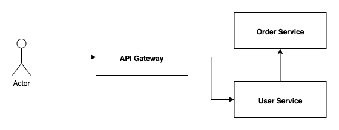
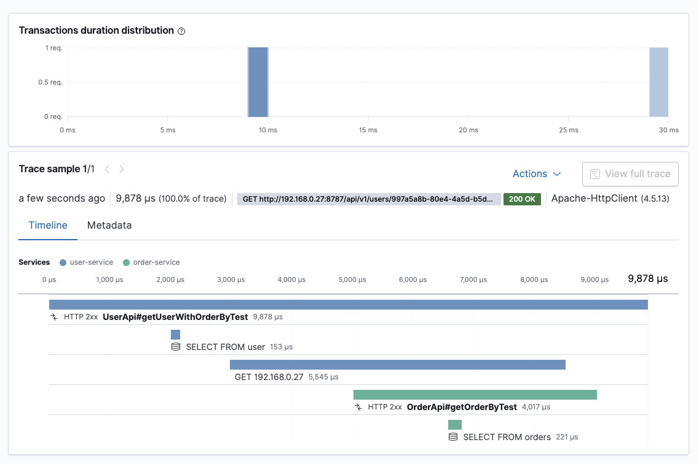
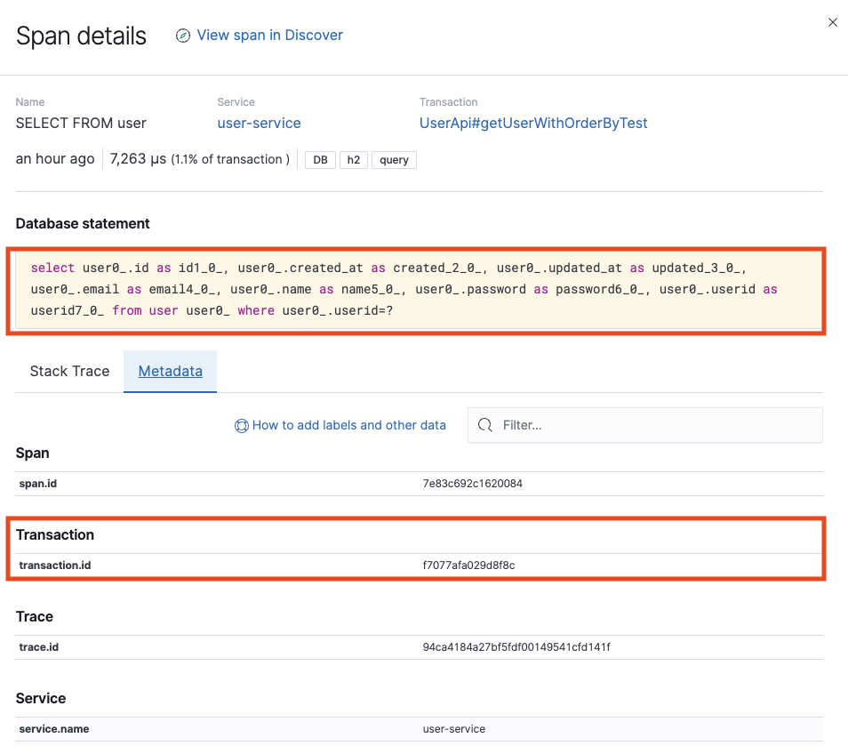
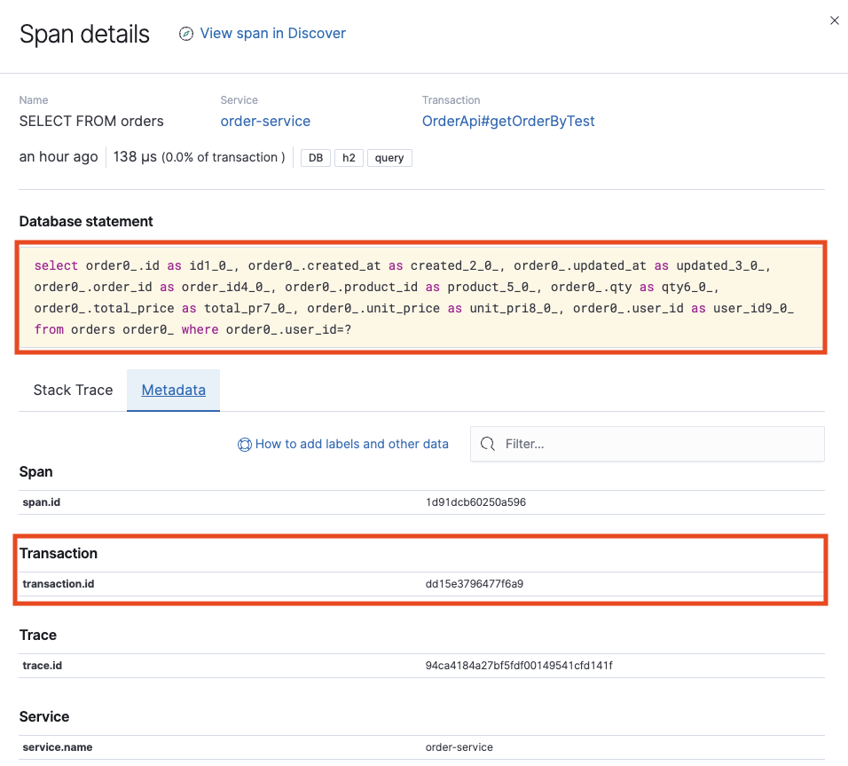
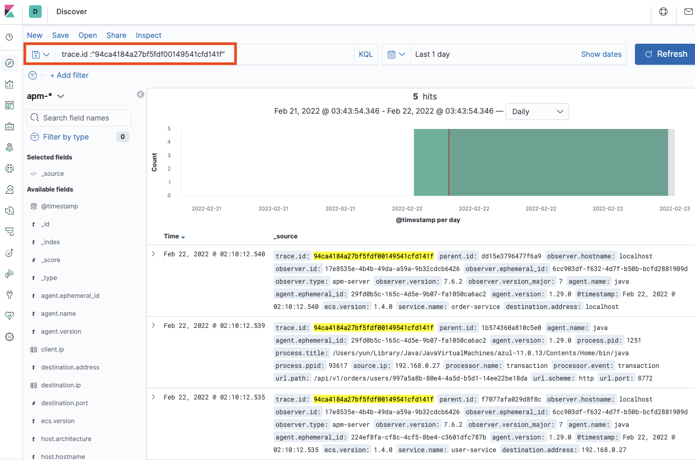
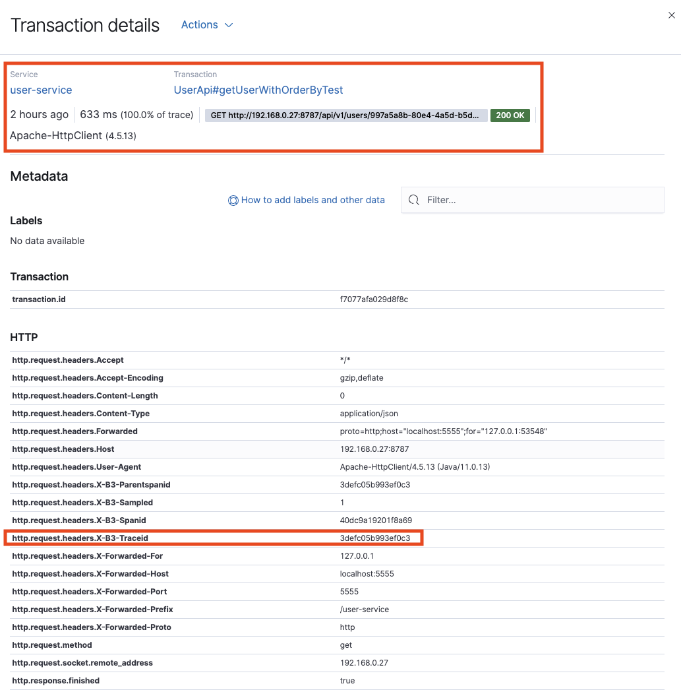
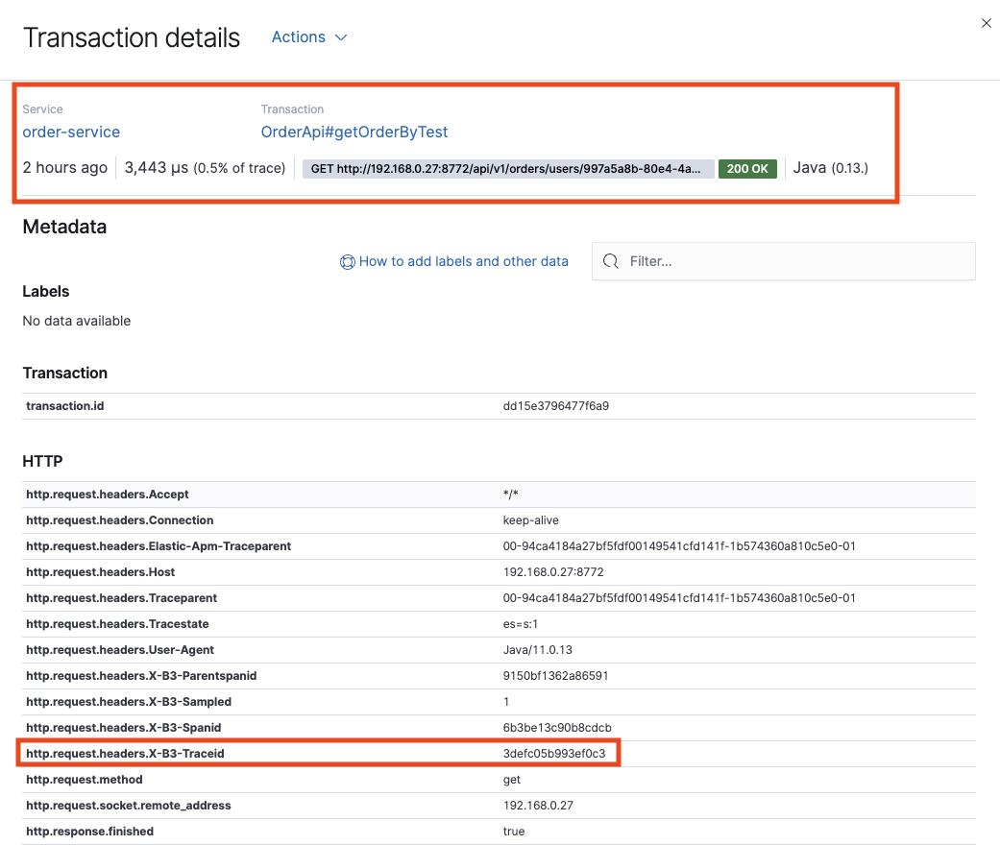

# Elasticsearch APM : 분산 트랜잭션 추적


분산 환경에서는 한 요청이 여러 서비스들의 호출로 이루어집니다. 이런 경우 여러 서비스 사이의 트랜잭션, 로그의 모니터링과 요청에 대한 순차적인 연결이 중요합니다.

## 분산 트랜잭션 추적



유저의 본인 정보와 본인이 주문한 목록을 조회하는 플로우 입니다. API Gateway -> User Service(유저 정보 조회) -> Order Service(주문 목록 조회)

이런 경우 분산 환경에서의 트랜잭션 추적은 상당히 어려운 부분이 있습니다. 위 예제는 2대의 서버밖에 없지만 연결 서비스가 많아지면 그 복잡도는 더욱 증가됩니다. 이런 경우 연결된 요청의 트랜잭션을 시각화하여 제공해 주는 루션이 매우 유용하게 사용될 수 있습니다. Elasticsearch APM은 이러한 서비스를 제공해 주고 있습니다. Elasticsearch APM의 기초적인 설명 및 설정 방법은 [Elasticsearch APM 기본 설정](https://cheese10yun.github.io/elk-apm-1/)을 참고해 주세요.




User Service(유저 정보 조회) -> Order Service(주문 목록 조회)의 분산 트랜잭션에 대한 정보를 Elasticsearch APM에서 제공해 주고 있습니다. user-service, order-service의 각각의 트랜잭션에 사항을 표시해 주고 있습니다.



User Service의 트랜잭션에 대한 내용이 있습니다.



Order Service의 트랜잭션에 대한 내용이 있으며 당연한 이야기겠지만 `transaction.id`가 서로 다르고 `trace.id`는 `94ca4184a27bf5fdf00149541cfd141f`으로 동일한 것을 확인할 수 있습니다. 



해당 값으로 전체의 분산 트랜잭션의 로그 데이터를 타임라인으로 확인할 수 있습니다.

## 분산 HTTP 통신 연결


### Sleuth

스프링 클라우드 슬루스(Sleuth)는 마이크로 서비스 환경에서 서로 다른 시스템의 요청을 연결하여 로깅을 해줄 수 있게 해주는 도구입니다. 이런 경우 슬루스를 이용해서 쉽게 요청에 대한 로깅을 연결해서 볼 수 있습니다. 또 RestTemplate, 페인 클라이언트, 메시지 채널 등등 다양한 플랫폼과 연결하기 쉽습니다. 자세한 내용은 본 포스팅에서는 다루지 않겠습니다.


```
implementation("org.springframework.cloud:spring-cloud-starter-sleuth")
```
User Service, Order Service에 각각 추가 sleuth 디펜던시를 추가한 이후에 User Service(유저 정보 조회) -> Order Service(주문 목록 조회)를 하는 경우 아래 로그 처럼 Trace ID로 연결되어 분산 HTTP 통신을 연결할 수 있습니다.

```
2022-02-22 04:08:56.987  INFO [user-service,3defc05b993ef0c3,40dc9a19201f8a69] 1578 --- [nio-8787-exec-9] c.s.member.config.HttpLoggingFilter      :
2022-02-22 04:08:56.986  INFO [order-service,3defc05b993ef0c3,6b3be13c90b8cdcb] 1251 --- [nio-8772-exec-4] com.service.order.HttpLoggingFilter      :
```



User Service의 `http.request.headers.X-B3-Traceid:3defc05b993ef0c3` 로그에 있는 값을 확인할 수 있습니다.





Order Service의 `http.request.headers.X-B3-Traceid:3defc05b993ef0c3` 로그에 있는 값으로 분산 환경에서 HTTP 요청에 대한 로그를 연결할 수 있습니다.