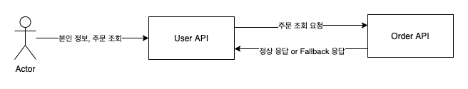

# Resilience4j

> Resilience4j 이론적인 설명은 [스프링으로 하는 마이크로 서비스 구축](http://www.yes24.com/Product/Goods/95593443)을 참조했습니다.

마이크로 서비스 사이의 통신이 이루어지는 대규모 시스템 환경에서 발생하는, 느리거나 응답하지 않은 다운스트림 서비스가 발생했을 때 그 피해를 최소화시키는 것이 서킷 브레이커의 가장 큰 핵심이라고 할 수 있습니다.

대표적으로 마이크로 서비스의 응답이 늦거나 전혀 응답하지 않는 경우, 일시적인 네트워크 문제 등으로 요청이 무작위로 실패하는 경우 등이 이에 해당합니다.


## Resilience4j 소개


* 서킷 브레이커는 다량의 오류를 감지하면 서킷을 열어 새 호출을 받지 않는다.
* 서킷 브레이커는 서킷이 열려 있을 때 빠른 실패 로직을 수행한다. 즉 이어지는 호출에서 시간 초과, 예외 발생 등 오류가 발생하지 않게, 폴백 메서드 호출을 리다 디렉션을 한다. 폴백 메서드에서 다양한 비즈니스 로직을 적용하면 로컬 캐시의 데이터를 반환하거나 즉각적인 오류 메시지를 반환하는 등 최적화된 응답을 생성할 수 있다. 이로써 의존하는 서비스의 응답 중단 때문에 마이크로 서비스가 응답하지 못하게 되는 문제를 방지할 수 있는다.
* 시간이 지나면 서킷 브레이커는 반 열림 상태로 전환돼 새로운 호출을 허용하며, 이를 통해 문제를 일으킨 원인이 사라졌는지 확인한다. 서킷 브레이커는 새로운 오류를 감지하면서 서킷을 다시 열고 빠른 실패 로직을 다시 수행하며, 오류가 사라졌으면 서킷을 닫고 정상 작동 상태로 돌아간다. 마이크로 서비스는 이런 방법으로 장야에 대한 탄력성을 가지며, 이는 동기 방식으로 통신하는


Resilience4j는 런타임에 다양한 방법으로 서킷 브레이커의 정보를 공개한다.

* 서킷 브레이커의 현재 상태를 마이크로 서비스 액추에이터 상태 점검 엔드 포인트(/actuator/health)를 사용해 모니터링할 수 있다.
* 서킷 브레이커는 상태 전이 등의 이벤트 액추에이터 엔드 포인트(/actuator/citcuitbreakerevents)를 게시한다.
* 서킷 브레이커 스프링 부트의 매트릭스 시스템과 통합돼 있으며 이를 이용해 프로테우스와 같은 모니터링 도구에 메트릭을 게시할 수 있다.


## CircuitBreaker Config 설정

| Properties                                   | Description                                                                                                                                                                                                                                                      |
| -------------------------------------------- | ---------------------------------------------------------------------------------------------------------------------------------------------------------------------------------------------------------------------------------------------------------------- |
| ringBufferSizeInClosedState                  | 닫힌 상태에서의 호출 수로, 서킷을 열어애 할지 결정할 때 사용한다.                                                                                                                                                                                                |
| failureRateThreshold                         | 실패한 호출에 대한 임계값(백분율)으로 이 값을 초과하면 서킷이 열린다.                                                                                                                                                                                            |
| waitInterval                                 | 반열림 상태로 전환하기 전에 시킷을 열린 상태로 유지하는 시간                                                                                                                                                                                                     |
| ringBufferSizeInHalfOpenState                | 반열림 상태로 전환하기 전에 서킷을 열림 상태로 유지하는 시간                                                                                                                                                                                                     |
| automaticTransitionFromOpenToHalfOpenEnabled | 대기 시간이 지난 후에 서킷을 반열림 상태로 자동 전환할지, 첫 번째 호출이 들어오길 기다렸다가 반열림 상태로 전환할지를 결정한다.                                                                                                                                  |
| ignoreExceptions                             | 오류를 간주하지 않을 예외를 지정한다. 보통 InvaildInputException, NotfoundExceotion과 같이 예상할 수 있는 비즈니스 예외는 서킷 브레이커에서 무시하는데, 존재하지 않은 데이터 검색이나 유요하지 않은 입력으로 발생하는 예외 때문에 서킷을 열어선 안되기 때문이다. |


다음과 같이 사용할 수 있다.

* ringBufferSizeInClosedState = 5, failureRateThreshold = 50% : 마지막 5개의 호출 중 3개 이상이 실패하면 서킷이 열린다.
* waitInterval = 10000, automaticTransitionFromOpenToHalfOpenEnabled = true : 서킷 브레이커는 10초 동안 서킷을 열린 상태로 유지했다가 반열림 상태로 전환한다.
* ringBufferSizeInHalfOpenState = 3 : 서킷 브레이커는 서킷 반열림 상태로 전환 후에 처음으로 유입된 3개의 호출을 기준 삼아 서킷의 열림 여부를 결정한다. failureRateThreshold = 50%으로 설정돼 있기 때문에 2개 이상 호출이 실패하면 서킷이 다시 열리며, 이 외 경우에는 서킷이 닫힌다.
* ignoreExceptions = InValidInputException, NotFoundException : 이 두 가지 비즈니스 예외는 서킷 브레이커에서 오류 여기지 않는다.

## 재시도 메커니즘

재시도 메커니즘은 일시적인 네티워크 결함과 같음 무작위로 드물게 발생하는 오류에 매우 유용하다. 재시도 메커니즘은 설정된 대기 시간을 사이에 두고, 실패한 요청에 여러번 다시 시도하는 것이다. 재시도 메커니즘을 사용하기 위한 주요 요건 중 하나는 재시도 대상 서비스의 **멱등성**이 있어야 한다는 것이다. 만약 재시도 메커니즘에 의해 2개의 주문이 생성되는 일이 발생하지 않아야 하기 때문이다.

Resilience4j는 서킷 브레이커와 같은 방식으로 재시도 관련된 이벤트 및 메트릭 정보를 공개하지만 상태 정보는 전혀 공개하지 않으며, 재시도 이벤트에 관한 정보는 Actuator 엔드포인트에서 얻을 수 있다. Resilience4j는 다음과 같은 매개변수를 사용한다.


| Properties       | Description                           |
| ---------------- | ------------------------------------- |
| maxRetryAttempts | 첫번째 호출을 포함한 총 재시도 횟수   |
| waitDuration     | 재시도를 다시 수행하기 전의 대기 시간 |
| retryExceptions  | 재시도를 트러거하는 예외 목록         |

다음과 같이 사용 가능하다.

* maxRetryAttempts = 3: 최대 두 번의 재시도를 수행한다.
* waitDuration = 1000: 재시도 사이의 대기 시간은 1초다.
* retryExceptions = IntervalServerError:HTTP 요청에 대한 응답으로 500 상태 코가 오고, 발생한 예외가 IntervalServerError인 경우에만 재시도를 트리거 한다.


## 테스트 시나리오



* User API에서 회원 정보 조회 이후 Order API를 통해서 주문 목록 조회
* 정상적인 조회의 경우 정상적인 응답, 오류 발생시 **Fallback 으로 응답하고 빠른 실패**


### Code

코드는 대략적인 흐름에 이해를 돕기 위해 첨부합니다.

```kotlin
@RestController
@RequestMapping("/api/v1/users")
class UserApi {
    
    ...
    @GetMapping("/{userId}/orders")
    fun getUserWithOrderByTest(
        @PathVariable userId: String,
        @RequestParam(value = "delay", defaultValue = "0") delay: Int = 0,
        @RequestParam(value = "faultPercentage", defaultValue = "0") faultPercentage: Int = 0
    ): UserWithOrderResponse {
        return userFindService.findWithOrder(userId, faultPercentage, delay)
    }
}
```
* delay: 쓰레드 slip을 진행할 값, 특정 시간동안 API가 응답하지 않으면 Fallback 처리
* faultPercentage: 예외가 발생할 퍼센트지, 100이면 100% 예외 발생 하고 Fallback 처리

```kotlin
@FeignClient(name = "order-service")
interface OrderClient {

    @GetMapping("/api/v1/orders/users/{userId}")
    fun getOrderByUserId(
        @PathVariable userId: String,
        @RequestParam(value = "delay", defaultValue = "0") delay: Int = 0,
        @RequestParam(value = "faultPercentage", defaultValue = "0") faultPercentage: Int = 0
    ): List<OrderResponse>
}

class UserFindService {
    ...
    
    fun findWithOrder(
        userId: String,
        faultPercentage: Int,
        delay: Int
    ): UserWithOrderResponse {
        val user = findByUserId(userId)
        return UserWithOrderResponse(
            user = user,
            orders = orderClient.getOrderByUserId(
                userId = userId,
                faultPercentage = faultPercentage,
                delay = delay
            )
        )
    }
}
```
* user를 데이터베이스에서 조회
* order 조회는 FeignClient를 이용해, Order API를 호출

```kotlin
// (1)
@RestController
@RequestMapping("/api/v1/orders")
class OrderApi {
    ..

    @GetMapping("/users/{userId}")
    fun getOrderByTest(
        @PathVariable userId: String,
        @RequestParam(value = "delay", defaultValue = "0") delay: Int = 0,
        @RequestParam(value = "faultPercentage", defaultValue = "0") faultPercentage: Int = 0
    ): List<OrderResponse> {
        return orderFindService.findOderByUserId(
            userId = userId,
            faultPercentage = faultPercentage,
            delay = delay
        )
            .map { OrderResponse(it) }
    }
}

@Service
@Transactional(readOnly = true)
class OrderFindService(
    private val orderRepository: OrderRepository
) {

    // (2)
    @CircuitBreaker(
        name = "findOderByUserId",
        fallbackMethod = "findOderByUserIdFallback"
    )
    fun findOderByUserId(userId: String, faultPercentage: Int, delay: Int): List<Order> {
        Thread.sleep(delay.toLong()) // (3)
        val random = Random.nextInt(0, 100) // (4)
        if (faultPercentage > random) {
            throw RuntimeException("faultPercentage Error...")
        }
        return orderRepository.findByUserId(userId)
    }

    // (5)
    private fun findOderByUserIdFallback(ex: Exception): List<Order> {
        return emptyList()
    }
}

```
* (1) 주문 조회를 진행하는 컨트롤러 코드
* (2) CircuitBreaker에 대한 name, fallbackMethod 지정
* (3) 응답 시간 지연을 위한 스레드 대기, 특정 지연 시간 초과하는 경우 fallbackMethod 응답
* (4) faultPercentage에 의해 예외 발생, 예외 발생시 fallbackMethod 응답
* (5) fallBack 메서드 지정, 위에서 지정한 fallbackMethod와 메서드명이 일치 해야한다.


### 정상 응답
```json
{
  "orders": [
    {
      "productId": "123a5a8b-20w2-1223d-b5d1-14ssd2dbe18da",
      "userId": "997a5a8b-80e4-4a5d-b5d1-14ee22be18da",
      "orderId": "5566da6f-3f03-4ce5-8863-3c142e452522",
      "qty": 3,
      "unitPrice": 100,
      "totalPrice": 300
    }
  ],
  "email": "qwe@asd.cm",
  "name": "Kim",
  "userid": "997a5a8b-80e4-4a5d-b5d1-14ee22be18da"
}
```
* 해당 유조의 주문 조회

### Fallback 응답
```json
{
  "orders": [],
  "email": "qwe@asd.cm",
  "name": "Kim",
  "userid": "997a5a8b-80e4-4a5d-b5d1-14ee22be18da"
}
```
* Fallback 응답으로 주문 목록 빈 배열로 응답


## 참고
* [스프링으로 하는 마이크로서비스 구축](http://www.yes24.com/Product/Goods/95593443)
* [Spring Boot에 Resilience4j (CircuitBreaker) 적용하기](https://leejongchan.tistory.com/100)
* [Resilience4j Document](https://resilience4j.readme.io/docs/getting-started)


