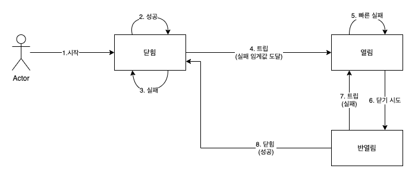

# Resilience4j

서킷 브레이커 패턴을 사용해서 느리거나 응답하지 않는 다운스트림 서비스에 대한 피해를 최소화 할 수 있다. 

* 마이크로서비스의 응답이 늦거나 전혀 응답하지 않는 경우
* 일시적인 네트워크 문제 등으로 요청이 무작위로 실패하는 경우

이번 장에서는 Resilience4j를 통해서 다음과 같은 내용을 다룬다

* Resilience4j의 서킷 브레이커 및 재시도 메커니즘 소개
* 소스 코드에서 서킷 브레이커 및 재시도 메커니즘 추가
* 서빗 크레아커 및 재시도 메커니즘 사용

## Resilience4j의 서킷 브레이커와 재시도 멬커니즘 소개

재시도와 서킷 브레이커 매커니즘은 마이크로 서비스와 같이 동기 방식으로 연결되는 소프트웨어에서 유용하다.

### 서킷 브래이커 소개

* 서킷 브레이커는 다량의 오류를 감지하면서 서킷을 열어 새 호출을 받지 않는다.
* 서킷 브레이커는 서킷이 열려 있을 때 빠른 실패 로직을 수행한다. 즉 이어지는 ㅎ출에서 시간 초과 드으로 말미암은 새로운 오류가발생하지 않게 하며, 풀백 메서드로 호출 리디렉션한다.
* 시간이 지나면 서킷 브레이커는 반열림 상태로 전환돼 새로운 호출을 허용하며, 이를 통해 문제를 일으킨 원인이 사라졌는지 확인한다. 서킷 브레이커는 새로운 오류를 감지하면 서킷을 다시 열고 빠른 실패 로직을 수행며, 오류가 사라졌다면 서킷을 닫고 정상 작동 상태로 돌아간다.

Resilience4j는 런타임에 다양한 방법으로 서킷 브레이커의 정보를 공개한다
* 서킷 브레이커의 현재 상태를 마이크로서비스 액추에이터 상태 점검 엔드포인트를 사용해 모니터링할 수 있다.
* 서킷 브레이커는 상태 전이 등의 이벤트 액추에이터 엔드포인트를 게시한다.
* 서킷 브레이커 스프링 부트의 매트릭스 시스템과 통합돼 있이며 이를 이용해 프로테우스와 같은 모니터링 도구에 메트릭을 게시할 수 있다.

Resilience4j은 다음과같은 매개 변수를 사용한다.

* ringBufferSizeInClosedState: 닫힌 상태에서의 호출 수로, 서킷을 열어애 할지 결정할 떄 사용한다.
* failureRateThreshold: 실패한 호출에 대한 임계값(백분율)으로 이 값을 초과하면 서킷이 열린다.
* waitInterval: 반열림 상태로 전환하기 전에 시킷을 열린 사앹로 유지하는 시간
* ringBufferSizeInHalfOpenState: 반열림 상태로 전환하기 전에 서킷을 열림 상태로 유지하는 시간
* automaticTransitionFromOpenToHalfOpenEnabled: 대기 시간이 지난 후에 서킷을 반열림 사앹로 자동 전환할지, 첫 번째 호출이 들어오길 기다렸다가 반열림 상태로 전환할지를 결정한다.
* ignoreExceptions: 오류를 간주하지 않을 예외를 지정한다. 보통 InvaildInputException, NotfoundExceotion과 같이 예상할 수 있는 비지니스 예외는 서킷 브레이커에서 무시하는데, 존재하지 않은 데이터 검색이나 유요하지 않은 입력으로 발생하는 예외 때문에 서킷을 열어선 안되기 때문이다.

다음과 같이 사용할 수 있다.

* ringBufferSizeInClosedState = 5, failureRateThreshold = 50% : 마지막 5개의 호출중 3개 이상이 실패라면 서킷이 열린다.
* waitInterval = 10000, automaticTransitionFromOpenToHalfOpenEnabled = true : 서킷 브레이커는 10초 동안 서킷을 열린 상태로 유지했다가 반일렴 사앹로 전환하낟.
* ringBufferSizeInHalfOpenState = 3 : 서킷 브레이커는 서킷 반열림 상태로 전환 후에 처음으로 유입된 3개의 호출을 기준 삼아 서킷의 열림 여부를 결정한다. failureRateThreshold = 50% 으로 설정돼 있기 때문에 2개이상 호출이  실패하면 서킷이 다시 열리며, 이 외 경우에는 서킷이 닫힌다.
* ignoreExceptions = InValidInputException, NotFoundException : 이 두 가지 비지니스 예외는 서킷 브레이커에서 오유로 여기지 않는다.

### 재시도 매커니즘 소개

재시도 매커니즘은 일시적인 네티워크 결함과 같음 무작위로 드물게 발생하는 오류에 매우 우용하다. 재시도 메커니즘은 설정된 대기 시간을 사이에 두고, 실패한 요총에 여러 번 다시 시도하는 것이다. 재시도 메커니즘을 사용하기 위한 주요 요건 중 하나는 재시도 대상 서비스의 멱등성이 있어야 한다는 것이다.

Resilience4j는 서킷 브레이커와 같은 방시긍로 재시도 관련된 이벤트 및 메트릭 정보를 공해하지만 상태 정보는 전혀 공개하지 않으며, 재시도 이벤트에 관한 저옵는 액추에이터 엔드포인트에서 얻을 수 있다. Resilience4j는 다음과 같은 매개 벼수를 사용한다.

* maxRetryAttemps: 첫번째 호출을 포함한 총 재시도 횟수
* waitDuration: 재시도를 다시 수행하기 전의 대기 시간
* retryExceptions: 재시도를 트러거하는 예외 목록

다음과 같이 사용 가능하다.

* maxRetryAttemps = 3: 최대 두 번의 재시도를 수랭한다.
* waitDuration = 1000: 재시도 사이의 대기 시간은 1초다.
* retryExceptions = IntervalServerError:HTTP 요청에 대한 응답으로 500 상태 코가 오고, 발생한 예외가 IntervalServerError인 경우에만 재시도를 트리거 한다.

## 