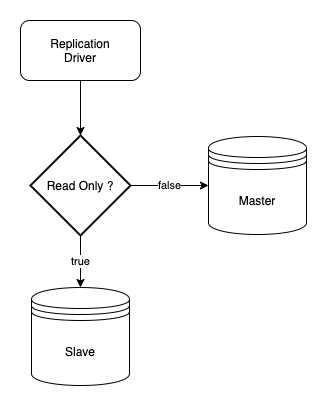
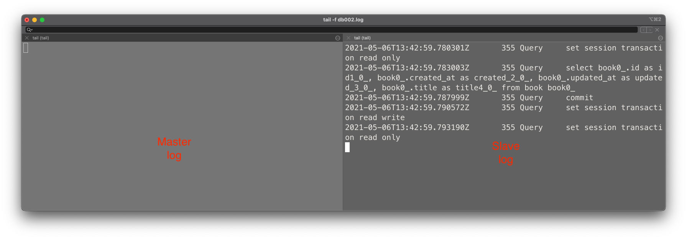
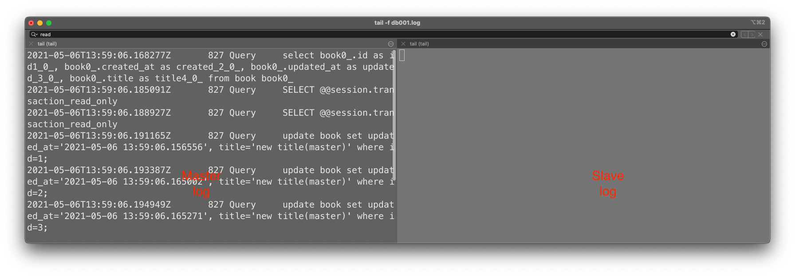
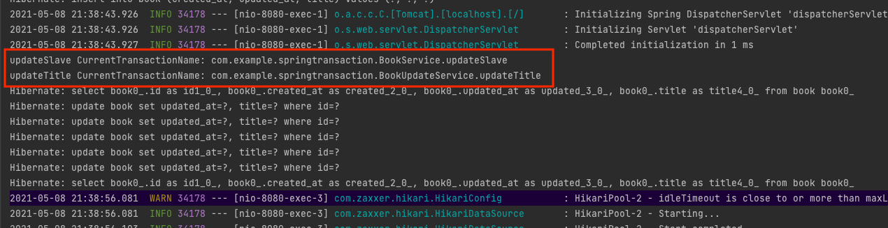

# Spring Master, Slave 트랜잭션 처리 방식

대부분의 서비스에서는 데이터베이스를 Master, Slave 구조로 Master에서는 Create, Update, Delete 업무를 진행하고 Slave에서 Read 업무를 진행하는 구조로 설계합니다. Spring의 Master, Slave 환경에서의 트랜잭션에 대해서 포스팅해보겠습니다.

## 레플리케이션

### MySQL 레플리케이션


MySQL은 위와 같은 구조로 마스터 - 슬레이브 구조를 지원합니다. 간략하게 설명하면 다음과 같이 구성되어 있습니다.

* 마스터의 변경을 기록하기 위한 바이너리 로그
* 슬레이브에 데이터를 전송하기 위한 마스터 스레드
* 슬레이브에서 데이터를 받아 릴레이 로그에 기록하기 위한 I/O 스레드
* 릴레이 로그에서 데이터를 읽어 재생하기 위한 슬레이브 SQL 스레드

MySQL 5.7부터 ACK를 기다리는 시점의 변경이 생겼습니다. 기존 COMMIT을 실행한 다음이 아니라 COMMIT을 실행하기 전에 ACK를 기다리도록 변경되었습니다. 이로 인해 마스터에서 COMMIT이 완료된 트랜잭션은 모두 슬레이브에 확실히 전달되게 되어서 무손실 레플리케이션을 보다 잘 지원하게 되었습니다. 자세한 내용은 [MySQL 5.7 완벽 분석](http://www.yes24.com/Product/Goods/72270172?)에 잘 설명되어 있습니다.


### RoutingDataSource



트랜잭션에서 `readOnly` 설정을 기준으로 `false` 경우 Master DataSource, `true` 경우 Slave DataSource를 바라보게 설정할 수 있습니다. Master, Slave의 DataSource의 설정은 Spring Boot에서의 순정을 상태를 최대한 이용하려 했습니다. 본 포스팅은 DataSource 코드 구성을 다루는 아니기 때문에 해당 내용은 다른 자료를 보시는 것을 권장드립니다.

```yml
# application.yml
spring:
    datasource:
        initialization-mode: never
        master:
            hikari:
                jdbc-url: jdbc:mysql://localhost:3306/study?useSSL=false&serverTimezone=UTC&autoReconnect=true&rewriteBatchedStatements=true&logger=Slf4JLogger&profileSQL=false&maxQuerySizeToLog=100000
                username: root
                password: root
                driver-class-name: com.mysql.cj.jdbc.Driver

        slave:
            hikari:
                jdbc-url: jdbc:mysql://localhost:3307/study?useSSL=false&serverTimezone=UTC&autoReconnect=true&rewriteBatchedStatements=true&logger=Slf4JLogger&profileSQL=false&maxQuerySizeToLog=100000
                username: root
                password: root
                driver-class-name: com.mysql.cj.jdbc.Driver
```


```kotlin
const val PROPERTIES = "spring.datasource.hikari"
const val MASTER_DATASOURCE = "masterDataSource"
const val SLAVE_DATASOURCE = "slaveDataSource"

@Configuration
class DataSourceConfiguration {

    @Bean(name = [MASTER_DATASOURCE])
    @ConfigurationProperties(prefix = "spring.datasource.master.hikari")
    fun masterDataSource() =
        DataSourceBuilder.create()
            .type(HikariDataSource::class.java)
            .build()

    @Bean(name = [SLAVE_DATASOURCE])
    @ConfigurationProperties("spring.datasource.slave.hikari")
    fun slaveDataSource() =
        DataSourceBuilder.create()
            .type(HikariDataSource::class.java)
            .build()
            .apply { this.isReadOnly = true }

    @Bean
    @DependsOn(MASTER_DATASOURCE, SLAVE_DATASOURCE)
    fun routingDataSource(
        @Qualifier(MASTER_DATASOURCE) masterDataSource: DataSource,
        @Qualifier(SLAVE_DATASOURCE) slaveDataSource: DataSource
    ): DataSource {
        val routingDataSource = RoutingDataSource()
        val dataSources = hashMapOf<Any, Any>()
        dataSources["master"] = masterDataSource
        dataSources["slave"] = slaveDataSource
        routingDataSource.setTargetDataSources(dataSources)
        routingDataSource.setDefaultTargetDataSource(masterDataSource)
        return routingDataSource
    }

    @Primary
    @Bean
    @DependsOn("routingDataSource")
    fun dataSource(routingDataSource: DataSource) =
        LazyConnectionDataSourceProxy(routingDataSource)
}

class RoutingDataSource : AbstractRoutingDataSource() {
    override fun determineCurrentLookupKey(): Any =
        when {
            TransactionSynchronizationManager.isCurrentTransactionReadOnly() -> "slave"
            else -> "master"
        }
}
```

`masterDataSource`, `routingDataSource` DataSource의 Bean을 설정합니다. 각각 3306(Master), 3307(Slave) 포트를 사용하며 해당 디비는 Master, Slave 설정까지 완료되어 있습니다.

`routingDataSource`에서는 `masterDataSource`, `routingDataSource` 데이터 소스를 `master`, `slave`를 HashMap에 저장합니다. `determineCurrentLookupKey` 메서드에서 `readOnly` 설정 여부에 따라 `master`, `slave`의 `DataSource`를 선택하게 됩니다. 

마지막으로 기본 `dataSource` Bean을 생성합니다. 이때 `routingDataSource` Bean을 이용해서 `LazyConnectionDataSourceProxy`를 생성합니다.

### RoutingDataSource 테스트

```kotlin
@RestController
@RequestMapping("/api/book")
class BookApi(
    private val bookRepository: BookRepository
) {

    @GetMapping("/slave")
    @Transactional(readOnly = true)
    fun getSlave() = bookRepository.findAll()

    @GetMapping("/master")
    @Transactional(readOnly = false)
    fun getMaster() = bookRepository.findAll()
}
```

`/api/book/slave`는 `readOnly = true` 설정으로 Slave를 바라보게 하고, 그와 반대로 `/api/book/master`는 `readOnly = false`설정으로 Master를 바라보게 설정하고 API 호출 이후 데이터베이스 로그를 확인해보겠습니다.


`readOnly` 여부에 따라서 DataSource가 적절하게 라우팅 되는 것을 확인할 수 있습니다.


## Spring Transaction 테스트

```kotlin
@Component
class AppSetup(
    private val bookRepository: BookRepository
) : ApplicationRunner {

    override fun run(args: ApplicationArguments) {
        bookRepository.saveAll(
            (1..5).map { Book(title = "INIT") }
                .toList()
        )
    }
}
```
Application이 실행될 때 title이 `INIT`으로 데이터를 5개를 생성하는 코드를 추가했습니다. 각 메서드마다 `readOnly` 설정을 다루게 두고 업데이트 작업을 진행하게 됩니다.


### 조회 이후 업데이트

```kotlin
@RestController
@RequestMapping("/api/book")
class BookApi(
    private val bookRepository: BookRepository,
    private val bookService: BookService
) {

    @GetMapping("/update/slave")
    fun startSlave() {
        bookService.updateSlave()
    }
}

@Service
class BookService(
    private val bookRepository: BookRepository
) {

    @Transactional(readOnly = true)
    fun updateSlave() {
        updateTitle("new title(slave)")
    }

    @Transactional(readOnly = false)
    fun updateMaster() {
        updateTitle("new title(master)")
    }

    @Transactional(readOnly = false)
    fun updateTitle(title: String) {
        val books = bookRepository.findAll()
        for (book in books) {
            book.title = title
        }
        bookRepository.saveAll(books)
    }
}
```
* `updateSlave()` 메서드는 `readOnly = true` 시작하고, `updateTitle()` 메서드에서 `readOnly = false`로 진행
* `updateMaster()` 메서드는 `readOnly = false` 시작하고, `updateTitle()` 메서드에서 `readOnly = false`로 진행


#### slave 조회 이후 업데이트



select query가 slave에서 진행된 것을 확인할 수 있습니다. 조회는 `readOnly = true` 설정이지만 title를 업데이트할 때는 `readOnly = false`이기 때문에 영속성 컨텍스트가 flush를 진행하면 해당 내용이 데이터베이스에 반영될 까요? 확인해 보겠습니다.


```
GET http://localhost:8080/api/book/master

HTTP/1.1 200 
Content-Type: application/json
Transfer-Encoding: chunked
Date: Thu, 06 May 2021 13:53:28 GMT
Keep-Alive: timeout=60
Connection: keep-alive

[
  {
    "title": "INIT",
    "id": 1,
    "createdAt": "2021-05-06T22:42:33",
    "updatedAt": "2021-05-06T22:42:33"
  },
  {
    "title": "INIT",
    "id": 2,
    "createdAt": "2021-05-06T22:42:33",
    "updatedAt": "2021-05-06T22:42:33"
  },
  {
    "title": "INIT",
    "id": 3,
    "createdAt": "2021-05-06T22:42:33",
    "updatedAt": "2021-05-06T22:42:33"
  },
  {
    "title": "INIT",
    "id": 4,
    "createdAt": "2021-05-06T22:42:33",
    "updatedAt": "2021-05-06T22:42:33"
  },
  {
    "title": "INIT",
    "id": 5,
    "createdAt": "2021-05-06T22:42:33",
    "updatedAt": "2021-05-06T22:42:33"
  }
]

Response code: 200; Time: 31ms; Content length: 461 bytes
```
결과는 변경되지 않았습니다.

### master 조회 이후 업데이트



select, update query가 master에서 진행된 것을 확인할 수 있습니다. 마찬가지로 API를 호출해서 결과를 확인해 보겠습니다.

```
GET http://localhost:8080/api/book/master

HTTP/1.1 200 
Content-Type: application/json
Transfer-Encoding: chunked
Date: Thu, 06 May 2021 14:01:40 GMT
Keep-Alive: timeout=60
Connection: keep-alive

[
  {
    "title": "new title(master)",
    "id": 1,
    "createdAt": "2021-05-06T22:42:33",
    "updatedAt": "2021-05-06T22:59:06"
  },
  {
    "title": "new title(master)",
    "id": 2,
    "createdAt": "2021-05-06T22:42:33",
    "updatedAt": "2021-05-06T22:59:06"
  },
  {
    "title": "new title(master)",
    "id": 3,
    "createdAt": "2021-05-06T22:42:33",
    "updatedAt": "2021-05-06T22:59:06"
  },
  {
    "title": "new title(master)",
    "id": 4,
    "createdAt": "2021-05-06T22:42:33",
    "updatedAt": "2021-05-06T22:59:06"
  },
  {
    "title": "new title(master)",
    "id": 5,
    "createdAt": "2021-05-06T22:42:33",
    "updatedAt": "2021-05-06T22:59:06"
  }
]

Response code: 200; Time: 51ms; Content length: 526 bytes
```
정상적으로 title이 변경된 것을 확인할 수 있습니다.


### 다른 트랜잭션에서 Update

```kotlin
@Service
class BookService(
    private val bookRepository: BookRepository
) {

    @Transactional(readOnly = true)
    fun updateSlave() {
        println("updateSlave CurrentTransactionName: ${TransactionSynchronizationManager.getCurrentTransactionName()}")
        bookUpdateService.updateTitle("new title(slave)")
    }
}

@Service
class BookUpdateService(
    private val bookRepository: BookRepository
){
    @Transactional(readOnly = false, propagation = Propagation.REQUIRES_NEW)
    fun updateTitle(title: String) {
        println("updateTitle CurrentTransactionName: ${TransactionSynchronizationManager.getCurrentTransactionName()}")
        val books = bookRepository.findAll()
        for (book in books) {
            book.title = title
        }
        bookRepository.saveAll(books)
    }
}
```
BookUpdateService 클래스를 만들고 `updateTitle` 메서드를 해당 클래스에서 `propagation = Propagation.REQUIRES_NEW` 설정을 통해서 새로운 트랜잭션에서 처리하도록 작성하고 `/api/book/update/slave`를 호출하고 조회 API를 호출해서 결과를 확인해 보겠습니다. 

기존 서비스 코드에서 구현을 하지 않고 BookUpdateService 서비스 코드를 만든 이유는 동일한 Bean에서 `@Transactional`예상하는 것과 다르게 동작하기 때문입니다. 자세한 내용은 이전 동일한 [Bean(Class)에서 @Transactional 동작 방식](https://cheese10yun.github.io/spring-transacion-same-bean/)을 참고해 주세요

```
GET http://localhost:8080/api/book/slave

HTTP/1.1 200 
Content-Type: application/json
Transfer-Encoding: chunked
Date: Sat, 08 May 2021 12:38:56 GMT
Keep-Alive: timeout=60
Connection: keep-alive

[
  {
    "title": "new title(slave)",
    "id": 1,
    "createdAt": "2021-05-08T21:37:43",
    "updatedAt": "2021-05-08T21:38:44"
  },
  ...
]

Response code: 200; Time: 107ms; Content length: 521 bytes
```
새로운 트랜잭션의 경우 `masterDataSource`를 바라보게 되며 데이터베이스에 반영되는것을 확인할 수 있습니다.



트랜잭션 이름을 봐도 해당 트랜잭션이 다르다는 것을 확인할 수 있습니다. 즉 `com.example.springtransaction.BookService.updateSlave` 트랜잭션은 `salveDataSoruce`, `com.example.springtransaction.BookUpdateService.updateTitle`는 `masterDataSource`를 바라봅니다.


## 그렇다면 왜 그런것일까?

**첫 트랜잭션의 설정의 `readOnly`에 따라 `salveDataSoruce`, `masterDataSource`가 결정되며, 동일한 트랜잭션에서는 지정된 `readOnly` 속성은 변경되지 않습니다.** 기존 트랜잭션과 전혀 다른 트랜잭션을 만나게 되면 해당 트랜잭션의 `readOnly`설정에 따라 `DataSource`가 결정됩니다. 그렇다면 왜 이렇게 되는 걸까요? **제가 학습했던 내용을 토대로 설명드리기 때문에 틀린 부분이 있을 수도 있습니다.**


### 스프링의 트랜잭션 동기화

> 
> [토비의 스프링 3.1, 361 페이지](http://m.yes24.com/goods/detail/7516911)

스프링은 위와 같은 방식으로 트랜잭션 동기화를 진행합니다. 해당 방식은 트랜잭션을 시작하기 위해 만든 Connection 오브젝트를 특별한 저장소에 보관해두고, 이후에 호출되는 메서드에서 저장된 Connection을 가져다가 사용합니다. 

* `(1)` Userservice Connection을 생성
* `(2)` 생성된 Connection을 트랜잭션 동기화 저장소에 저장, SetAutoCommit(false)를 호출하여 트랜잭션을 시작
* `(3)` 첫 번째 `update()` 메서드가 호출되고 **`(4)` 트랜잭션 동기화 저장소에 현재 시작된 트랜잭션을 가진 Connection을 확인합니다. 이 경우는`(2)`에서 생성한 Connection을 가져옵니다.**
* `(5)` Connection을 이용해 PreparedsStatment을 만들어 해당 SQL을 실행하고 **JdbcTemplated는 Connection 닫지 않은 상태로 작업을 마침**
* 동일한 플로우로 `(6)`, `(7)`, `(8)` 수행
* 또 동일한 플로우로 `(9)`, `(10)`, `(11)` 수행하며 **트랜잭션 내의 모든 작업이 정상적으로 끝났으면 `(12)` Conntion commit을 호출해 트랜잭션을 완료**
* `(13)` 트랜잭션 저장소가 더 이상 Connection 객체를 저장하지 않도록 이를 제거

위와 같은 플로우로 트랜잭션이 진행됩니다. 

> `updateSlave()` 메서드는 `readOnly = true` 시작하고, `updateTitle()` 메서드에서 `readOnly = false`로 진행 되는 경우 

이런 경우에는 `updateSlave()`에서 Connection(Slave)을 생성 하고 **`updateTitle()`에서 트랜잭션 동기화 저장소에 저장된 트랜잭션을 가진 Connection(Slave) 기반으로 트랜잭션을 시작하게 됩니다.** 그러기 때문에 `updateTitle()` 메서드의 트랜잭션 `readOnly = false` 설정은 동작하지 않게 됩니다.


## 참고
* [MySQL 5.7 완벽 분석](http://www.yes24.com/Product/Goods/72270172?)
* [Spring, master-slave dynamic routing datasource 사용하기](https://taes-k.github.io/2020/03/11/sprinig-master-slave-dynamic-routing-datasource/)
* [토비의 스프링 3.1](http://m.yes24.com/goods/detail/7516911)