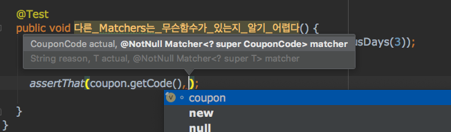
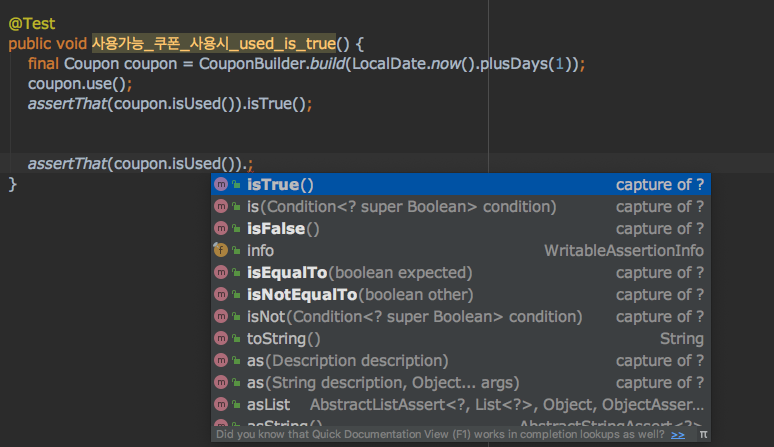
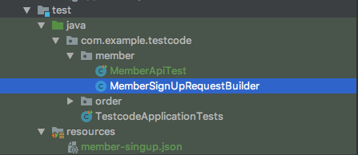

# 테스트 코드 작성에 대한 나름의 고찰
스프링 기반으로 많은 테스트 코드를 작성하면서 느꼈던 나름의 고찰과 어려움을 정리하는 포스팅입니다. 사실은 테스트 코드 작성 시 효율적인 방법을 소개하는 포스팅을 진행하려 했으나 
이런저런 고민들 때문에 명확한 결론이 나지 않아서 이런 고민들을 정리한 포스팅입니다.


## POJO 테스트는 언제나 옳다
이전에 포스팅한 [Test 전략 가이드](https://github.com/cheese10yun/spring-guide/blob/master/docs/test-guide.md), [Spring Boot 테스트 종류](https://github.com/cheese10yun/spring-guide/blob/master/docs/test-guide.md) 등 스프링에서는 매우 다양한 테스트 방법을 제공해주고 있습니다. 이런 Slice 테스트 지원으로 테스트 하고자 하는 레이어를 부분적으로 빠르게 테스트할 수 있습니다.

**이런 강력한 기능들 때문에 POJO에 대한 테스팅은 상대적으로 관심도가 낮다 보니 POJO에 대한 테스트 코드 작성에도 관심이 부족한 거 같습니다.**

POJO 테스트의 장점
* POJO 객체를 테스트하는 것이라서 빠르다.
* 디펜더시가 상대적으로 적어서 테스트 코드 작성이 편하다.
* 단위 테스트하기 가장 이상적이다.

POJO 테스트의 대표적인 항목들은 Util 객체, Domain 객체 등이 있습니다. **특히 ORM을 사용하고 있다면 도메인 객체들의 테스트 코드는 해당 프로젝트의 도메인 지식을 설명해주는 아주 좋은 문서 역할을 해줍니다.**

```java
public class CouponTest {

    @Test(expected = CouponExpireException.class)
    public void 만료일이지난_쿠폰_사용_불가() {
        final Coupon coupon = CouponBuilder.build(LocalDate.now().minusDays(1));
        coupon.use();
    }

    @Test(expected = CouponAlreadyUseException.class)
    public void 이미_사용한_쿠폰은_쿠폰_사용_불가() {
        final Coupon coupon = CouponBuilder.build(LocalDate.now().plusDays(3));
        coupon.use();

        // 이미 사용한 쿠폰을 다시 한번 사용했을 다시 사용
        coupon.use();
    }

    @Test
    public void 사용가능_쿠폰_사용시_used_is_true() {
        final Coupon coupon = CouponBuilder.build(LocalDate.now().plusDays(1));
        coupon.use();
        assertThat(coupon.isUsed()).isTrue();
    }
}
```
쿠폰 테스트 코드를 통해서 쿠폰 도메인의 비즈니스 요구 사항 나타내는 도큐먼트로 볼 수 있습니다.

## Matchers는 AssertJ가 좋다.


위 그림은 assertThat은 `import static org.junit.Assert.assertThat;`에서 가져온 assertThat입니다. 해당 Matchers는 자동완성 기능을 제공해주지 않아 무슨 메서드가 있는지 일단 외우고 있어야 합니다. 다른 Matchers들도 어느 정도 추천 자동 완성 기능을 제공해주고 있지만 매개변수로 넘기는 방식입니다.


반면 `AssertJ`는 사용법은 매개변수를 넘기는 방식이 아닙니다. `assertThat(coupon.isUsed())` 코드 뒤에 `.`을 붙여 사용하는 방식이라서 해당 함수가 무엇이 있는지 명확하게 알려줍니다. 그리고 AssertJ는 다른 Matchers에 비해 테스트하기 편리한 메서드들을 제공해줍니다. **JUnit을 사용하고 있다면 Matchers는 AssertJ를 적극 추천합니다.**


## 테스트만을 위한 코드
테스트 코드를 작성하기 위해서 테스트 코드에서 사용하는 코드를 작성할 때가 있습니다. 테스트에만 사용하는 코드는 객체 간의 협력관계에는 참여하지 않지만 코드로만 존재하기 때문에 그 존자 자체가 저는 부정적으로 생각합니다.


```java
public class MemberApi {

  private final MemberRepository memberRepository;

  @PostMapping
  public Member create(@RequestBody MemberSingUpRequest dto) {
    return memberRepository.save(new Member(dto.getEmail(), dto.getName()));
  }
}

public class MemberSingUpRequest {

  @NotEmpty private String name;

  @Email private String email;
}

```

위와 같은 API가 있을 경우 아래처럼 테스트 코드를 작성할 수 있습니다.


```java
@SpringBootTest
@RunWith(SpringRunner.class)
@AutoConfigureMockMvc
public class MemberApiTest {

  @Autowired
  private MockMvc mvc;

  @Autowired
  protected ObjectMapper objectMapper;

  @Test
  public void 회원가입테스트() throws Exception {

    //given
    final MemberSingUpRequest dto = new MemberSingUpRequest("yun", "yun@asd.com");

    //when
    final ResultActions resultActions = mvc.perform(post("/members")
        .contentType(MediaType.APPLICATION_JSON_UTF8)
        .content(objectMapper.writeValueAsString(dto)))
        .andDo(print());

    //then
    resultActions
        .andExpect(status().isOk());

  }
}
```

여기서 중요한 것은 Given 절에서 Request Body가 받을 DTO를 만들어야 하는 점인데. 실제 값 바인딩은 리플렉션 기반으로 처리되니 별다른 생성자를 만들 필요가 없습니다. 하지만 테스트 코드에서는 json 값을 넘겨줘야 하기 때문에 테스 코드 작성을 위 헤서 아래와 같은 생성자를 만들어야 합니다.

```java
public MemberSingUpRequest(final String name, final String email) {
    this.name = name;
    this.email = email;
  }
```

Validation을 어노테이션들이 동작하지 않습니다. 내가 의도하지 않은 객체 생성이 이루어지는 가능성이 있고 무엇보다 해당 코드는 테스트 코드에서만 사용되는 코드인 점입니다.

### JSON 기반으로 테스트

```json
{
  "name": "yun",
  "email": "yun@asd.com"
}
```

```java
...
public class MemberApiTest {

    ...

    @Test
  public void json_파일로테스트() throws Exception {
    //given
    final String requestBody = readJson("classpath:member-singup.json");

    //when
    final ResultActions resultActions = mvc.perform(post("/members")
        .contentType(MediaType.APPLICATION_JSON_UTF8)
        .content(requestBody))
        .andDo(print());

    //then
    resultActions
        .andExpect(status().isOk());

  }
}
```
json 파일을 읽어 들여 String으로 값을 전달하게 되면 위에서 작성한 생성자 코드를 사용하지 않아도 됩니다.

```json
{
  "orderer": {
    "name": "yun",
    "email": "yun@asd.com"
  },
  "product": [
    {
      "name": "양말",
      "price": 123233
    },
    {
      "name": "바자",
      "price": 1000
    },
    {
      "name": "치마",
      "price": 1120
    }
  ],
  "coupon": {
    "code": "xx2sd292kd"
  },
  "address": {
    "address1": "서울블라브라..."
    "address2": "어디 동...",
    "zip": "123-2332"
  }
}
```

특히 위처럼 json이 복잡한 경우에는 객체 기반으로 생성하는 것이 많이 번거롭습니다. 이런 경우에는 json으로 관리하는 것이 효율적일 수 있습니다.

단점도 있습니다. 유효성 검사 등 다양한 값을 넣기 위해서는 그만큼 json 파일을 만들어야 하는 단점도 있습니다. 객체 생성으로 만들면 파라미터를 통해서 값만 변경할 수 있지만 json 파일로 만들게 되는 경우는 여러 json 만들어서 테스트해야 합니다.


### Default 접근 제어 지시자를 통한 객체 생성
Default 접근 제어 지시자를 사용하면 동일 패키지 내에서는 접근할 수가 있습니다.

```java
@NoArgsConstructor(access = AccessLevel.PRIVATE)
@Getter
public class MemberSingUpRequest {

  @NotEmpty
  private String name;

  @Email
  private String email;

  MemberSingUpRequest(final String name, final String email) {
    this.name = name;
    this.email = email;
  }
}

// 해당 클래스는 test 디렉토리에 위치합니다.
public class MemberSignUpRequestBuilder {

  public static MemberSingUpRequest build(String name, String email) {
    return new MemberSingUpRequest(name, email);
  }
}
```


`test` 디렉터리에 경로가 동일하다면 `Default` 접근 제어 지시자로 되있는 생성자로 접근이 가능합니다.

```java
  @Test
  public void default_접근지시자_를이용한_테스트() throws Exception {
    //given
    final MemberSingUpRequest dto = MemberSignUpRequestBuilder.build("yun", "yun@asd.com");

    //when
    final ResultActions resultActions = mvc.perform(post("/members")
        .contentType(MediaType.APPLICATION_JSON_UTF8)
        .content(objectMapper.writeValueAsString(dto)))
        .andDo(print());

    //then
    resultActions
        .andExpect(status().isOk());

  }
```
이런 식으로 테스트를 진행하면 동일 패키지에서 밖에 접근하지 못하는 코드이므로 테스트 코드만을 위한 코드이지만 영향을 최소한으로 할 수 있습니다.

주의해야 할 점은 생성자가 추가됐기 때문에 반드시 기본 생성자를 하나 만들어야 합니다. 이때 접근 제어 지시자는 `private` 접근 지시자를 통해서 최소한으로 만들어 줍니다. **항상 접근 제어 지시자는 되도록 낮은 것을 사용하는 습관을 갖는 것이 좋습니다.**

Setter를 추가하는 방법도 있겠지만 Setter는 Request, Response 객체 같은 경우에는 최대한 지양하는 것이 좋습니다. 이런 방식은 코드 양이 많기도 하고 애초에 default 생성자라도 있는 것이기 때문에 **현재는 RequestBody 객체가 복잡하면 JSON 기반 테스트를 진행하고 그렇지 않은 경우에는 그냥 public 생서자 or Builder를 이용해서 Given 절을 작성하고 있습니다.**


## Setter의 유혹
[step-06: Setter 사용하지 않기](https://github.com/cheese10yun/spring-jpa-best-practices/blob/master/doc/step-06.md) 및 많은 포스팅에서 Setter 메서드를 지양해야 한다고 말해왔습니다. 하지만 테스트 코드 작성 시 Setter 메서드는 너무 달콤한 유욕이 있습니다.

```java
public enum OrderStep {
  AWAITING_DEPOSITED, //  결지 미완료
  PAID, // 지불 완료
  REAMDY, // 배송 준비
  SHIPPING, // 배송중
  COMPLETED // 완료
}

public class Order {

...
  public void changeStepToCompleted() {

      if (this.step != OrderStep.SHIPPING) {
        throw new IllegalStateException();
      }

      this.step = OrderStep.COMPLETED;
    }
}
```

주문의 상태가 있고 배송 완료로 변경하기 위해서는 현재 Step이 SHIPPING 이어야 한다는 로직입니다.

```java
  @Test
  public void setter_메서드의_유혹() {
    //given
    final List<Product> products = new ArrayList<>();
    products.add(new Product("양말"));
    products.add(new Product("모자"));
    products.add(new Product("바지"));

    final Order order = Order.order("yun", products);
    // order.setStep(OrderStep.SHIPPING); Setter 메서드가 간절하다.

    //when
    order.changeStepToCompleted();

    //then
    assertThat(order.getStep()).isEqualTo(OrderStep.COMPLETED);

  }
```
Order 객체를 테스트하기 위해서는 Order 객체를 만들어야 합니다. 그리고 Order 객체는 시간에 따라서 데이터들이 달라집니다. 주문 신청부터 주문 완료까지 Order 객체는 계속해서 변경됩니다.

적절하게 단위 테스트하기 위해서는 데이터를 특정 시점처럼 만들어야 합니다. 위 테스트도 주문 완료를 테스트하기 위해서 주문 생성 -> 주문 배송 중으로 변경해야 합니다. 이럴 경우 Setter를 쓰면 모든 비니지스 로직을 무시하고 데이터를 특정 시점으로 변경시킬 수 있습니다.

위 도메인은 상당히 간단한 편이지만 주문, 환불, 주문 부분 취소, 주문 전체 취소 등 다양한 도메인들을 테스트하기 위해서는 특정 시점으로 변경하기 어렵습니다. 위처럼 방어적 로직이 있어 모든 조건이 만족할 때만 데이터를 변경하도록 하기 때문입니다.

그래서 나름의 **결론은 @Setter를 사용하고 test 코드 작성 시에만 Setter를 사용한다 정도입니다.** 객체지향 관점에서 아무 로직 없는 Setter는 객체 간의 협력관계에서 객체의 자율성을 심하게 훼손시킵니다. 테스트 코드 이외에는 Setter를 사용하지 않아야 한다는 것이 지금의 결론입니다.

**그래도 명확한 가이드가 없는 건 사실입니다. test 디렉터리에서만 Setter 메서드를 사용하지 않는다**라는 팀 차원의 공유만 있을 뿐 그것을 강제할 방법은 없습니다.

## 통합 테스트의 어려움
통합 테스트에서 어려운 점들이 Given 작성하는 것입니다. 페이징 및 필터 관련된 API를 테스트한다고 했을 경우 데이터를 Set up 해주기가 어렵습니다.

만약 주문 생성 API를 테스트하기 위해서는

- 회원
- 상품
- 상품 카테고리
- 해당 상품의 입점사 정보
- 쿠폰 (만약 쿠폰을 사용했을 때 필요)

아무리 간단하게 생각해도 최소한 이 정도의 데이터를 Set up 해야 합니다. 실제 오픈 커머스 같은 경우에는 주문 한 번을 하기 위해서 수십 개의 테이블들을 Set up 해야 합니다. 
테스트를 위해서 객체를 만들고 JPA로 데이터를 Set up 한다면 차라리 저는 테스트를 포기하겠습니다.


### Import를 이용한 데이터 Set up

스프링이 로드될 때 `data.sql`을 읽어 들여 Given을 만드는 방식입니다.

```sql
# data.sql
INSERT INTO
    `member` (`id`, `email`, `name`)
VALUES
	(1, 'yun@asd.com', 'yun'),
	(2, 'wan@asd.com', 'wan'),
	(3, 'jin@asd.com', 'jin'),
	(4, 'ck@asd.com', 'ck');
```


```java
  @Test
  public void member_page_test() throws Exception {
    //given

    //when
    final ResultActions resultActions = mvc.perform(get("/members")
        .contentType(MediaType.APPLICATION_JSON_UTF8))
        .andDo(print());

    //then
    resultActions
        .andExpect(status().isOk())
        .andExpect(jsonPath("content").exists())
        .andExpect(jsonPath("pageable").exists())
        .andExpect(jsonPath("pageable").exists())
        .andExpect(jsonPath("numberOfElements").value("4"));

  }
```
`SQL`로 given을 구성하게 되면 테스트하고자 하는 부분의 when, then 구절은 어렵지 않게 작성할 수 있습니다. 또 비즈니스 로직과 상관없이 데이터를 특정 시점으로 만들 수 있습니다.

하지만 단점도 있습니다. 칼럼의 변경 및 확장 시 테스트 코드의 지속적인 관리가 어렵다는 점이 있습니다. 또 누군가의 `member` insert를 추가적으로 하면 `.andExpect(jsonPath("numberOfElements").value("4"))` 테스트 코드는 실패하게 됩니다. **모든 작업자들이 `data.sql`을 추가 및 변경하다 보면 문제가 계속 생기게 됩니다.**


### 나름의 해결 방법
위에서도 말했듯이 `data.sql`을 모든 작업자가 공동으로 사용하게 되니 문제가 발생한다면 테스트 단위로 `data-{xxx-test}.sql`을 관리하면 좋을 거 같습니다.

```java
  @Test
  public void member_page_test() throws Exception {
    //given
    dataSetUp("classpath:member_page_test.sql"); // 로직은 구현하지 않았습니다.

    //when
    final ResultActions resultActions = mvc.perform(get("/members")
        .contentType(MediaType.APPLICATION_JSON_UTF8))
        .andDo(print());

    //then
    resultActions
        .andExpect(status().isOk())
        .andExpect(jsonPath("content").exists())
        .andExpect(jsonPath("pageable").exists())
        .andExpect(jsonPath("pageable").exists())
        .andExpect(jsonPath("numberOfElements").value("4"));

  }
```

JSON 기반으로 테스트처럼 객체로 생성하기 어려운 Given을 JSON에서는 json 파일로 했고 여기에서는 SQL 파일로 진행합니다. 이 방식으로는 실제 실무에서 사용해본 경험은 없어 다른 문제들이 발생할지는 모르겠습니다.

## 결론
결론이라고 말하기는 어렵지만 테스트 코드를 작성할 때 Given을 만들기 위해서 많은 어려운 점이 있습니다. 지금의 제 결론은 Given을 최대한 편리하게 작성하는 방법과 의존도를 낮게 코딩해서 최대한 단위 테스트를 하기 쉽게 의도적으로 설계하고 코딩하는 편이 좋다고 생각합니다.

